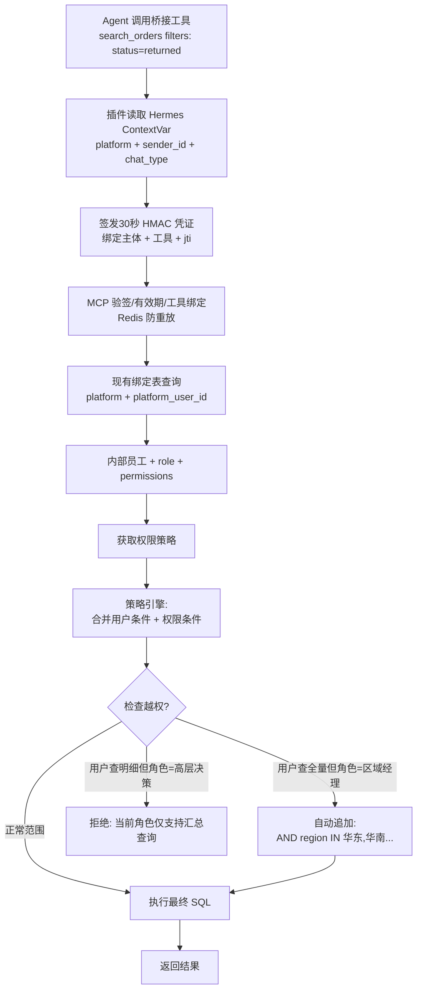

# 05a-MCP层RBAC权限注入

# 05a · MCP 层 RBAC 权限动态注入

> 这个难点的本质是：同一个问题"最近退单量多少"，不同角色查到的数据范围必须不一样。权限管控不能靠 Agent 自己"自觉"——LLM 是不可靠的，必须在 MCP 调用层面硬拦截。

完整的落地代码、调用时序、Redis 缓存和运维说明见
[MCP_RBAC_Implementation.md](../MCP_RBAC_Implementation.md)。

---

## 为什么难

1.  **权限维度多**：用户权限可能同时受"区域+品类+数据粒度+时间范围"四个维度约束。一个华东区空调品类的品控工程师，只能查华东+空调+明细级+近90天
    
2.  **动态计算**：用户身份来自 Hermes Gateway 已验证的请求级会话上下文，桥接插件把外部平台 ID 签名后传给 MCP；MCP 再映射到内部员工和角色。业务工具不接收 OAuth Token 或模型可填写的身份参数
    
3.  **不能靠 Agent 自觉**：LLM 生成的 SQL 可能遗漏 WHERE 条件，可能被 prompt injection 诱导绕过权限。权限过滤必须在 MCP Server 端硬编码执行
    
4.  **行级过滤**：不是"能不能访问表"，而是"能访问表里的哪些行"。同一个 `orders` 表，全国运营看到 100 万行，华东经理只能看到 20 万行
    

---

## 技术方案

采用 **MCP 拦截器模式**——在 MCP Tool 执行前，由权限中间件自动注入过滤条件：


---

## 实现思路

核心思路是**权限策略的声明式定义 + 调用时动态注入**。预定义每类角色的数据边界，在每次 MCP 调用前由拦截器自动缝合到查询条件中。

当前实现不修改 Hermes 源码，也不新增身份表：

```text
Hermes Gateway 请求级身份
  → suning-rbac-bridge 插件签名
  → tools/call._meta["suning/authn"]
  → auth_attestation.verify_attestation()
  → user_platform_binding
  → user_identity
  → user_role_permission
  → PermissionInterceptor
  → 参数化 SQL 行级条件
  → 返回值脱敏
```

关键文件：

- `.hermes/plugins/suning-rbac-bridge/bridge.py`：读取 Hermes 会话身份并签发短期凭证
- `backend/mcp_suning/auth_attestation.py`：验签、有效期、工具绑定和 Redis 防重放
- `backend/mcp_suning/auth_middleware.py`：用户映射、角色/用户范围求交、群聊降权
- 五个 `*_server.py`：授权必须发生在首次 SQL 之前，并使用 `allowed_*` 构造参数化条件

统一授权入口的实际调用方式：

```python
user, safe_filters = authorize_mcp_request(
    ctx,
    tool_name,
    filters,
)
```

验签、现有绑定表映射、策略求交和群聊降权都封装在这个入口内，业务工具不得
自行拆开调用内部步骤。

安全约束：

- 普通工具参数中不存在 `user_context`、工号、角色或权限字段
- 旧的裸 `hermes/platform`、`hermes/user_id` 元数据不再接受
- 未绑定、禁用、范围缺失、未知角色、签名错误、过期或重放全部默认拒绝
- 角色策略只从现有权限表读取，避免代码和数据库出现两套配置
- 群聊/频道最多返回 `anonymized`，高层仍保持更严格的 `aggregated`
- 高层汇总工具使用显式白名单，未来新增工具默认不能返回明细

---

## 实际关键代码结构

桥接插件在 Hermes 进程内读取请求身份，并把只绑定当前工具、30 秒有效的凭证
放进 MCP 私有元数据；身份字段不会出现在工具 schema 中：

```python
identity = current_identity()
attestation = mint_attestation(tool_name=tool_name, identity=identity)
result = await session.call_tool(
    tool_name,
    arguments=arguments,
    meta={"suning/authn": attestation},
)
```

每个业务工具在首次 SQL 前调用同一个授权入口，并且只使用授权结果构造 SQL：

```python
_, safe_filters = authorize_mcp_request(ctx, tool_name, filters)
scope_sql, scope_params = build_scope_clause(
    safe_filters,
    region_column="o.region_code",
    city_column="o.city_code",
    category_column="o.category_code",
)
rows = execute_readonly_query(scope_sql, scope_params)
return interceptor.mask_sensitive_data(rows, safe_filters["data_scope"])
```

不要从模型参数、提示词或裸 `_meta` 读取工号/角色；也不要在 MCP 工具中复制一套
角色判断。完整实现以 `bridge.py`、`auth_attestation.py`、`auth_middleware.py` 和
五个 `*_server.py` 为准。
---

## 涉及业务模块

*   M3 · MCP 数据网关
    
*   M6 · 权限管控引擎
    
*   M4 · 多平台接入网关（提供请求级平台发送者身份；内部用户映射在 MCP 完成）
