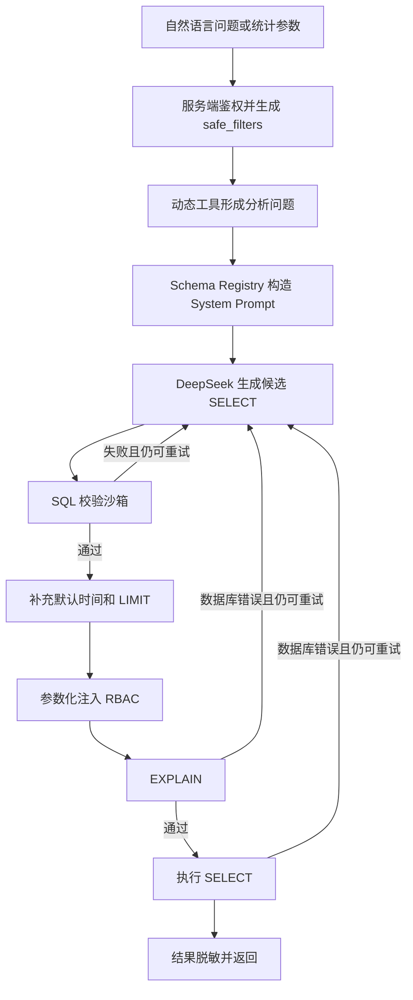

# 05b · NL2SQL 可靠生成

## 问题

用户会直接提出“最近一周退单最多的三个品类”一类问题，但数据库使用英文表名、固定关联字段和
Unix 时间戳。模型可能生成不存在的表字段、错误 JOIN、无时间范围的全表查询，甚至非只读 SQL。

本项目把 NL2SQL 用在**动态售后退单分析**，不把所有查询都交给模型。当前动态工具是
`query_return_stats_nl2sql` 和 `query_aftersale_nl2sql`，两者共用同一个 Pipeline；参数和返回结构明确
的业务 API 继续使用固定 SQL。

## 实现方案

采用一条简单的 **Schema-first Prompt + SQL 校验沙箱** 链路：

```text
自然语言问题或结构化统计参数
  -> 动态工具统一形成分析问题
  -> Schema Registry 生成 System Prompt
  -> DeepSeek 生成一条候选 SELECT
  -> SQL 沙箱校验并补充时间范围、LIMIT
  -> 参数化注入服务端 RBAC 条件
  -> EXPLAIN
  -> 执行 SELECT
  -> 按权限粒度脱敏并返回
```

失败重试只保留两种必要场景：

- 候选 SQL 未通过沙箱校验：把错误加入下一轮 User Prompt。
- EXPLAIN 或 SELECT 抛出数据库错误：把错误加入下一轮 User Prompt。

默认最多生成两轮。模型配置错误或网络错误直接返回，不在 Pipeline 内重试。



## 1. Schema-first Prompt

Schema 注册表位于 `backend/nl2sql/schema_registry.py`，只登记当前业务需要的五张表：

| 表 | 别名 | 用途 |
| --- | --- | --- |
| `t_aftersale_return` | `r` | 退单事实表 |
| `t_order_main` | `o` | 区域、城市、渠道 |
| `t_product_sku` | `s` | 连接退单、品类和品牌 |
| `t_product_category` | `c` | 品类编码和名称 |
| `t_product_brand` | `b` | 品牌编码和名称 |

合法 JOIN 同样集中登记，不让模型猜关联字段：

```text
r.order_id = o.order_id
r.sku_code = s.sku_code
s.category_l3_code = c.category_code
s.brand_id = b.brand_id
```

`build_schema_prompt()` 把 Schema、JOIN 和生成规则组成 System Prompt。自然语言问题作为独立的
User Message 发送，避免把长期规则和单次输入混在一起。

```python
def build_schema_prompt() -> str:
    """输入：无显式参数；读取模块内 Schema 和 JOIN 注册信息。

    输出：交给 SQL 生成模型的 Schema-first System Prompt。
    功能：集中描述静态表字段、JOIN 关系和生成规则，用户问题由独立消息传入。
    """
```

Prompt 的关键规则只有当前执行链真正支持的部分：

- 只生成一条 MySQL `SELECT`，不输出解释。
- 使用登记的表、字段、固定别名和 JOIN。
- 只返回聚合结果，不返回用户或订单明细。
- 必须有 `WHERE`，方便服务端追加条件。
- 退单数量使用 `COUNT(DISTINCT r.return_id)`。
- 金额底层单位为分。
- 最近 N 天以 `t_aftersale_return` 的最新数据时间为锚点，适配模拟和离线数据集。
- 中文品类按统一编码映射过滤 `s.category_l3_code`；父品类用编码前缀包含子品类，不依赖名称模糊匹配。
- 模型不生成 RBAC 条件，权限由服务端统一注入。

## 2. 模型调用

`backend/nl2sql/generator.py` 中的 `DeepSeekSQLGenerator` 使用公共包
`suning_context_runtime.create_model()` 创建 LangChain DeepSeek 模型：

```python
def __call__(self, system_prompt: str, user_prompt: str) -> str:
    """输入：包含 Schema 规则的 ``system_prompt`` 和用户问题 ``user_prompt``。

    输出：模型返回并去除首尾空白的候选 SQL 字符串。
    功能：按 System/User 角色调用 LangChain 模型，并校验非空 SQL 内容。
    """
```

Schema 和规则放在 `system` 消息，自然语言问题及可选的上一轮错误放在 `user` 消息。模型由
LangChain `init_chat_model(model_provider="deepseek")` 统一构造，当前设置 `temperature=0`、
`max_tokens=1200` 和两次 SDK 重试；不再手工拼接网站 API 请求。

## 3. SQL 校验沙箱

`backend/nl2sql/sql_sandbox.py` 中的 `SQLValidator.validate_and_fix()` 负责一次完整校验：

1. 清理模型可能返回的 Markdown 代码围栏和末尾分号。
2. 拒绝多语句、SQL 注释和非 `SELECT` 查询。
3. 拒绝 DDL、DML、文件读写、延迟函数和锁语句等危险关键字。
4. 拒绝 `SELECT *`、`CROSS JOIN`、未登记表字段和错误 JOIN；允许已登记表显式声明的子查询别名。
5. 要求查询包含聚合指标，阻止返回用户、订单和退单明细字段。
6. 要求存在 `WHERE`。
7. 没有退单时间条件时补充最近 30 天。
8. 没有 `LIMIT` 时补 `LIMIT 500`，超过 1000 时截断为 1000。

默认时间条件是：

```sql
AND r.create_time >= (
    SELECT MAX(create_time) - (30 * 86400)
    FROM t_aftersale_return
)
```

RBAC 的角色最大时间范围使用同一个数据时间锚点，不能再追加基于 `NOW()` 的第二个窗口，否则
冻结在历史日期的模拟数据会被全部过滤。

校验器基于正则，目标是支持当前固定、简单的聚合 SQL 子集，没有引入通用 SQL AST。

## 4. RBAC 注入

公开 MCP 工具必须先通过 `authorize_mcp_request()` 得到服务端生成的 `safe_filters`。NL2SQL
只使用这些可信值追加：

- 区域范围：`o.region_code`
- 城市范围：`o.city_code`
- 品类及其子品类范围：`s.category_l3_code`
- 角色最大查询天数：`r.create_time`

权限值全部使用 SQLAlchemy 绑定参数，不把 `HD`、`C1-AC` 等值直接拼进 SQL。

RBAC SQL 由服务端固定代码生成，所以候选 SQL 通过沙箱后只注入一次，不再重复执行完整的模型
SQL 校验。随后由数据库 EXPLAIN 验证最终 SQL 的语法和表字段可用性。

## 5. EXPLAIN 与执行

`backend/nl2sql/executor.py` 在同一连接上依次执行：

```text
SET SESSION MAX_EXECUTION_TIME = 5000
EXPLAIN <最终 SELECT>
<最终 SELECT>
```

`ReadOnlyExecutor` 只接收通过校验的 SELECT。部署时使用的 MySQL 账号还必须只授予 SELECT 权限；
代码中的类名不能代替数据库权限配置。

## 6. Pipeline 编排

`backend/nl2sql/runtime.py` 创建模块级 `nl2sql_pipeline`，所有动态分析工具都引用这个对象。
`backend/nl2sql/pipeline.py` 只负责串联组件：

```python
def run(
    self,
    question: str,
    safe_filters: Mapping[str, Any],
) -> dict[str, Any]:
    """输入：自然语言问题 ``question`` 和授权后的 ``safe_filters``。

    输出：包含最终 SQL、EXPLAIN 和查询行的结果字典。
    功能：生成 SQL、校验修正、注入 RBAC、执行，并在校验或数据库失败时有限重试。
    """
```

单轮顺序固定为：

```text
生成 -> 校验/修正 -> RBAC 注入 -> EXPLAIN/SELECT
```

首次失败时，Schema System Prompt 保持不变，只在第二轮 User Prompt 后追加错误信息。

## 7. 哪些 MCP Tool 使用 NL2SQL

判断标准不是“接口是否查询数据库”，而是 SQL 结构能否由明确参数完整确定：

| MCP Tool | 是否使用 NL2SQL | 原因 |
| --- | --- | --- |
| `query_return_stats_nl2sql` | 是 | 分组维度和统计组合会扩展，属于动态聚合分析 |
| `query_aftersale_nl2sql` | 是 | 直接承接复杂运营分析和临时统计问题 |
| `search_orders` | 否 | 状态、品类、时间等筛选参数明确，固定 SQL 更稳定 |
| `get_order_detail` | 否 | 按订单 ID 查询，结构固定 |
| `get_aftersale_workflow` | 否 | 按退单 ID 查询固定流程字段 |
| `get_product_info` | 否 | 按 SKU 查询，结构固定 |
| `query_logistics` | 否 | 按退单 ID 查询物流轨迹，结构固定 |
| `get_refund_status` | 否 | 按退单 ID 查询退款状态，结构固定 |

“复杂运营数据分析”和“临时统计查询”是 `query_aftersale_nl2sql` 的使用场景，不新增同义 MCP
Tool，避免 Agent 在多个功能重叠的工具之间误选。

两个动态工具都位于 `backend/mcp_suning/aftersale_server.py`：

- `query_return_stats_nl2sql` 保留稳定的结构化参数接口。它先鉴权，再把 `group_by`、时间和品类转换为
  受控问题，然后调用共用 Pipeline。当前支持 `day`、`category`、`reason`、`region`、`brand`。
- `query_aftersale_nl2sql` 直接接收自然语言，用于固定统计参数不能表达的组合维度、复杂运营分析
  和临时统计。

两者都遵循下面的公共步骤：

1. 验证调用身份，生成 `safe_filters`。
2. 接收自然语言，或把结构化参数转换为受控分析问题。
3. 调用同一个 `NL2SQLPipeline.run()`。
4. 按各自 API 契约组装结果。
5. 按 `data_scope` 对结果进行统一脱敏。

`query_return_stats_nl2sql` 保持原有列表返回值；`query_aftersale_nl2sql` 返回 `success`、`question`、
`sql`、`row_count` 和 `rows`。Pipeline 内部保留 EXPLAIN，但两个 MCP 响应都不返回 EXPLAIN。

### 7.1 工具注册名必须贯穿调用链

Hermes 通过 `.hermes/plugins/suning-rbac-bridge` 把这两个工具注册到 `suning_business` toolset，调用时
使用裸名称 `query_return_stats_nl2sql` 和 `query_aftersale_nl2sql`。以下位置必须保持同名：

1. 售后 MCP 的 `@mcp.tool`；
2. 数据库工具注册表；
3. 桥接插件 `schemas.py` 的 key 和 schema name；
4. `plugin.yaml` 的 `provides_tools`；
5. Agent 使用的业务查询 skill。

不能通过尝试 `mcp__`、点号或冒号前缀来修复名称不一致。桥接 schema 在 Hermes gateway 启动时
加载，因此修改后需要重启 gateway；已缓存旧工具说明的会话需要重新开始会话。测试
`backend/tests/test_mcp_rbac_wiring.py` 会校验 MCP、桥接 schema 和插件清单的工具集合一致。

## 8. 代码位置

| 文件 | 职责 |
| --- | --- |
| `backend/nl2sql/runtime.py` | 创建动态工具共用的 Pipeline |
| `backend/nl2sql/schema_registry.py` | Schema、JOIN、System Prompt |
| `backend/nl2sql/generator.py` | DeepSeek 调用 |
| `backend/nl2sql/sql_sandbox.py` | SQL 校验、修正和 RBAC 注入 |
| `backend/nl2sql/executor.py` | EXPLAIN 和 SELECT |
| `backend/nl2sql/pipeline.py` | 有限重试和组件编排 |
| `backend/mcp_suning/aftersale_server.py` | MCP 入口、鉴权、响应脱敏 |
| `backend/tests/test_nl2sql.py` | NL2SQL 行为测试 |

## 9. 实现边界

- 当前两个动态工具只支持售后退单聚合查询。
- 当前使用固定 Schema、别名和 JOIN，不支持任意数据库。
- 当前校验器支持受限 SQL 子集，不承担通用 SQL 解析职责。
- 当前没有 EXPLAIN 成本阈值判断，只用 EXPLAIN 验证最终 SQL 能否被数据库接受。
- 当前不在 Pipeline 内重试 DeepSeek 网络错误。

## 涉及业务模块

- M1 · 退单分析引擎
- M3 · MCP 数据网关
