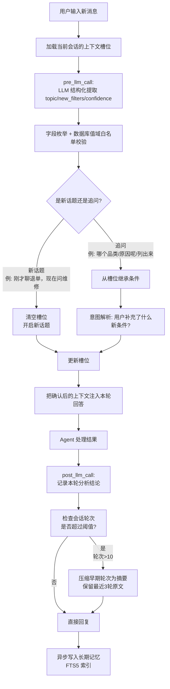

# 05c · 多轮会话上下文继承与意图消歧

> 这个难点的本质是：用户不会一次性把所有条件说清楚。第一轮问"退单量"，第二轮到"哪个品类"，第三轮问"原因呢"，第四轮要"列订单号"。Agent 必须像人一样记住前面聊了什么，自动补全缺失的筛选条件。

---

## 为什么难

1.  **隐含指代**：用户说"它的原因呢"——"它"是上一轮的"空调"还是"退单"？需要做指代消解
    
2.  **嵌套上下文**：连续追问之间可能存在话题切换——"退单量→品类→各品类退单原因→切换到说说维修工单的情况"——Agent 需要识别话题边界
    
3.  **上下文窗口管理**：不能把所有历史对话都塞进 Prompt（会爆 Token、推理变慢），需要做选择性压缩
    
4.  **跨会话延续**：今天问了一半，明天继续追问——需要靠长期记忆检索历史上下文
    

---

## 技术方案

采用 **Hermes Hooks + LLM 结构化槽位（Slot Filling）+ 数据库白名单 + 压缩式上下文摘要**：

每次 Agent 回复后，自动将当前"话题 + 筛选条件 + 分析结论"存入上下文槽位。下一轮对话时，优先从槽位继承条件，识别新条件时更新槽位。当轮次超过阈值时，将早期轮次压缩为摘要而不是生历史。


---

## 实现思路

用 JSON 结构维护"当前会话状态"，包含话题标识、所有有效筛选条件、历史轮次的压缩摘要。Agent 每轮决策前先读这个结构，再决定是继承还是重置。

---

## 落地实现

核心实现拆成 Python 3.11+ 公共包 `packages/suning-context-runtime`。后端的
`backend/src/suning_hermes_agent/conversation_context.py` 只保留兼容导入；Hermes 插件
`.hermes/plugins/suning-rbac-bridge/context_hooks.py` 负责把公共包接进 Agent 生命周期。
MCP 继续保持无状态，只负责鉴权后的业务查询。

### Hooks 接入点

| Hook | 时机 | 职责 |
| --- | --- | --- |
| `pre_llm_call` | Hermes 组织本轮回答前 | 读取 Redis、结构化提取本轮增量、过白名单、合并槽位并返回 `context` 注入本轮消息 |
| `post_llm_call` | Hermes 形成最终回答后 | 保存用户原文、助手回答、回复摘要和轮次，必要时触发历史压缩 |

Hooks 只注入受信的业务上下文，不修改 Hermes 源码，也不修改工具调用参数。Hermes 工具自身的 JSON
Schema 仍是最终参数字段白名单，MCP 服务端 RBAC 仍是数据权限边界。数据库或 LLM 临时失败时，
`pre_llm_call` 最多注入已保存上下文并允许正常回答，不让上下文增强能力拖垮既有工具。

### LLM 结构化提取

公共包的 `create_model()` 统一封装 LangChain `init_chat_model()`；NL2SQL、槽位提取和历史摘要都复用
这个工厂，不再各自拼 HTTP 请求。槽位提取通过 `with_structured_output(SlotExtraction)` 得到：

```json
{
  "topic": "return_analysis",
  "new_filters": {
    "category": "空调",
    "date_range_days": 30,
    "group_by": "reason"
  },
  "confidence": 0.93
}
```

- `topic` 固定为 `return_analysis`、`return_case`、`order_query`、`product_query`、`general`。
- `new_filters` 只允许 Pydantic 模型声明的字段，额外字段直接校验失败。
- 每个话题再用 `TOPIC_ALLOWED_FILTERS` 约束字段，例如 `return_case` 只接受 `return_id`，防止合法字段
  出现在错误话题中。
- 置信度低于 `CONTEXT_SLOT_CONFIDENCE_THRESHOLD`（默认 `0.7`）时，保留当前话题但拒绝本轮全部增量；
  置信度写入上下文用于调试，不会作为 MCP 参数。
- 不提供“删除某个槽位”的指令或能力；本轮明确条件只会覆盖同名值。只有确认发生话题切换时才创建新话题槽位。

### 数据库白名单

`DatabaseWhitelistLoader` 从当前业务库读取品类、区域、品牌、退单原因、订单/退单/退款状态和 SKU，
同时建立名称与编码的规范化映射。LLM 能看到有上限的候选列表，但其结果仍会在代码中二次校验：

- 数据库存在：如 `华东 -> HD`、`质量问题 -> QUALITY`，转换为稳定规范值后写入槽位。
- 数据库不存在：直接丢弃，不把模型虚构的品类、品牌或状态带进回答和工具调用。
- 白名单默认缓存 300 秒，降低每轮查询开销；过期时重新读取数据库。

### 数据结构

| 类型 | 字段 | 作用 |
| --- | --- | --- |
| `ConversationSlot` | `topic`、`filters` | 保存当前标准化话题和仍然有效的筛选条件 |
| `ConversationContext` | `session_id`、`user_id` | 标识会话和用户 |
|  | `slot_confidence` | 保存最近一次槽位识别置信度，不属于工具参数 |
|  | `turn_count` | 记录已完成的会话轮数 |
|  | `compressed_history` | 保存已压缩的早期对话摘要 |
|  | `recent_turns` | 保存尚未压缩的最近原文 |
|  | `max_recent_turns=3` | Prompt 中保留的原文轮数 |
|  | `compress_threshold=10` | 超过该轮数才开始压缩 |

Redis 键固定为 `conv:<session_id>`，TTL 为 3600 秒。保存时使用 `dataclasses.asdict()` 序列化；加载时
显式恢复嵌套的 `ConversationSlot`，避免槽位被错误加载成普通字典。

`topic` 和 `new_filters` 由 LLM 结合当前槽位与用户本轮原文产生，但必须通过上述固定 Schema、
话题字段映射和数据库值域三层检查，不能把整句用户原文直接当作话题或筛选条件。

### 槽位与话题规则

1. 当前还没有话题时，记录 `new_intent` 并合并本轮条件。
2. `new_intent` 与当前 `topic` 相同时，继承旧筛选，并用本轮显式条件覆盖同名字段。
3. 两者不同时，先创建全新的 `ConversationSlot`，再写入新条件；旧话题的筛选和结论不得带入。
4. Agent 回复后，把 `reply_summary` 写入 `last_reply_summary`，同时记录本轮用户原文、助手回复和摘要。
5. `last_reply_summary` 只用于上下文理解；`prepare_turn()` 返回 MCP 参数时必须剔除它，避免把元数据传给
   业务 Tool。

### 历史压缩规则

1. `turn_count <= 10` 时不压缩。
2. 从第 11 轮开始，把最近 3 轮之前的原文压缩为一条摘要。
3. 将待压缩轮次的用户消息、助手回复和 `reply_summary` 通过 LangChain DeepSeek 模型生成不超过 400 个汉字的
   上下文摘要，保留用户目标、话题变化、有效条件、关键结论、修正和未决事项。
4. `build_system_context()` 最多注入最近 3 条历史摘要和最近 3 轮原文；每轮助手原文截取前 200 字。

当前模块完成短期上下文管理。流程图末尾的长期记忆写入仍由
[05e-长期记忆结构化沉淀与召回](./05e-长期记忆结构化沉淀与召回.md) 定义的 Hermes Memory Skill
异步负责，不在本模块内重复实现 FTS5 或 Milvus。

### 验证

`backend/tests/test_conversation_context.py` 覆盖 Redis 往返、追问继承、话题切换、第 10/11 轮压缩
边界、最近三轮保留以及 Prompt 选择性注入；`backend/tests/test_conversation_hooks.py` 覆盖数据库别名、
未知值丢弃、话题字段限制、低置信度降级、跨轮注入、用户隔离和插件 Hook 注册。

---

## 涉及业务模块

*   M1 · 退单分析引擎
    
*   M7 · 长期记忆引擎
