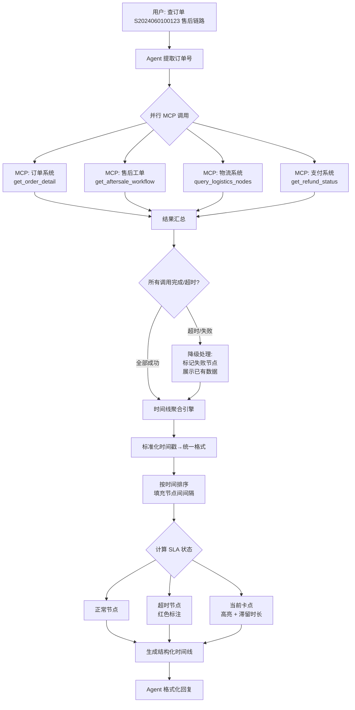

# 05d-跨系统订单全链路串联

# 05d · 跨系统订单全链路数据串联

> 这个难点的本质是：一个订单的售后链路散落在 4 个以上的数据库里——订单库、工单库、物流库、支付库、仓储库。Agent 要一句话把它们串成一条时间线，并行去各系统取数、合并时间线、标注卡点。

---

## 为什么难

1.  **多源异构**：各系统的数据格式不统一——订单系统用"14:23:05"，工单系统用"2024-06-01T14:23:05Z"，物流系统用 Unix 时间戳
    
2.  **部分失败处理**：4 个 MCP 调用可能 1 个超时、1 个返回空——是等重试还是先出部分结果？需要降级策略
    
3.  **数据对齐**：订单号在不同系统里的字段名不一样（`order_id` / `source_order_no` / `trade_id`），需要建立统一的 ID 映射
    
4.  **SLA 计算**：不同品类、不同服务类型的 SLA 标准不同——空调维修的响应时效是 2 小时，小家电换货是 48 小时
    

---

## 技术方案

采用 **并行 MCP 调用 + 结果汇总 + 时间线标准化** 模式：


---

## 实现思路

不串行取数据（那会慢很多），而是通过 asyncio 并发调用所有 MCP 工具，用 `asyncio.wait` 设置超时。收集结果后在内存中做时间线合并。每个节点统一为 `{time, source, status, description}` 的标准格式。

---

## 关键代码示例

```python
# timeline/tracker.py - 跨系统订单全链路追踪

import asyncio
from dataclasses import dataclass
from datetime import datetime
from typing import Optional

@dataclass
class TimelineNode:
    """标准化的时间线节点"""
    timestamp: datetime
    source: str          # order / aftersale / logistics / payment / warehouse
    status: str          # 节点状态描述
    description: str     # 人类可读描述
    sla_status: str      # normal / warning / overrun
    duration_hours: Optional[float] = None  # 距上一节点的耗时

@dataclass
class SLAConfig:
    """不同服务类型的 SLA 标准"""
    apply_to_audit: int = 24       # 申请到审核: 24小时
    audit_to_pickup: int = 48      # 审核到上门取件: 48小时
    pickup_to_warehouse: int = 72  # 取件到仓库签收: 72小时
    warehouse_to_quality: int = 48 # 签收到质检完成: 48小时
    quality_to_refund: int = 24    # 质检通过到退款: 24小时
    total_turnaround: int = 168    # 全流程: 7天


class OrderTimelineTracker:
    """跨系统订单全链路追踪引擎"""

    def __init__(self, mcp_clients: dict):
        self.mcp_clients = mcp_clients  # {"order": client1, "aftersale": client2, ...}

    async def trace(self, order_id: str) -> tuple[list[TimelineNode], Optional[str]]:
        """
        追踪订单售后全链路。
        返回 (时间线节点列表, 错误信息)
        """

        # 并行调用所有 MCP 数据源
        tasks = {
            "order": self.mcp_clients["order"].get_order_detail(order_id),
            "aftersale": self.mcp_clients["aftersale"].get_aftersale_workflow(order_id),
            "logistics": self.mcp_clients["logistics"].query_logistics(order_id),
            "payment": self.mcp_clients["payment"].get_refund_status(order_id),
        }

        results = {}

        errors = [ ]

        timeout = 10  # 每个调用超时10秒

        # asyncio.wait 并发等待
        done, pending = await asyncio.wait(
            [self._safe_call(k, coro) for k, coro in tasks.items()],
            timeout=timeout
        )

        # 收集成功结果和失败信息
        for task in done:
            try:
                source, data = task.result()
                if data:
                    results[source] = data
            except Exception as e:
                errors.append(str(e))

        for task in pending:
            task.cancel()
            errors.append(f"{task} 调用超时")

        # 合并时间线
        timeline = self._merge_timeline(order_id, results)
        error_msg = "; ".join(errors) if errors else None

        return timeline, error_msg

    async def _safe_call(self, source: str, coro):
        """包装 MCP 调用，捕获异常"""
        try:
            result = await coro
            return (source, result)
        except Exception as e:
            raise Exception(f"[{source}] {e}")

    def _merge_timeline(
        self, order_id: str, results: dict
    ) -> list[TimelineNode]:
        """合并多系统数据为统一时间线"""

        nodes = [ ]


        # 订单系统 → 申请/审核节点
        if "order" in results:
            order = results["order"]
            nodes.append(TimelineNode(
                timestamp=self._parse_time(order.get("create_time")),
                source="order",
                status="用户提交退货申请",
                description=f"原因: {order.get('return_reason', '')}",
                sla_status="normal",
            ))
            if order.get("update_time"):
                nodes.append(TimelineNode(
                    timestamp=self._parse_time(order["update_time"]),
                    source="order",
                    status="订单状态更新",
                    description=f"操作人: {order.get('operator_id', '系统')}",
                    sla_status="normal",
                ))

        # 物流系统 → 上门取件/运输节点
        if "logistics" in results:
            for node in results["logistics"]:
                nodes.append(TimelineNode(
                    timestamp=self._parse_time(node["time"]),
                    source="logistics",
                    status=node["status_desc"],
                    description=node.get("operator", ""),
                    sla_status="normal",
                ))

        # 售后工单 → 质检/退款节点
        if "aftersale" in results:
            for step in results["aftersale"]:
                nodes.append(TimelineNode(
                    timestamp=self._parse_time(step["time"]),
                    source="aftersale",
                    status=step["step_name"],
                    description=step.get("remark", ""),
                    sla_status="normal",
                ))

        # 支付系统 → 退款节点
        if "payment" in results:
            payment = results["payment"]
            if payment.get("refund_time"):
                nodes.append(TimelineNode(
                    timestamp=self._parse_time(payment["refund_time"]),
                    source="payment",
                    status=f"退款到账 ¥{payment.get('refund_amount', 0)/100:.2f}",
                    description=f"退款方式: {payment.get('refund_method', '')}",
                    sla_status="normal",
                ))

        # 按时间排序
        nodes.sort(key=lambda n: n.timestamp)

        # 计算节点间耗时 & SLA 状态
        sla_config = SLAConfig()
        for i in range(1, len(nodes)):
            delta = (nodes[i].timestamp - nodes[i-1].timestamp).total_seconds() / 3600
            nodes[i].duration_hours = round(delta, 1)

        # 标记最后一个节点为"当前卡点"
        if nodes:
            last_node = nodes[-1]
            if last_node.source in ("warehouse", "aftersale"):
                last_node.sla_status = "overrun"
                last_node.description += f" [已滞留{last_node.duration_hours}小时]"

        return nodes

    def _parse_time(self, time_val) -> datetime:
        """统一多种时间格式"""
        if isinstance(time_val, (int, float)):
            return datetime.fromtimestamp(time_val)
        if isinstance(time_val, str):
            for fmt in [
                "%Y-%m-%d %H:%M:%S",
                "%Y-%m-%dT%H:%M:%SZ",
                "%Y-%m-%dT%H:%M:%S+08:00",
            ]:
                try:
                    return datetime.strptime(time_val, fmt)
                except ValueError:
                    continue
        return datetime.now()
```
---

## 涉及业务模块

*   M2 · 订单全链路追踪
    
*   M3 · MCP 数据网关
