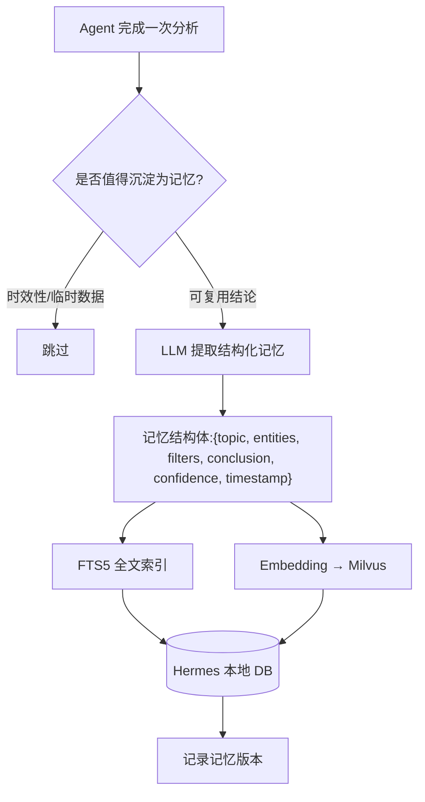
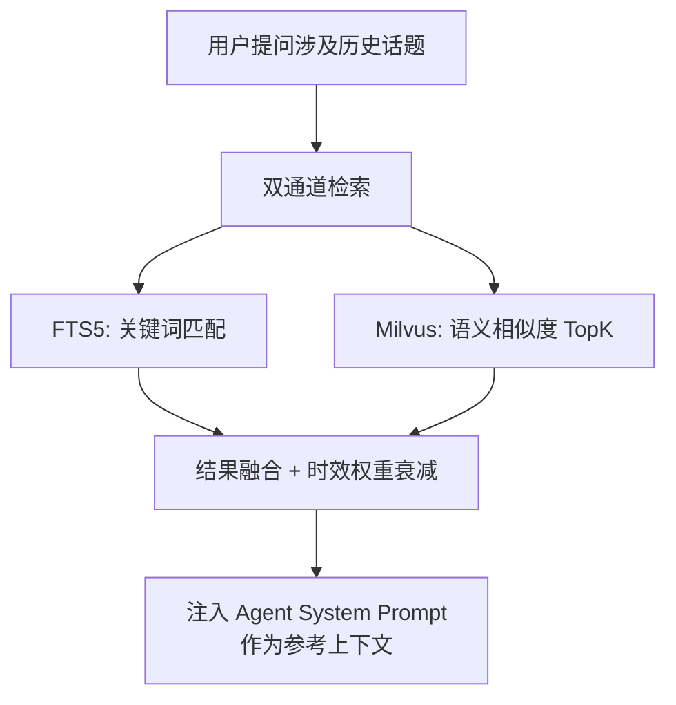

# 05e-长期记忆结构化沉淀与召回

# 05e · 长期记忆的结构化沉淀与语义召回

> 这个难点的本质是：Agent 不能只"记住聊天原文"，要能从对话中抽象出可复用的分析结论。"上次你说空调退单里安装问题占 62%"——这句话的信息密度远超原始聊天记录，而且是结构化的、可被后续查询检索的。

---

## 为什么难

1.  **记忆提取**：什么值得记？"昨天退单 1,283 单"这种时效性数据不适合长期记忆。应该记的是"空调品类退单原因中安装问题长期占比 40%+ 的趋势性结论"
    
2.  **结构化存储**：原始聊天是自然语言，记忆需要结构化为 `{topic, filters, conclusion, timestamp}` 才能被高效检索
    
3.  **语义检索**：用户问"空调退单还是安装问题为主吗"，需要同时命中"空调""退单""安装问题"三个关键词 + 语义相似度
    
4.  **记忆时效衰减**：三个月前的分析结论可能已经过时，召回时应降低权重
    
5.  **记忆冲突**：同一话题可能有多次分析结论，新结论应覆盖或补充旧结论
    

---

## 技术方案

利用 Hermes Agent 内置的 **FTS5 全文检索 + 向量语义检索** 双通道，自建记忆提取与索引管道：

**记忆写入流程：**



**记忆召回流程：**


---

## 实现思路

在 Hermes 的 Skill 系统中注册一个 `memory_extractor` Skill。Agent 每次完成复杂分析后自动触发该 Skill，由 LLM 判断是否值得沉淀、提取结构化摘要、写入记忆库。检索时用 FTS5 搜关键词 + Milvus 搜语义，合并排序后取 Top3 注入上下文。

---

## 关键代码示例

```python
# memory_pipeline.py - 长期记忆提取与检索管道

from dataclasses import dataclass, field
from datetime import datetime, timedelta
from typing import Optional
import json
import math

@dataclass
class MemoryRecord:
    """结构化记忆记录"""
    id: str
    topic: str                    # 话题: return_analysis / order_trace
    entities: list[str]           # 实体: ["空调", "安装问题", "华东区"]
    filters: dict                 # 使用过的筛选条件
    conclusion: str               # 核心结论（自然语言摘要）
    evidence: str                 # 支撑数据（JSON）
    confidence: float             # 置信度 0~1
    created_at: datetime
    updated_at: datetime
    version: int = 1

@dataclass
class RetrievalResult:
    record: MemoryRecord
    score: float                  # 综合检索得分
    source: str                   # fts5 / vector / both


class MemoryPipeline:
    """长期记忆提取与检索管道"""

    DECAY_HALF_LIFE_DAYS = 30     # 记忆半衰期：30天

    def __init__(self, fts5_db, milvus_client, embedder, llm_client):
        self.fts5 = fts5_db
        self.milvus = milvus_client
        self.embedder = embedder
        self.llm = llm_client

    async def extract_memory(
        self, conversation_context: dict
    ) -> Optional[MemoryRecord]:
        """从对话上下文中提取可沉淀的记忆"""

        prompt = f"""判断以下对话是否值得沉淀为长期记忆。只记录具有复用价值的分析结论，不记录时效性的临时数据。

对话摘要: {json.dumps(conversation_context, ensure_ascii=False)}

如果值得记录，返回:
{{
    "should_record": true,
    "topic": "话题类型",
    "entities": ["实体1", "实体2"],
    "conclusion": "一句话核心结论",
    "evidence": {{"key": "value"}},
    "confidence": 0.85
}}

如果不值得记录:
{{"should_record": false}}
"""
        response = await self.llm.chat(prompt)
        result = json.loads(response)

        if not result.get("should_record"):
            return None

        return MemoryRecord(
            id=f"mem_{datetime.now().timestamp()}",
            topic=result["topic"],
            entities=result["entities"],
            filters=conversation_context.get("filters", {}),
            conclusion=result["conclusion"],
            evidence=result.get("evidence", {}),
            confidence=result["confidence"],
            created_at=datetime.now(),
            updated_at=datetime.now(),
        )

    async def store(self, record: MemoryRecord):
        """存储记忆到 FTS5 + Milvus"""

        # FTS5 全文索引
        self.fts5.execute("""
            INSERT INTO memories (id, topic, entities, conclusion, created_at, metadata)
            VALUES (?, ?, ?, ?, ?, ?)
        """, (
            record.id,
            record.topic,
            json.dumps(record.entities),
            record.conclusion,
            record.created_at.isoformat(),
            json.dumps(record.__dict__, default=str),
        ))

        # Milvus 向量索引
        embedding = await self.embedder.embed(record.conclusion)
        self.milvus.insert(
            collection_name="memory_vectors",
            data=[{
                "id": record.id,
                "vector": embedding,
                "topic": record.topic,
                "timestamp": int(record.created_at.timestamp()),
            }]
        )

    async def retrieve(
        self, query: str, top_k: int = 3
    ) -> list[RetrievalResult]:
        """双通道检索：FTS5 + 向量，合并排序"""

        # 通道1: FTS5 关键词检索
        fts5_results = self.fts5.execute("""
            SELECT id, topic, entities, conclusion, created_at,
                   bm25(memories) as score
            FROM memories
            WHERE memories MATCH ?
            ORDER BY score
            LIMIT ?
        """, (query, top_k * 2))

        # 通道2: Milvus 语义检索
        query_vector = await self.embedder.embed(query)
        milvus_results = self.milvus.search(
            collection_name="memory_vectors",
            data=[query_vector],
            limit=top_k * 2,
            output_fields=["id", "topic", "timestamp"],
        )

        # 合并 + 时效权重衰减
        merged = {}
        for row in fts5_results:
            merged[row["id"]] = {
                "score": row["score"] * 0.5,  # 关键词权重 0.5
                "source": "fts5",
            }
        for hit in milvus_results[0]:
            merged.setdefault(hit.id, {"score": 0, "source": "vector"})
            merged[hit.id]["score"] += hit.distance * 0.5  # 语义权重 0.5
            merged[hit.id]["source"] = "both" if merged[hit.id]["source"] == "fts5" else "vector"

        # 时效衰减: score *= e^(-λt), λ = ln(2)/30天
        now = datetime.now()
        for mem_id in merged:
            record = await self._load_record(mem_id)
            if record:
                age_days = (now - record.created_at).days
                decay = math.exp(-math.log(2) * age_days / self.DECAY_HALF_LIFE_DAYS)
                merged[mem_id]["score"] *= decay

        # 排序取 TopK
        sorted_ids = sorted(merged.items(), key=lambda x: x[1]["score"], reverse=True)[:top_k]

        results = [ ]

        for mem_id, info in sorted_ids:
            record = await self._load_record(mem_id)
            if record:
                results.append(RetrievalResult(
                    record=record,
                    score=info["score"],
                    source=info["source"],
                ))

        return results
```
---

## 涉及业务模块

*   M7 · 长期记忆引擎
    
*   M1 · 退单分析引擎
    
*   M2 · 订单全链路追踪