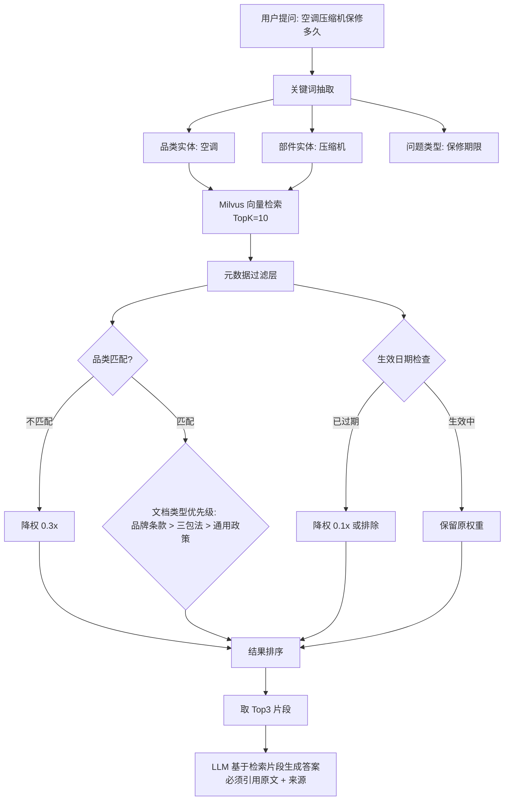

# 05f-售后知识库RAG精准检索

# 05f · 售后知识库 RAG 精准检索

> 这个难点的本质是：售后领域有大量法规条款、品牌政策、维修手册需要检索。用户问"空调整机保修几年"——三包法说 6 年，但某品牌有额外延保到 10 年的政策。RAG 必须精准召回最匹配的条款，不能只返回泛泛的法律条文。

---

## 为什么难

1.  **条款碎片化**：三包法是完整文档，但用户问的是"压缩机保修多久"——需要从整机保修、主要部件保修、品牌特殊政策三个来源检索，不能只切一个 chunk
    
2.  **规则冲突**：通用三包法 vs 品牌特殊政策 vs 苏宁自有售后承诺——三者优先级不同，RAG 需要标注每条规则的适用范围和优先级
    
3.  **时效性**：以旧换新补贴政策每个月可能变，召回时必须检查文档的生效日期
    
4.  **答案需要可溯源的原文引用**：Agent 不能说"根据相关规定保修期是X年"，必须引用具体条款编号和原文
    

---

## 技术方案

采用 **多级文档索引 + 元数据过滤 + 混合检索（向量+关键词）** 策略：


---

## 实现思路

知识库入库时就对每份文档打上元数据标签（品类、品牌、文档类型、生效日期、优先级）。检索时不只做向量相似度，还叠加元数据过滤层做二次排序。最终答案由 LLM 基于 Top3 片段生成，强制引用来源。

---

## 关键代码示例

```python
# knowledge_rag.py - 售后知识库 RAG 检索

from dataclasses import dataclass, field
from datetime import datetime
from enum import Enum
from typing import Optional

class DocType(Enum):
    NATIONAL_LAW = "national_law"        # 国家法规（三包法）
    BRAND_POLICY = "brand_policy"         # 品牌特殊政策
    SUNING_POLICY = "suning_policy"       # 苏宁自有售后政策
    REPAIR_MANUAL = "repair_manual"       # 维修手册
    FAQ = "faq"                           # 常见问题

PRIORITY_WEIGHTS = {
    DocType.BRAND_POLICY: 1.0,
    DocType.SUNING_POLICY: 0.9,
    DocType.REPAIR_MANUAL: 0.8,
    DocType.NATIONAL_LAW: 0.7,
    DocType.FAQ: 0.5,
}

@dataclass
class KnowledgeChunk:
    """知识库中的一个文档片段"""
    chunk_id: str
    content: str
    doc_type: DocType
    category: Optional[str]       # 适用品类（空调/冰箱/洗衣机/...）
    brand: Optional[str]          # 适用品牌（美的/格力/海尔/...）
    effective_date: datetime      # 生效日期
    expire_date: Optional[datetime]  # 失效日期（None=长期有效）
    source_title: str             # 来源文档标题
    article_number: Optional[str] # 条款编号（如"第二十三条"）


class KnowledgeRAG:
    """售后知识库 RAG 检索器"""

    def __init__(self, milvus_client, embedder):
        self.milvus = milvus_client
        self.embedder = embedder

    async def search(
        self, query: str, entities: dict, top_k: int = 5
    ) -> list[tuple[KnowledgeChunk, float]]:
        """
        混合检索知识库。
        entities: {"category": "空调", "brand": "格力", "component": "压缩机"}
        """

        # 1. 向量语义检索
        query_vector = await self.embedder.embed(query)
        vector_results = self.milvus.search(
            collection_name="knowledge_chunks",
            data=[query_vector],
            limit=top_k * 3,
            output_fields=[
                "chunk_id", "content", "doc_type", "category",
                "brand", "effective_date", "expire_date",
                "source_title", "article_number",
            ],
        )

        # 2. 元数据二次过滤 + 重排序

        scored = [ ]

        now = datetime.now()

        for hit in vector_results[0]:
            chunk = KnowledgeChunk(
                chunk_id=hit.id,
                content=hit.entity.get("content", ""),
                doc_type=DocType(hit.entity.get("doc_type", "faq")),
                category=hit.entity.get("category"),
                brand=hit.entity.get("brand"),
                effective_date=datetime.fromtimestamp(hit.entity.get("effective_date", 0)),
                expire_date=(
                    datetime.fromtimestamp(hit.entity["expire_date"])
                    if hit.entity.get("expire_date") else None
                ),
                source_title=hit.entity.get("source_title", ""),
                article_number=hit.entity.get("article_number"),
            )

            score = hit.distance  # 向量相似度

            # 品类匹配加权
            if entities.get("category") and chunk.category:
                if entities["category"] == chunk.category:
                    score *= 1.5
                else:
                    score *= 0.3

            # 品牌匹配加权
            if entities.get("brand") and chunk.brand:
                if entities["brand"] == chunk.brand:
                    score *= 1.3

            # 文档类型优先级加权
            priority = PRIORITY_WEIGHTS.get(chunk.doc_type, 0.5)
            score *= priority

            # 时效性检查
            if chunk.expire_date and chunk.expire_date < now:
                score *= 0.1  # 已失效，大幅降权
            elif chunk.effective_date > now:
                score *= 0.1  # 尚未生效

            scored.append((chunk, score))

        # 排序取 TopK
        scored.sort(key=lambda x: x[1], reverse=True)
        return scored[:top_k]

    def build_answer_prompt(
        self, query: str, chunks: list[tuple[KnowledgeChunk, float]]
    ) -> str:
        """基于检索片段构建带引用来源的答案生成 Prompt"""


        context_parts = [ ]

        for i, (chunk, score) in enumerate(chunks):
            source = f"{chunk.source_title}"
            if chunk.article_number:
                source += f" {chunk.article_number}"
            context_parts.append(
                f"[来源{i+1}] {source}\n{chunk.content}"
            )

        context_text = "\n\n---\n\n".join(context_parts)

        prompt = f"""请基于以下检索到的售后政策/法规片段回答用户问题。
必须在答案中引用具体来源（如"根据《部分商品修理更换退货责任规定》第二十三条..."）。

可用的参考资料:
{context_text}

用户问题: {query}

请用中文回答，简洁准确，必须标注来源编号。"""
        return prompt
```
---

## 涉及业务模块

*   M5 · 售后知识 RAG
    
*   M1 · 退单分析引擎