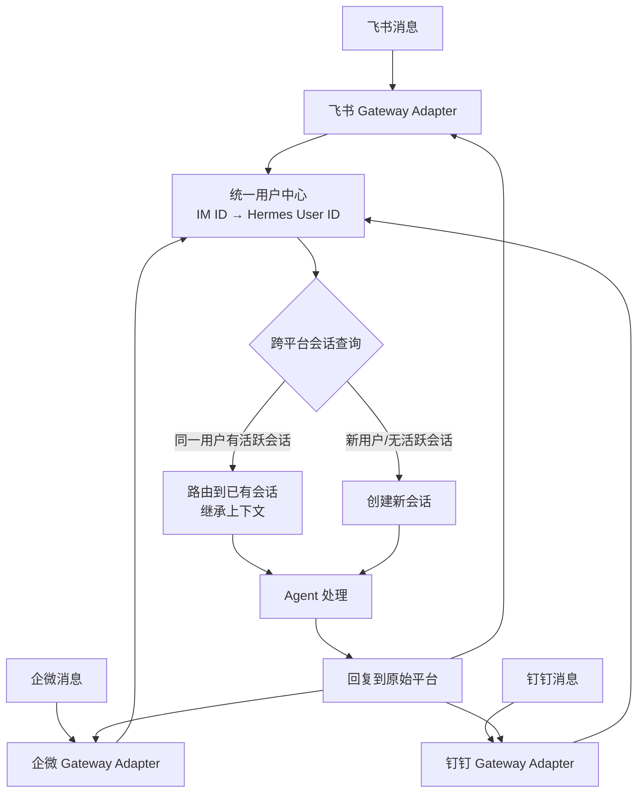

# 05g-多IM平台身份统一与会话延续

## 当前状态与后续约定

> 归档日期：2026-08-14

- 本项目已完成 `user_platform_binding -> user_identity -> hermes_user_id` 的身份映射，并已用于 MCP RBAC、短期上下文和长期记忆。
- 飞书、企微与钉钉 Gateway 稳定收发消息后，插件会复用现有身份表和解析逻辑；不新建统一用户中心。
- 仅私聊使用 Redis `im:active-session:<hermes_user_id>` 维护 30 分钟活跃上下文路由；群聊使用用户隔离的群内上下文，绝不恢复私聊上下文。
- 第一阶段不修改 Hermes 源码，不强求跨平台共享 Hermes 完整 transcript；跨平台共享的是结构化上下文和用户级长期记忆。
- 未绑定、已停用身份由 `pre_tool_call` 在工具执行前阻断，并由输出 Hook 固定回复未授权；群聊不恢复私聊上下文；不根据手机号或姓名自动合并用户。

后续提到“多 IM 平台身份统一”时，以本节为恢复开发的默认基线。

# 05g · 多IM平台身份统一与会话延续

> 这个难点的本质是：用户可能在飞书上问了一半"空调退单原因是什么"，然后切到钉钉继续问"那安装问题具体是哪些型号"。Agent 必须认出是同一个人、接上之前的会话。三个IM平台各有各的用户体系和 Token 机制，把它们统一到一个用户身份下是件脏活。

---

## 为什么难

1.  **ID 体系不互通**：飞书用 `open_id`，企微用 `userid`，钉钉用 `unionid`——三个完全独立的命名空间
    
2.  **Token 生命周期不一致**：飞书 access\_token 有效期 2 小时，企微 7200 秒，钉钉 7200 秒——需要各自的刷新逻辑
    
3.  **跨平台会话延续**：用户在飞书聊了 5 轮，切到钉钉发"继续刚才的话题"——怎么找到刚才的会话？
    
4.  **安全风险**：不能因为用户在不同平台用同一个手机号就认为是同一个人——需要管理员在后台做显式绑定
    

---

## 技术方案

采用 **统一用户中心 + 平台账号绑定 + 会话路由** 架构：


---

## 实现思路

在 MySQL 中维护一张 `user_identity` 表，记录每个 Hermes 内部用户 ID 关联了哪些 IM 平台的账号。管理员在后台完成绑定操作（首次使用或换平台时）。Gateway 层收到消息后先查统一用户中心，拿到 Hermes User ID 后再查该用户当前是否有活跃会话，有则路由到已有会话。

---

## 关键代码示例

```python
# unified_identity.py - 多平台身份统一与会话路由

from dataclasses import dataclass
from datetime import datetime, timedelta
from enum import Enum
from typing import Optional
import hashlib

class Platform(Enum):
    FEISHU = "feishu"
    WECOM = "wecom"
    DINGTALK = "dingtalk"

@dataclass
class UserIdentity:
    """统一用户身份"""
    hermes_user_id: str          # Hermes 内部用户ID
    employee_id: str             # 苏宁员工工号
    display_name: str
    bindings: dict               # {Platform.FEISHU: "ou_xxx", Platform.WECOM: "zhangsan", ...}
    role: str                    # 售后运营 / 区域经理 / ...
    permissions: dict            # 权限数据范围
    created_at: datetime
    is_active: bool = True

@dataclass
class ActiveSession:
    """活跃会话"""
    session_id: str
    hermes_user_id: str
    last_platform: Platform
    last_active: datetime
    topic: str
    turn_count: int


class UnifiedUserCenter:
    """统一用户中心"""

    def __init__(self, mysql_conn, redis_client):
        self.db = mysql_conn
        self.redis = redis_client

    async def resolve_user(
        self, platform: Platform, platform_user_id: str
    ) -> Optional[UserIdentity]:
        """根据 IM 平台 ID 解析为 Hermes 统一用户"""

        # 1. 查 Redis 缓存
        cache_key = f"user:bind:{platform.value}:{platform_user_id}"
        cached = self.redis.get(cache_key)
        if cached:
            return UserIdentity(**__import__('json').loads(cached))

        # 2. 查 MySQL
        row = await self.db.fetch_one("""
            SELECT ui.* FROM user_identity ui
            JOIN user_platform_binding upb ON ui.hermes_user_id = upb.hermes_user_id
            WHERE upb.platform = ? AND upb.platform_user_id = ? AND ui.is_active = 1
        """, (platform.value, platform_user_id))

        if not row:
            return None

        identity = UserIdentity(**row)
        self.redis.setex(cache_key, 3600, __import__('json').dumps(row))
        return identity

    async def bind_platform(
        self, hermes_user_id: str, platform: Platform, platform_user_id: str
    ):
        """管理员绑定 IM 平台账号到 Hermes 用户"""
        await self.db.execute("""
            INSERT INTO user_platform_binding (hermes_user_id, platform, platform_user_id)
            VALUES (?, ?, ?)
            ON DUPLICATE KEY UPDATE platform_user_id = ?
        """, (hermes_user_id, platform.value, platform_user_id, platform_user_id))

        self.redis.delete(f"user:bind:{platform.value}:{platform_user_id}")

    async def find_or_route_session(
        self, user_id: str, platform: Platform
    ) -> tuple[str, bool]:
        """
        查找或路由活跃会话。
        返回 (session_id, is_new_session)
        """
        # 查找该用户最近30分钟内有活动的会话
        cutoff = datetime.now() - timedelta(minutes=30)
        row = await self.db.fetch_one("""
            SELECT session_id FROM active_sessions
            WHERE hermes_user_id = ? AND last_active > ?
            ORDER BY last_active DESC LIMIT 1
        """, (user_id, cutoff))

        if row:
            # 有活跃会话：更新最后活跃时间 + 平台
            await self.db.execute("""
                UPDATE active_sessions
                SET last_platform = ?, last_active = ?
                WHERE session_id = ?
            """, (platform.value, datetime.now(), row["session_id"]))
            return row["session_id"], False

        # 没有活跃会话：创建新会话
        session_id = self._generate_session_id(user_id)
        await self.db.execute("""
            INSERT INTO active_sessions (session_id, hermes_user_id, last_platform, last_active, topic, turn_count)
            VALUES (?, ?, ?, ?, '', 0)
        """, (session_id, user_id, platform.value, datetime.now()))
        return session_id, True

    def _generate_session_id(self, user_id: str) -> str:
        raw = f"{user_id}:{datetime.now().timestamp()}"
        return hashlib.sha256(raw.encode()).hexdigest()[:16]


# Gateway 层的使用示例
async def on_message_received(platform: Platform, raw_msg: dict):
    user_center = UnifiedUserCenter(db, redis)
    context_manager = ContextManager(redis)

    # 1. 解析用户身份
    platform_user_id = raw_msg.get("sender_id")
    user = await user_center.resolve_user(platform, platform_user_id)
    if not user:
        return {"text": "未授权用户，请联系管理员绑定账号"}

    # 2. 路由会话
    session_id, is_new = await user_center.find_or_route_session(
        user.hermes_user_id, platform
    )

    # 3. 加载会话上下文
    ctx = context_manager.load_context(session_id)

    # 4. 如果跨平台恢复会话，注入提示
    if not is_new and ctx.slots.last_platform != platform:
        await send_message(platform, raw_msg["channel_id"],
            f"[检测到您从 {ctx.slots.last_platform} 切换到 {platform}，已恢复之前的会话]")

    # 5. 交给 Agent 处理
    return await agent_router.handle(user, ctx, raw_msg["text"])
```
---

## 涉及业务模块

*   M4 · 多平台接入网关
    
*   M6 · 权限管控引擎
    
*   M7 · 长期记忆引擎
