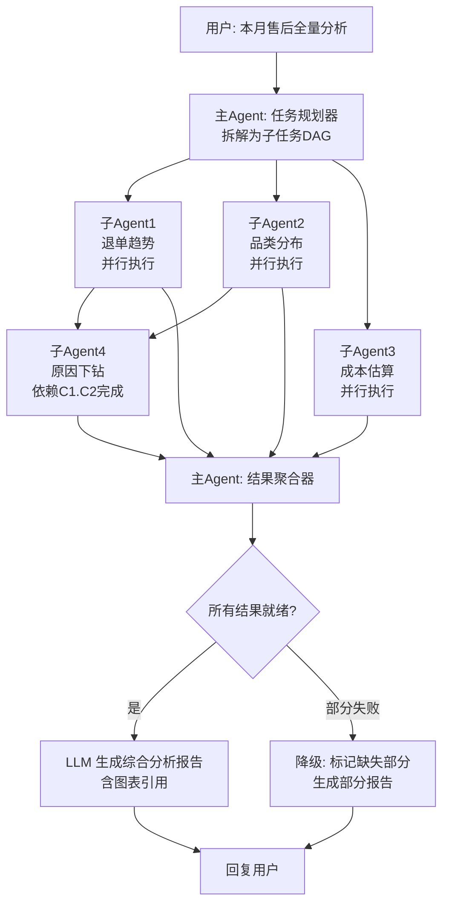

# 05h-复杂分析任务多Agent编排

## 当前实现状态

- `orchestrate_aftersale_analysis` 已在飞书、企微和钉钉的可信会话中启用；不再按平台返回占位。
- 三个平台共用受限 DAG、子 Agent 工具白名单、单节点/全局超时、摘要压缩和部分失败降级。
- 子 Agent 继续通过已有 MCP RBAC 获取统一用户身份，不自行接收平台用户 ID。

# 05h · 复杂分析任务的多 Agent 协作编排

> 这个难点的本质是：用户一句话"帮我做本月售后全量分析"背后是 5 个以上的子任务——退单趋势、品类分布、原因分析、成本估算、图表生成。一个 Agent 串行做太慢，需要拆成多个子 Agent 并行执行，然后由主 Agent 聚合。

---

## 为什么难

1.  **任务拆解**：LLM 需要把"全量分析"拆成可并行执行的子任务，拆多了浪费、拆少了串行慢
    
2.  **依赖编排**：有些子任务有依赖关系——"退单最多的品类"先算出来，然后才能对那个品类做"原因下钻"
    
3.  **结果聚合**：5 个子 Agent 各自返回不同格式的结果，主 Agent 要把它们拼成一个连贯的分析报告
    
4.  **部分失败降级**：某个子 Agent 超时或报错，不能整个任务崩溃——应该标记"此部分数据暂时不可用"继续出其他结果
    
5.  **Token 成本**：不能把 5 个子 Agent 的完整结果都塞进主 Agent 的上下文——需要压缩摘要
    

---

## 技术方案

利用 Hermes Agent 的 **子 Agent 派发（Sub-agent Spawning）** 能力，结合任务 DAG（有向无环图）编排：


---

## 实现思路

主 Agent 用 LLM 生成任务的 DAG（JSON 描述每个子任务的类型、依赖、超时时间），然后按拓扑序派发子 Agent。Hermes 原生支持 `spawn_subagent` 方法。所有子任务完成后，主 Agent 对结果做摘要压缩后生成最终报告。

---

## 关键代码示例

```python
# task_orchestrator.py - 多 Agent 任务编排

from dataclasses import dataclass, field
from enum import Enum
from typing import Optional
import asyncio
import json

class TaskStatus(Enum):
    PENDING = "pending"
    RUNNING = "running"
    SUCCESS = "success"
    FAILED = "failed"
    TIMEOUT = "timeout"

@dataclass
class SubTask:
    """DAG 中的子任务节点"""
    task_id: str
    task_type: str               # trend_analysis / category_breakdown / reason_drilldown / cost_estimation / chart_gen
    description: str
    dependencies: list[str] = field(default_factory=list)  # 依赖的 task_id 列表
    timeout: int = 30            # 超时秒数
    status: TaskStatus = TaskStatus.PENDING
    result: Optional[dict] = None
    error: Optional[str] = None

@dataclass
class TaskDAG:
    """任务有向无环图"""
    root_task: str               # 用户原始问题
    sub_tasks: list[SubTask]
    global_timeout: int = 120    # 总超时

class TaskOrchestrator:
    """多 Agent 任务编排器"""

    def __init__(self, llm_client, agent_factory):
        self.llm = llm_client
        self.agent_factory = agent_factory  # 创建子 Agent 的工厂

    async def plan(self, user_query: str) -> TaskDAG:
        """使用 LLM 将用户请求拆解为子任务 DAG"""
        prompt = f"""将以下用户的分析请求拆解为子任务 DAG。每个子任务独立可执行，标注依赖关系。

可用子任务类型:
- trend_analysis: 趋势分析（退单量/金额随时间变化）
- category_breakdown: 品类分布（按品类聚合）
- reason_drilldown: 原因下钻（某品类/型号的退单原因分布）
- cost_estimation: 成本估算（退单金额汇总）
- chart_gen: 图表生成

返回 JSON 格式:
{{
    "sub_tasks": [

        {{"task_id": "t1", "task_type": "trend_analysis", "description": "...", "dependencies": [ ]}},


        {{"task_id": "t2", "task_type": "category_breakdown", "description": "...", "dependencies": [ ]}},

        {{"task_id": "t3", "task_type": "reason_drilldown", "description": "...", "dependencies": ["t1", "t2"]}},
    ]
}}

用户请求: {user_query}"""

        response = await self.llm.chat(prompt)
        plan = json.loads(response)

        sub_tasks = [
            SubTask(
                task_id=t["task_id"],
                task_type=t["task_type"],
                description=t["description"],

                dependencies=t.get("dependencies", [ ]),

            )
            for t in plan["sub_tasks"]
        ]

        return TaskDAG(root_task=user_query, sub_tasks=sub_tasks)

    async def execute(self, dag: TaskDAG, user_context: dict) -> dict:
        """
        按拓扑序执行 DAG。
        无依赖的子任务并行执行，有依赖的等前置完成再执行。
        """
        completed = {}  # task_id → result
        failed = {}     # task_id → error
        remaining = list(dag.sub_tasks)

        # 拓扑执行
        while remaining:
            # 找出当前轮次可执行的子任务（所有依赖已完成）
            ready = [
                t for t in remaining
                if all(dep in completed for dep in t.dependencies)
            ]

            if not ready:
                # 有循环依赖或所有剩余任务都有失败的前置
                for t in remaining:
                    dep_failed = [
                        dep for dep in t.dependencies if dep in failed
                    ]
                    if dep_failed:
                        failed[t.task_id] = f"前置任务失败: {dep_failed}"
                break

            # 并行执行
            results = await asyncio.gather(
                *[self._execute_subtask(t, user_context) for t in ready],
                return_exceptions=True,
            )

            for task, result in zip(ready, results):
                if isinstance(result, Exception):
                    failed[task.task_id] = str(result)
                    task.status = TaskStatus.FAILED
                    task.error = str(result)
                else:
                    completed[task.task_id] = result
                    task.status = TaskStatus.SUCCESS
                    task.result = result

                remaining.remove(task)

        # 聚合结果
        return await self._aggregate(dag, completed, failed)

    async def _execute_subtask(
        self, task: SubTask, user_context: dict
    ) -> dict:
        """执行单个子任务——派发子 Agent"""

        # 注入前置任务的结果作为上下文
        context_extra = ""
        for dep_id in task.dependencies:
            if hasattr(self, "_completed_cache") and dep_id in self._completed_cache:
                context_extra += f"\n前置分析结果[{dep_id}]: {json.dumps(self._completed_cache[dep_id], ensure_ascii=False)}"

        sub_agent = self.agent_factory.create(
            task_type=task.task_type,
            system_prompt=f"你是{task.description}的专用Agent。简洁输出JSON格式结果。{context_extra}",
            user_context=user_context,
        )

        try:
            result = await asyncio.wait_for(
                sub_agent.run(task.description),
                timeout=task.timeout,
            )
            return result
        except asyncio.TimeoutError:
            raise Exception(f"子任务 {task.task_id} 超时 ({task.timeout}s)")

    async def _aggregate(
        self, dag: TaskDAG, completed: dict, failed: dict
    ) -> dict:
        """聚合所有子任务结果为综合分析报告"""


        success_parts = [ ]

        for tid, result in completed.items():
            # 对每个成功结果做摘要压缩
            summary = await self._summarize_result(result)
            success_parts.append(f"## {tid}\n{summary}")


        failed_parts = [ ]

        for tid, error in failed.items():
            failed_parts.append(f"## {tid}\n[数据暂不可用: {error}]")

        all_parts = success_parts + failed_parts

        report_prompt = f"""根据以下子分析结果，生成一份连贯的综合分析报告。

{chr(10).join(all_parts)}

要求:
1. 有总体概览和关键发现
2. 用数据支撑结论
3. 标注哪些数据暂不可用
4. 给出 2-3 条建议"""

        return await self.llm.chat(report_prompt)
```
---

## 涉及业务模块

*   M1 · 退单分析引擎
    
*   M2 · 订单全链路追踪
    
*   M8 · 定时报告推送
