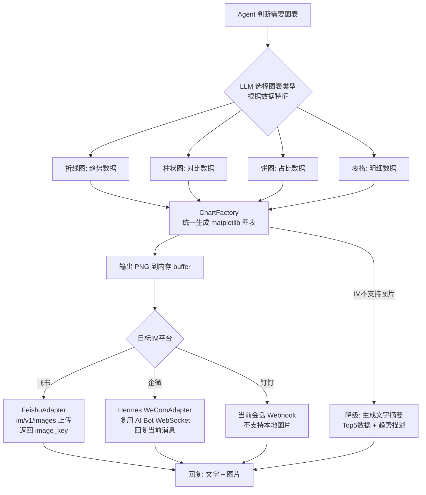

# 05i-图表生成与多IM适配

## 当前实现状态

- 飞书保持内存双分辨率 PNG 上传与当前消息回复。
- 企微复用 Hermes 已连接的 WeCom AI Bot WebSocket，以当前 `chat_id` / `message_id` 上传并回复移动版 PNG，不要求 `WECOM_CORP_SECRET` 或 `WECOM_AGENT_ID`；图片限制为 2MB。
- Hermes 的企微公开图片接口只接收路径，因此内存 PNG 仅在发送期间写入临时文件，等待上传完成后立即删除；这是相对“完全不落盘”要求无法绕过的最小偏差。
- 当前 Hermes 钉钉会话 Webhook 不支持本地图片上传，按本文降级策略返回 Top5 文字摘要，不伪造发送成功。

# 05i · 图表生成与多IM适配输出

> 这个难点的本质是：用户说"拉个趋势图"，Agent 要在服务端生成图表图片，然后通过飞书/企微/钉钉各自的上传接口发回去。三家 IM 的图片上传 API 不一样、支持的图片格式不一样、移动端渲染效果不一样——一套图表生成逻辑要适配三个输出渠道。

---

## 为什么难

1.  **中文渲染**：matplotlib 默认字体不支持中文，服务端必须配置中文字体（如 SimHei/WenQuanYi），否则图表里全是方块
    
2.  **IM API 差异**：飞书用 `im/v1/images` 上传图片返回 `image_key`；当前企微接入是 AI Bot WebSocket，媒体上传和回复由 Hermes 适配器完成；当前钉钉会话 Webhook 不支持本地图片上传
    
3.  **移动端适配**：飞书手机端图表渲染尺寸跟电脑端不同，需要生成多套分辨率
    
4.  **图表类型自动选择**：LLM 需要根据数据特征自动选合适的图表类型——趋势用折线图、占比用饼图、对比用柱状图、分布用箱线图
    
5.  **降级策略**：如果 IM 不支持图片（如纯文字版钉钉旧版），需要降级为文字摘要
    

---

## 技术方案

采用 **图表生成工厂 + IM 适配器模式**：


---

## 实现思路

用 matplotlib 做核心渲染，封装一个 ChartFactory 根据数据类型自动排版。飞书直接上传内存 PNG；企微把移动版 PNG 交给 Hermes 已连接的 WeCom AI Bot 适配器。由于该适配器公开接口只接收路径，企微发送会创建单次临时 PNG，并在等待 WebSocket 上传完成后立即删除。中文字体在 Dockerfile 中预装。

---

## 关键代码示例

```python
# chart_factory.py - 图表生成工厂

import io
from enum import Enum
from typing import Optional
import matplotlib
matplotlib.use("Agg")  # 无 GUI 后端
import matplotlib.pyplot as plt
import matplotlib.font_manager as fm
import numpy as np

class ChartType(Enum):
    LINE = "line"           # 折线图：趋势
    BAR = "bar"             # 柱状图：对比
    HORIZONTAL_BAR = "hbar" # 横向柱状图：TopN排名
    PIE = "pie"             # 饼图：占比
    TABLE = "table"         # 表格：明细

class ChartFactory:
    """图表生成工厂"""

    # 预设配色方案（苏宁品牌色系）
    COLORS = ["#FF6600", "#2879FF", "#FFB300", "#00C48C", "#FF5C8D",
              "#8B5CF6", "#0EA5E9", "#F97316", "#22C55E", "#EF4444"]

    def __init__(self):
        self._setup_chinese_font()

    def _setup_chinese_font(self):
        """配置中文字体"""
        # Docker 中预装了 WenQuanYi Micro Hei
        font_paths = [
            "/usr/share/fonts/truetype/wqy/wqy-microhei.ttc",
            "/usr/share/fonts/opentype/noto/NotoSansCJK-Regular.ttc",
            "C:/Windows/Fonts/simhei.ttf",  # Windows 开发环境
        ]
        for path in font_paths:
            try:
                fm.fontManager.addfont(path)
                prop = fm.FontProperties(fname=path)
                plt.rcParams["font.family"] = prop.get_name()
                break
            except Exception:
                continue
        plt.rcParams["axes.unicode_minus"] = False

    def generate(
        self, chart_type: ChartType, data: dict, title: str = "",
        width: int = 10, height: int = 6,
    ) -> bytes:
        """生成图表并返回 PNG bytes"""

        fig, ax = plt.subplots(figsize=(width, height))

        if chart_type == ChartType.LINE:
            self._draw_line(ax, data)
        elif chart_type == ChartType.BAR:
            self._draw_bar(ax, data)
        elif chart_type == ChartType.HORIZONTAL_BAR:
            self._draw_hbar(ax, data)
        elif chart_type == ChartType.PIE:
            self._draw_pie(ax, data)
        elif chart_type == ChartType.TABLE:
            self._draw_table(ax, data)

        if title:
            ax.set_title(title, fontsize=14, fontweight="bold", pad=15)

        plt.tight_layout()

        buf = io.BytesIO()
        fig.savefig(buf, format="png", dpi=120, bbox_inches="tight")
        plt.close(fig)
        buf.seek(0)
        return buf.read()

    def _draw_line(self, ax, data: dict):
        """折线图: {labels: [...], values: [...], xlabel: str, ylabel: str}"""
        ax.plot(data["labels"], data["values"],
                marker="o", linewidth=2, color=self.COLORS[0],
                markersize=6, markerfacecolor="white",
                markeredgewidth=2, markeredgecolor=self.COLORS[0])
        ax.set_xlabel(data.get("xlabel", ""))
        ax.set_ylabel(data.get("ylabel", ""))
        ax.grid(True, alpha=0.3)
        ax.tick_params(axis="x", rotation=30)

    def _draw_bar(self, ax, data: dict):
        """柱状图: {labels: [...], values: [...], xlabel, ylabel}"""
        bars = ax.bar(data["labels"], data["values"],
                      color=self.COLORS[:len(data["labels"])],
                      edgecolor="white", linewidth=0.5)
        ax.set_xlabel(data.get("xlabel", ""))
        ax.set_ylabel(data.get("ylabel", ""))
        # 柱顶标注数值
        for bar, val in zip(bars, data["values"]):
            ax.text(bar.get_x() + bar.get_width()/2, bar.get_height() + 0.5,
                    str(val), ha="center", va="bottom", fontsize=9)
        ax.tick_params(axis="x", rotation=30)

    def _draw_hbar(self, ax, data: dict):
        """横向柱状图: {labels: [...], values: [...]} 适合 TopN 排名"""
        labels = data["labels"]
        values = data["values"]
        y_pos = range(len(labels))
        ax.barh(y_pos, values, color=self.COLORS[:len(labels)], edgecolor="white")
        ax.set_yticks(y_pos)
        ax.set_yticklabels(labels)
        ax.invert_yaxis()  # 最大值在上
        for i, v in enumerate(values):
            ax.text(v + 0.5, i, str(v), va="center", fontsize=9)

    def _draw_pie(self, ax, data: dict):
        """饼图: {labels: [...], values: [...], title}"""
        wedges, texts, autotexts = ax.pie(
            data["values"], labels=data["labels"],
            autopct="%1.1f%%", colors=self.COLORS[:len(data["labels"])],
            startangle=90, pctdistance=0.85,
        )
        for t in autotexts:
            t.set_fontsize(9)


# im_adapters.py - 多IM平台图片上传适配器

from abc import ABC, abstractmethod
import httpx

class IMImageAdapter(ABC):
    """IM 图片上传适配器基类"""

    @abstractmethod
    async def upload_image(self, image_bytes: bytes, filename: str = "chart.png") -> str:
        """上传图片，返回 IM 平台的图片标识符"""
        pass

    @abstractmethod
    def build_image_message(self, text: str, image_id: str) -> dict:
        """构建包含图片的回复消息体"""
        pass


class FeishuImageAdapter(IMImageAdapter):
    """飞书图片上传"""

    def __init__(self, app_id: str, app_secret: str):
        self.app_id = app_id
        self.app_secret = app_secret
        self.base_url = "https://open.feishu.cn/open-apis"

    async def _get_tenant_token(self) -> str:
        async with httpx.AsyncClient() as client:
            resp = await client.post(
                f"{self.base_url}/auth/v3/tenant_access_token/internal",
                json={"app_id": self.app_id, "app_secret": self.app_secret},
            )
            return resp.json()["tenant_access_token"]

    async def upload_image(self, image_bytes: bytes, filename: str = "chart.png") -> str:
        token = await self._get_tenant_token()
        async with httpx.AsyncClient() as client:
            resp = await client.post(
                f"{self.base_url}/im/v1/images",
                headers={"Authorization": f"Bearer {token}"},
                files={"image": (filename, image_bytes, "image/png")},
                data={"image_type": "message"},
            )
            return resp.json()["data"]["image_key"]

    def build_image_message(self, text: str, image_key: str) -> dict:
        return {
            "msg_type": "post",
            "content": {
                "post": {
                    "zh_cn": {
                        "content": [
                            [{"tag": "text", "text": text}],
                            [{"tag": "img", "image_key": image_key}],
                        ]
                    }
                }
            }
        }


class WeComBotImageAdapter:
    """复用 Hermes 进程内当前 WeCom AI Bot WebSocket。"""

    async def send(self, image_bytes: bytes, chat_id: str, message_id: str) -> dict:
        adapter = current_gateway_wecom_adapter()
        with NamedTemporaryFile(suffix=".png", delete=False) as temporary:
            temporary.write(image_bytes)
            image_path = temporary.name
        try:
            result = await adapter.send_image_file(
                chat_id=chat_id,
                image_path=image_path,
                reply_to=message_id,
            )
        finally:
            Path(image_path).unlink(missing_ok=True)
        return {"message_id": result.message_id}


# 图表回复编排器
class ChartResponseOrchestrator:
    """根据数据自动选择图表类型 + 上传 + 回复"""

    def __init__(self, chart_factory: ChartFactory, adapters: dict):
        self.factory = chart_factory
        self.adapters = adapters  # {Platform.FEISHU: FeishuAdapter, ...}

    async def respond_with_chart(
        self, platform: Platform, data: dict,
        suggested_type: Optional[ChartType] = None,
        text_summary: str = "",
    ) -> dict:
        """生成图表并回复到指定 IM 平台"""

        if not suggested_type:
            suggested_type = self._auto_select_chart_type(data)

        adapter = self.adapters.get(platform)

        if not adapter:
            # 不支持图表，降级为文字
            return self._fallback_text(data, text_summary)

        try:
            image_bytes = self.factory.generate(
                chart_type=suggested_type,
                data=data,
                title=data.get("title", ""),
            )
            image_id = await adapter.upload_image(image_bytes)
            return adapter.build_image_message(text_summary, image_id)
        except Exception as e:
            return self._fallback_text(data, f"[图表生成失败: {e}]\n{text_summary}")

    def _auto_select_chart_type(self, data: dict) -> ChartType:
        """根据数据特征自动选择图表类型"""

        values = data.get("values", [ ])


        labels = data.get("labels", [ ])


        if data.get("is_trend"):
            return ChartType.LINE
        if len(labels) <= 5:
            return ChartType.PIE
        if len(labels) <= 10:
            return ChartType.HORIZONTAL_BAR
        return ChartType.TABLE

    def _fallback_text(self, data: dict, summary: str) -> dict:
        """降级为纯文字"""

        top_items = list(zip(data.get("labels", [ ]), data.get("values", [ ])))[:5]

        items_text = "\n".join(
            f"  {i+1}. {label}: {value}"
            for i, (label, value) in enumerate(top_items)
        )
        return {
            "msgtype": "text",
            "text": {
                "content": f"{summary}\n\n{items_text}\n\n[当前平台不支持图表展示，已切换为文字模式]"
            }
        }
```
---

## 涉及业务模块

*   M1 · 退单分析引擎
    
*   M4 · 多平台接入网关
    
*   M8 · 定时报告推送
