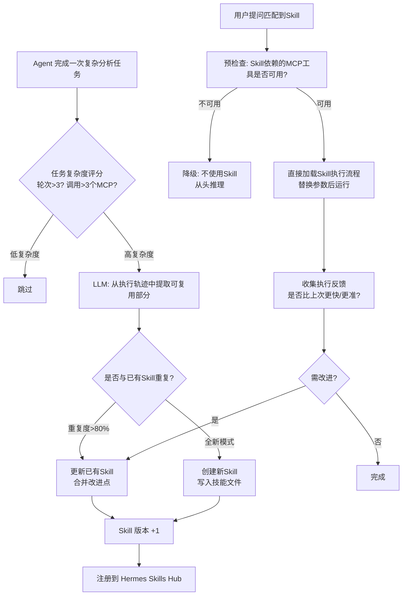

# 05j-Skill自进化闭环

# 05j · Agent Skill 自进化闭环

> 这个难点的本质是：Agent 完成一次"退单原因分析"后，能不能自动把这个分析流程沉淀为可复用的 Skill？下次有人说"分析电视退单原因"，Agent 直接复用 Skill 而不是从头推理"我应该调哪个 MCP 工具、怎么组织输出"。这就是 Hermes Agent 核心能力"会自我进化"的具体体现。

---

## 为什么难

1.  **流程抽象**：从一次具体的分析执行中抽象出通用流程——"查退单数据→按品类聚合→按原因分类→生成图表→输出结论"，这个抽象不能太具体（只适用于空调），也不能太泛（跟任何分析都匹配不上）
    
2.  **触发时机**：什么情况下该自动创建 Skill？太频繁会创建垃圾 Skill，太少又等于没用。需要置信度判断
    
3.  **Skill 版本管理**：同一个 Skill 可能被多次调用和改进——第二次执行时 Agent 发现"上次只查了7天，这次应该查30天"——Skill 需要支持自我更新
    
4.  **失效检测**：业务表结构变了、MCP 工具改了参数——Skill 里的旧流程可能不再适用，需要在执行前做有效性校验
    

---

## 技术方案

利用 Hermes Agent 的 **Skill 系统 + 自主进化引擎**：


---

## 实现思路

每次 Agent 任务结束时，将完整执行轨迹（调了哪些 MCP、用了什么参数、输出格式）发给 LLM 做抽象提取。提取结果与已有 Skill 做语义相似度比较，决定创建新 Skill 还是更新已有 Skill。Skill 以 Markdown 文件形式存储在 Hermes 的 `skills/` 目录。

---

## 关键代码示例

```python
# skill_evolution.py - Skill 自进化引擎

from dataclasses import dataclass, field
from datetime import datetime
from typing import Optional
import json
import hashlib
import yaml
from pathlib import Path

@dataclass
class ExecutionTrace:
    """一次完整任务执行的轨迹"""
    user_query: str
    turns: list[dict]            # 每轮: {user_msg, intent, mcp_calls, result_summary}
    mcp_tools_used: list[str]
    total_duration_seconds: float
    final_output: str

@dataclass
class SkillDefinition:
    """技能定义"""
    skill_id: str
    name: str
    description: str
    version: int
    trigger_patterns: list[str]  # 触发匹配模式
    workflow: list[dict]         # 执行步骤: [{step, tool, params_template, output_key}]
    required_mcp_tools: list[str]
    output_template: str         # 输出模板
    created_at: datetime
    updated_at: datetime
    usage_count: int = 0
    avg_quality_score: float = 0.0


class SkillEvolutionEngine:
    """Skill 自进化引擎"""

    def __init__(self, llm_client, skills_dir: Path, embedder):
        self.llm = llm_client
        self.skills_dir = skills_dir
        self.embedder = embedder

    async def evaluate_and_evolve(
        self, trace: ExecutionTrace
    ) -> Optional[SkillDefinition]:
        """评估执行轨迹是否值得沉淀为 Skill"""

        # 1. 复杂度判断
        complexity = self._calc_complexity(trace)
        if complexity < 0.4:
            return None  # 太简单，不值得沉淀

        # 2. LLM 抽象提取
        extracted = await self._extract_workflow(trace)

        if not extracted.get("should_create_skill"):
            return None

        # 3. 与已有 Skill 对比
        existing_skills = self._load_all_skills()
        similar_skill = await self._find_similar_skill(extracted, existing_skills)

        if similar_skill and similar_skill.get("similarity", 0) > 0.8:
            # 更新已有 Skill
            return await self._update_skill(
                similar_skill["skill"], extracted, trace
            )
        else:
            # 创建新 Skill
            return await self._create_skill(extracted, trace)

    def _calc_complexity(self, trace: ExecutionTrace) -> float:
        """计算任务复杂度 0~1"""
        score = 0.0
        score += min(len(trace.turns) / 5, 1.0) * 0.3       # 轮次多 = 复杂
        score += min(len(trace.mcp_tools_used) / 5, 1.0) * 0.4  # MCP调用多 = 复杂
        score += min(trace.total_duration_seconds / 60, 1.0) * 0.3  # 耗时长 = 复杂
        return score

    async def _extract_workflow(self, trace: ExecutionTrace) -> dict:
        """从执行轨迹中提取可复用的工作流"""

        prompt = f"""从以下 Agent 执行轨迹中提取可复用的分析工作流。

执行轨迹:
- 用户问题: {trace.user_query}
- 调用轮次: {len(trace.turns)}
- 使用的MCP工具: {trace.mcp_tools_used}
- 最终输出摘要: {trace.final_output[:500]}

判断这个工作流是否值得沉淀为 Skill（考虑: 是否通用？是否会频繁被问到？）。

返回 JSON:
{{
    "should_create_skill": true/false,
    "skill_name": "技能名称",
    "description": "一句话描述",
    "trigger_patterns": ["可触发此技能的典型问法1", "问法2"],
    "workflow": [
        {{"step": 1, "tool": "mcp_tool_name", "params": {{"key": "可变的_value"}}, "output_key": "result_1"}},
    ],
    "output_template": "输出格式模板（用{{result_key}}引用中间结果)"
}}"""

        response = await self.llm.chat(prompt)
        return json.loads(response)

    async def _find_similar_skill(
        self, extracted: dict, existing_skills: list[SkillDefinition]
    ) -> Optional[dict]:
        """查找与提取结果最相似的已有 Skill"""

        if not existing_skills:
            return None

        new_desc = extracted.get("description", "")
        new_embedding = await self.embedder.embed(new_desc)

        best_match = None
        best_similarity = 0

        for skill in existing_skills:
            skill_embedding = await self.embedder.embed(skill.description)
            similarity = self._cosine_similarity(new_embedding, skill_embedding)
            if similarity > best_similarity:
                best_similarity = similarity
                best_match = {"skill": skill, "similarity": similarity}

        return best_match

    async def _create_skill(
        self, extracted: dict, trace: ExecutionTrace
    ) -> SkillDefinition:
        """创建新 Skill"""

        skill_id = hashlib.md5(
            extracted["skill_name"].encode()
        ).hexdigest()[:12]

        skill = SkillDefinition(
            skill_id=skill_id,
            name=extracted["skill_name"],
            description=extracted["description"],
            version=1,

            trigger_patterns=extracted.get("trigger_patterns", [ ]),


            workflow=extracted.get("workflow", [ ]),

            required_mcp_tools=list(set(

                step["tool"] for step in extracted.get("workflow", [ ])

            )),
            output_template=extracted.get("output_template", ""),
            created_at=datetime.now(),
            updated_at=datetime.now(),
            usage_count=1,
        )

        # 写入 Skill 文件
        self._write_skill_file(skill)
        return skill

    async def _update_skill(
        self, existing: SkillDefinition, extracted: dict, trace: ExecutionTrace
    ) -> SkillDefinition:
        """更新已有 Skill"""

        existing.version += 1
        existing.updated_at = datetime.now()
        existing.usage_count += 1

        # 合并触发模式

        new_patterns = extracted.get("trigger_patterns", [ ])

        for p in new_patterns:
            if p not in existing.trigger_patterns:
                existing.trigger_patterns.append(p)

        # 合并工作流（新步骤追加或替换）
        existing.workflow = extracted.get("workflow", existing.workflow)

        # 合并输出模板
        if extracted.get("output_template"):
            existing.output_template = extracted["output_template"]

        self._write_skill_file(existing)
        return existing

    def _write_skill_file(self, skill: SkillDefinition):
        """Skill 文件序列化到磁盘"""

        skill_yaml = {
            "skill_id": skill.skill_id,
            "name": skill.name,
            "description": skill.description,
            "version": skill.version,
            "trigger_patterns": skill.trigger_patterns,
            "workflow": skill.workflow,
            "required_mcp_tools": skill.required_mcp_tools,
            "output_template": skill.output_template,
            "created_at": skill.created_at.isoformat(),
            "updated_at": skill.updated_at.isoformat(),
            "usage_count": skill.usage_count,
        }

        file_path = self.skills_dir / f"{skill.skill_id}.yaml"
        file_path.write_text(
            yaml.dump(skill_yaml, allow_unicode=True, default_flow_style=False),
            encoding="utf-8",
        )

    def _load_all_skills(self) -> list[SkillDefinition]:
        """加载所有已有 Skill"""

        skills = [ ]

        for yaml_file in self.skills_dir.glob("*.yaml"):
            data = yaml.safe_load(yaml_file.read_text(encoding="utf-8"))
            skills.append(SkillDefinition(**data))
        return skills

    def _cosine_similarity(self, a: list[float], b: list[float]) -> float:
        dot = sum(x * y for x, y in zip(a, b))
        norm_a = sum(x ** 2 for x in a) ** 0.5
        norm_b = sum(x ** 2 for x in b) ** 0.5
        return dot / (norm_a * norm_b) if norm_a and norm_b else 0
```
---

## 涉及业务模块

*   M7 · 长期记忆引擎
    
*   M1 · 退单分析引擎
    
*   全部模块（Skill 横切所有业务能力）