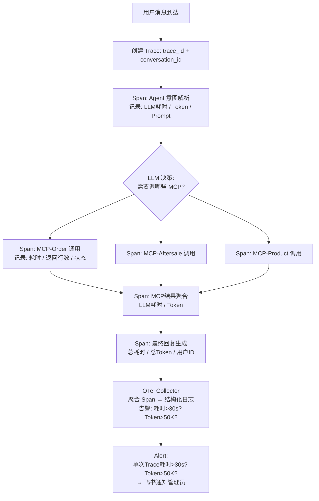

# 05k-MCP调用链路追踪与可观测性

# 05k · MCP 调用链路追踪与 Agent 可观测性

> 这个难点的本质是：Agent 用户说"查一下退单原因"，背后可能调了 3 个 MCP Server、发了 5 次 LLM 请求。如果回复慢了或者不对，你怎么排查？传统 Web 服务有日志就够了，但 Agent 的调用链是 LLM→MCP→LLM→MCP 交叉嵌套的，普通日志根本看不出来卡在哪。

---

## 为什么难

1.  **调用链不是线性的**：Agent 一次回复可能经历"LLM决策→调MCP-A→LLM再决策→调MCP-B和MCP-C并行→LLM聚合→输出"，是一条带分支和回环的链路
    
2.  **LLM 调用的内部不可见**：LLM 的 Token 消耗、推理时间、上下文窗口使用率——这些是 Agent 性能优化的关键指标，但经常被忽略
    
3.  **多 MCP 并行调用的时序分析**：一次分析任务中 5 个 MCP 调用并行发出，哪个最慢？哪个失败了但被静默跳过？需要把并行调用的时序对齐到同一条 Trace 上
    
4.  **与 Hermes 内置日志的互补**：Hermes 有自己的日志系统，但缺少业务级 Trace 和可视化 Dashboard
    

---

## 技术方案

采用 **OpenTelemetry + Hermes 内置日志**（不引入 Langfuse，零额外依赖）：


---

## 实现思路

在 Hermes 的 Agent 执行循环中埋点——每次 LLM 调用前后、每次 MCP 调用前后自动创建 OpenTelemetry Span，注入统一的 `trace_id`。最终数据导出到 OTel Collector，配合 Hermes 内置的结构化日志即可完成全链路排查，不引入 Langfuse 等额外 Agent 可观测平台。

---

## 关键代码示例

```python
# observability.py - Agent 全链路可观测性

import time
import uuid
from contextvars import ContextVar
from dataclasses import dataclass, field
from typing import Optional
from opentelemetry import trace
from opentelemetry.sdk.trace import TracerProvider
from opentelemetry.sdk.trace.export import BatchSpanProcessor
from opentelemetry.exporter.otlp.proto.http.trace_exporter import OTLPSpanExporter

# 跨异步任务的 Trace 上下文传递
current_trace_id: ContextVar[str] = ContextVar("trace_id", default="")
current_conversation_id: ContextVar[str] = ContextVar("conversation_id", default="")

# 初始化
tracer_provider = TracerProvider()
tracer_provider.add_span_processor(
    BatchSpanProcessor(OTLPSpanExporter(endpoint="http://localhost:4318/v1/traces"))
)
trace.set_tracer_provider(tracer_provider)
tracer = trace.get_tracer("suning.hermes")

@dataclass
class TraceSpan:
    """一次调用 Span 的完整信息"""
    span_id: str
    parent_span_id: Optional[str]
    name: str                          # llm_decision / mcp_call / aggregation / response
    start_time: float
    end_time: float = 0
    duration_ms: float = 0
    attributes: dict = field(default_factory=dict)
    # 典型 attributes:
    # LLM: {model, prompt_tokens, completion_tokens, total_tokens, temperature}
    # MCP: {tool_name, server, rows_returned, status, error_message}

@dataclass
class AgentTrace:
    """一次完整 Agent 对话的 Trace"""
    trace_id: str
    conversation_id: str
    user_id: str
    platform: str
    user_query: str
    spans: list[TraceSpan] = field(default_factory=list)
    total_llm_tokens: int = 0
    total_mcp_calls: int = 0
    total_mcp_failures: int = 0
    final_response: str = ""


class AgentObservability:
    """Agent 全链路可观测性封装"""

    def start_trace(self, conversation_id: str, user_id: str,
                    platform: str, query: str) -> AgentTrace:
        trace_id = str(uuid.uuid4())[:16]
        current_trace_id.set(trace_id)
        current_conversation_id.set(conversation_id)

        return AgentTrace(
            trace_id=trace_id,
            conversation_id=conversation_id,
            user_id=user_id,
            platform=platform,
            user_query=query,
        )

    # --- LLM 调用埋点 ---

    def start_llm_span(self, name: str, parent_span_id: str = None) -> TraceSpan:
        span = TraceSpan(
            span_id=str(uuid.uuid4())[:8],
            parent_span_id=parent_span_id,
            name=f"llm.{name}",
            start_time=time.time(),
        )
        # OpenTelemetry Span
        otel_span = tracer.start_span(
            f"llm.{name}",
            attributes={"trace_id": current_trace_id.get()}
        )
        span.attributes["otel_span"] = otel_span
        return span

    def end_llm_span(self, span: TraceSpan, prompt_tokens: int,
                     completion_tokens: int, model: str):
        span.end_time = time.time()
        span.duration_ms = (span.end_time - span.start_time) * 1000
        span.attributes.update({
            "model": model,
            "prompt_tokens": prompt_tokens,
            "completion_tokens": completion_tokens,
            "total_tokens": prompt_tokens + completion_tokens,
        })
        otel_span = span.attributes.pop("otel_span", None)
        if otel_span:
            otel_span.set_attributes(span.attributes)
            otel_span.end()

    # --- MCP 调用埋点 ---

    def start_mcp_span(self, tool_name: str, server: str,
                       parent_span_id: str = None) -> TraceSpan:
        return TraceSpan(
            span_id=str(uuid.uuid4())[:8],
            parent_span_id=parent_span_id,
            name=f"mcp.{tool_name}",
            start_time=time.time(),
            attributes={"tool_name": tool_name, "server": server},
        )

    def end_mcp_span(self, span: TraceSpan, rows_returned: int,
                     success: bool, error: str = None):
        span.end_time = time.time()
        span.duration_ms = (span.end_time - span.start_time) * 1000
        span.attributes.update({
            "rows_returned": rows_returned,
            "success": success,
            "error_message": error or "",
        })

    # --- Trace 完成 & 导出 ---

    def finish_trace(self, trace: AgentTrace, final_response: str):
        """聚合所有 Span，计算统计指标，导出到 OTel Collector"""

        trace.final_response = final_response

        # 统计
        trace.total_llm_tokens = sum(
            s.attributes.get("total_tokens", 0)
            for s in trace.spans if s.name.startswith("llm")
        )
        trace.total_mcp_calls = sum(
            1 for s in trace.spans if s.name.startswith("mcp")
        )
        trace.total_mcp_failures = sum(
            1 for s in trace.spans
            if s.name.startswith("mcp") and not s.attributes.get("success", True)
        )

        total_duration = sum(s.duration_ms for s in trace.spans)
        slowest_span = max(trace.spans, key=lambda s: s.duration_ms) if trace.spans else None

        # OTel 已通过 BatchSpanProcessor 自动导出
        # Agent 级 Trace 的聚合指标写入结构化日志（Hermes 内置），可接入 ELK/Loki 等日志平台

        # 异常检测告警
        if total_duration > 30000:  # 超过30秒
            self._alert_slow_trace(trace, total_duration)
        if trace.total_llm_tokens > 50000:
            self._alert_high_token(trace)

    def _alert_slow_trace(self, trace: AgentTrace, duration_ms: float):
        """慢 Trace 飞书告警"""
        # 调用飞书 Bot API 发送告警消息（代码略）
        pass

    def _alert_high_token(self, trace: AgentTrace):
        """高 Token 消耗告警"""
        pass


# ===== 使用示例：在 Agent 执行循环中埋点 =====

obs = AgentObservability()

async def agent_execute(user_id: str, platform: str, query: str,
                        conversation_id: str, context: dict):
    # 1. 创建 Trace
    trace = obs.start_trace(conversation_id, user_id, platform, query)

    # 2. LLM 意图解析
    llm_span = obs.start_llm_span("intent_parsing")
    intent_result = await llm.parse_intent(query)
    obs.end_llm_span(llm_span, prompt_tokens=150, completion_tokens=80, model="deepseek")
    trace.spans.append(llm_span)

    # 3. MCP 调用（可能有多个）

    mcp_results = [ ]

    for tool in intent_result["tools"]:
        mcp_span = obs.start_mcp_span(tool["name"], tool["server"], parent_span_id=llm_span.span_id)
        try:
            result = await mcp_client.call(tool["name"], tool["params"])
            obs.end_mcp_span(mcp_span, rows_returned=len(result), success=True)
            mcp_results.append(result)
        except Exception as e:
            obs.end_mcp_span(mcp_span, rows_returned=0, success=False, error=str(e))
        trace.spans.append(mcp_span)

    # 4. LLM 聚合 & 生成回复
    agg_span = obs.start_llm_span("result_aggregation")
    response = await llm.generate_response(query, mcp_results, context)
    obs.end_llm_span(agg_span, prompt_tokens=800, completion_tokens=300, model="deepseek")
    trace.spans.append(agg_span)

    # 5. 完成 Trace + 导出
    obs.finish_trace(trace, response)

    return response
```
---

## 涉及业务模块

*   M3 · MCP 数据网关
    
*   全部模块（横切关注点）