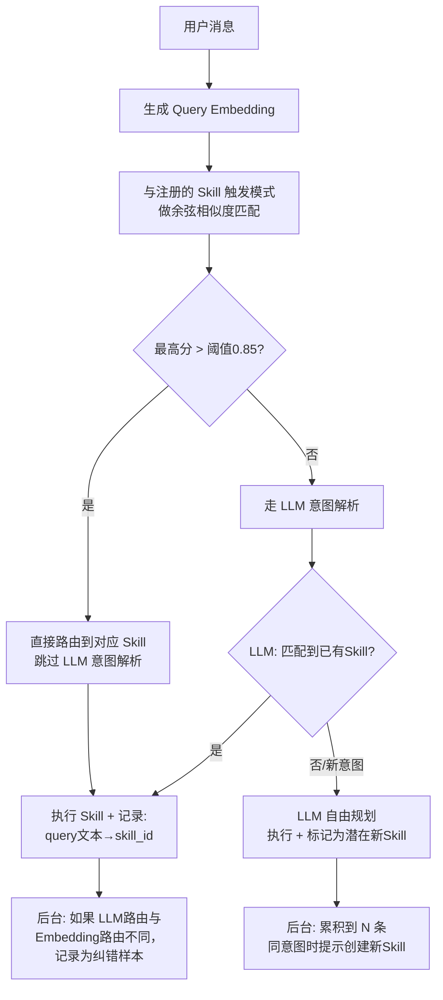

# 05l-意图语义路由

# 05l · 意图语义路由

> 这个难点的本质是：用户说"最近退单多的品类有哪些"和"退单量最近怎么样"，本质是同一个意图"退单统计"，但走 LLM 每次都要花 500 Token 去推理意图。如果把常见意图预分类，用 Embedding 相似度直接路由到对应 Skill，能省掉一大半 LLM 调用的 Token 和延迟。

---

## 为什么难

1.  **意图边界模糊**："空调退单原因"和"空调质量问题退单"——后者是前者的子集，路由到同一个 Skill 还是拆成两个？
    
2.  **冷启动问题**：没有历史数据之前，怎么定义初始的意图分类和示例语句？
    
3.  **路由准确率 vs 召回率的权衡**：宁可多走 LLM（慢但准），也不要路由错误（快但答非所问）。怎么做到路由错误率 < 1%？
    
4.  **多意图混杂**：用户一句话"退单量和原因分布都给我看看"——同时命中两个意图，怎么拆？
    

---

## 技术方案

采用 **两层路由：快速 Embedding 匹配 + LLM 兜底**。第一层用轻量 Embedding 做 Top-1 匹配，置信度高于阈值直接路由；低于阈值才走 LLM，LLM 的结果同时作为新样本反哺路由模型：


---

## 实现思路

维护一个轻量的"意图向量索引"——每个已注册 Skill 的触发模式取 Embedding 均值作为重心向量。用户消息 Embedding 与所有重心向量算余弦距离，Top-1 高于阈值就命中了。这个索引可以放在内存（NumPy 向量矩阵）或 Redis 中，毫秒级响应。

---

## 关键代码示例

```python
# semantic_router.py - 意图语义路由

import numpy as np
from dataclasses import dataclass, field
from typing import Optional
import json
import time

@dataclass
class SkillRoute:
    """技能路由条目"""
    skill_id: str
    skill_name: str
    trigger_patterns: list[str]          # 触发语句列表
    centroid_vector: np.ndarray = None   # 重心向量（trigger_patterns的Embedding均值）
    hit_count: int = 0                   # 命中次数
    last_hit: float = 0                  # 最后命中时间

@dataclass
class RouteResult:
    """路由结果"""
    skill_id: Optional[str]
    confidence: float
    method: str          # "embedding" / "llm" / "fallback"
    latency_ms: float


class SemanticRouter:
    """两层语义路由器"""

    CONFIDENCE_THRESHOLD = 0.85       # Embedding 匹配置信度阈值
    VECTOR_DIM = 1024                 # text-embedding-v3 维度

    def __init__(self, embedder, llm_client):
        self.embedder = embedder
        self.llm = llm_client
        self._routes: dict[str, SkillRoute] = {}
        self._vector_matrix: Optional[np.ndarray] = None  # N×1024 矩阵

        self._skill_ids: list[str] = [ ]                    # 矩阵行号→skill_id


    def register_skill(self, skill_id: str, skill_name: str,
                       trigger_patterns: list[str]):
        """注册一个 Skill 到路由表"""

        # 计算所有触发语句的 Embedding

        embeddings = [ ]

        for pattern in trigger_patterns:
            vec = self.embedder.embed(pattern)
            embeddings.append(vec)

        # 重心向量 = 所有 Embedding 的均值
        centroid = np.mean(embeddings, axis=0)
        centroid = centroid / np.linalg.norm(centroid)  # L2 归一化

        self._routes[skill_id] = SkillRoute(
            skill_id=skill_id,
            skill_name=skill_name,
            trigger_patterns=trigger_patterns,
            centroid_vector=centroid,
        )

        # 重建向量矩阵
        self._rebuild_matrix()

    def _rebuild_matrix(self):
        """重建 NumPy 矩阵用于向量化相似度计算"""
        if not self._routes:
            self._vector_matrix = None
            return

        self._skill_ids = list(self._routes.keys())
        vectors = [self._routes[sid].centroid_vector for sid in self._skill_ids]
        self._vector_matrix = np.stack(vectors)  # shape: (N, 1024)

    async def route(self, query: str) -> RouteResult:
        """
        路由用户消息。
        1. 先走 Embedding 快速匹配
        2. 置信度不够走 LLM
        """

        t0 = time.time()

        # 第一层：Embedding 匹配
        if self._vector_matrix is not None and len(self._skill_ids) > 0:
            query_vec = np.array(self.embedder.embed(query))
            query_vec = query_vec / np.linalg.norm(query_vec)

            # 一次矩阵乘法算出与所有 Skill 的余弦相似度
            similarities = self._vector_matrix @ query_vec  # shape: (N,)
            best_idx = int(np.argmax(similarities))
            best_score = float(similarities[best_idx])
            best_skill_id = self._skill_ids[best_idx]

            if best_score >= self.CONFIDENCE_THRESHOLD:
                route = self._routes[best_skill_id]
                route.hit_count += 1
                route.last_hit = time.time()
                return RouteResult(
                    skill_id=best_skill_id,
                    confidence=best_score,
                    method="embedding",
                    latency_ms=(time.time() - t0) * 1000,
                )

        # 第二层：LLM 路由（含多意图拆分）
        skill_list = "\n".join(
            f"- {s.skill_id}: {s.skill_name} ({', '.join(s.trigger_patterns[:2])})"
            for s in self._routes.values()
        )

        llm_prompt = f"""判断用户消息的意图，返回匹配的技能ID。

可用技能:
{skill_list}

返回JSON格式，如果匹配到多个技能，以列表返回：
{{"skill_ids": ["skill_id1"], "is_new_intent": false}}
如果是未注册的新意图:

{{"skill_ids": [ ], "is_new_intent": true, "suggested_skill_name": "xxx"}}


用户消息: {query}"""

        llm_result = json.loads(await self.llm.chat(llm_prompt))


        matched_skills = llm_result.get("skill_ids", [ ])

        is_new = llm_result.get("is_new_intent", False)

        # LLM 路由结果反哺 Embedding 路由（异步）
        if matched_skills and not is_new:
            for sid in matched_skills:
                if sid in self._routes:
                    self._add_pattern_to_skill(sid, query)

        latency = (time.time() - t0) * 1000
        return RouteResult(
            skill_id=matched_skills[0] if matched_skills else None,
            confidence=0.95 if matched_skills else 0.0,
            method="llm",
            latency_ms=latency,
        )

    def _add_pattern_to_skill(self, skill_id: str, new_pattern: str):
        """将 LLM 路由结果的新问法追加到 Skill 触发模式中"""
        route = self._routes.get(skill_id)
        if not route:
            return
        if new_pattern in route.trigger_patterns:
            return  # 去重

        route.trigger_patterns.append(new_pattern)

        # 更新重心向量（增量更新而非全量重算）
        new_vec = np.array(self.embedder.embed(new_pattern))
        n = len(route.trigger_patterns)
        route.centroid_vector = (
            route.centroid_vector * (n - 1) + new_vec
        ) / n
        route.centroid_vector = route.centroid_vector / np.linalg.norm(route.centroid_vector)

        self._rebuild_matrix()


# ===== 使用示例 =====

router = SemanticRouter(embedder, llm)

# 注册已有 Skill
router.register_skill(
    "return_stats",
    "退单统计",
    [
        "退单量多少",
        "最近退单多吗",
        "哪个品类退单最多",
        "退单趋势怎么样",
    ]
)
router.register_skill(
    "order_trace",
    "订单追踪",
    [
        "查订单售后链路",
        "这个订单卡在哪了",
        "订单退款到哪一步了",
        "帮我查一下这个订单的售后",
    ]
)
router.register_skill(
    "return_reason",
    "退单原因分析",
    [
        "退单原因是什么",
        "为什么退单这么多",
        "哪个原因退单最多",
        "退单原因分布",
    ]
)

# 路由测试
async def test_route():
    # 这条应该命中 Embedding 路由（与"退单量多少"高度相似）
    r1 = await router.route("最近退单数量怎么样")
    # RouteResult(skill_id="return_stats", confidence=0.92, method="embedding", latency_ms=3.2)

    # 这条太模糊，走 LLM
    r2 = await router.route("帮我看看最近的情况")
    # RouteResult(skill_id="return_stats", confidence=0.95, method="llm", latency_ms=450)

    # 同时 LLM 结果中的"最近的情况"被追加到 return_stats 的触发模式中
    # 下次再遇到类似表达就能命中 Embedding 路由了
```
---

## 涉及业务模块

*   M1 · 退单分析引擎
    
*   M7 · 长期记忆引擎（路由命中统计可作为用户偏好）
    
*   M9 · Skill 管理（路由表由 Skill 注册自动驱动）