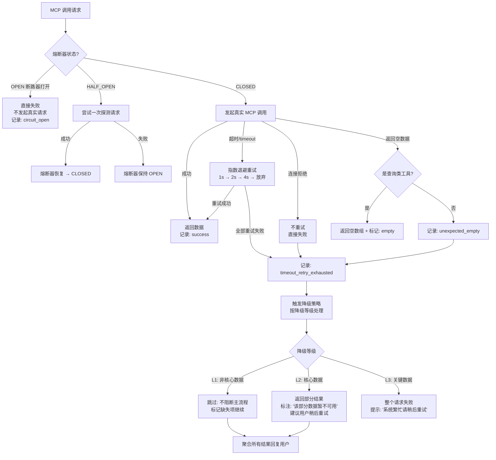

# 05m-MCP调用失败重试与降级

# 05m · MCP 调用失败的重试与降级策略

> 这个难点的本质是：Agent 调用 MCP 工具拿数据时，被调的服务可能超时、连接被拒、返回空数据、甚至返回格式错误的脏数据。Agent 不能因为一个 MCP 调用失败就整个任务崩溃——必须优雅降级，告诉用户"这部分数据暂时不可用，其他分析已完成"。

---

## 为什么难

1.  **故障类型多**：超时、连接拒绝、权限不足、返回空、返回错误格式——每种故障需要不同的处理策略
    
2.  **部分失败 vs 全部失败**：5 个 MCP 调用中 1 个失败——是重试还是跳过？如果是有依赖关系的调用，前置失败导致后续也无法执行，怎么处理？
    
3.  **重试不是万能的**：幂等的查询（查订单列表）可以重试，但非幂等的操作（虽然本项目都是只读，但如果未来扩展）不能盲目重试
    
4.  **降级结果的可信标注**：回复用户时必须明确标记哪些数据正常、哪些降级了、哪些缺失——不能让用户以为降级结果是完整数据
    

---

## 技术方案

采用 **熔断器（Circuit Breaker）+ 指数退避重试 + 多级降级策略** 三位一体：


---

## 实现思路

分别为每个 MCP Server 维护一个熔断器实例（在 Redis 中共享状态），记录连续失败次数。超过阈值（5 次/60 秒）触发熔断，之后 30 秒内不发送真实请求直接失败。半开状态时发送一次探测请求决定是否恢复。重试策略针对超时类错误（幂等查询），指数退避 3 次后放弃。降级等级由每个 MCP Tool 预声明——查询退单统计是 L2 核心数据，查询物流轨迹是 L1 非核心。

---

## 关键代码示例

```python
# circuit_breaker.py - 熔断器 + 重试 + 降级

import asyncio
import time
import random
from dataclasses import dataclass, field
from enum import Enum
from typing import Optional, Callable, Any
import json

class CircuitState(Enum):
    CLOSED = "closed"         # 正常
    OPEN = "open"             # 熔断
    HALF_OPEN = "half_open"   # 半开（探测中）

class DegradeLevel(Enum):
    L1_NON_CRITICAL = 1      # 非核心，跳过不阻断
    L2_CORE = 2              # 核心，缺了标注出来
    L3_CRITICAL = 3          # 关键，缺了整体失败

class FailureType(Enum):
    TIMEOUT = "timeout"               # 超时（可重试）
    CONNECTION_REFUSED = "conn_refused"  # 连接拒绝（不重试）
    PERMISSION_DENIED = "perm_denied"    # 权限不足（不重试）
    EMPTY_RESULT = "empty"               # 空结果（不一定算失败）
    MALFORMED_RESPONSE = "malformed"     # 脏数据（不重试）

@dataclass
class CircuitBreaker:
    """单个 MCP Server 的熔断器"""
    server_id: str
    failure_threshold: int = 5          # 连续失败阈值
    timeout_window: int = 60            # 统计窗口（秒）
    recovery_timeout: int = 30          # 熔断恢复时间（秒）
    state: CircuitState = CircuitState.CLOSED
    failure_count: int = 0
    last_failure_time: float = 0
    last_success_time: float = 0
    half_open_probe_sent: bool = False

    def before_call(self) -> bool:
        """调用前检查：是否允许发起请求"""
        now = time.time()

        if self.state == CircuitState.CLOSED:
            # 清理过期的失败计数
            if now - self.last_failure_time > self.timeout_window:
                self.failure_count = 0
            return True

        if self.state == CircuitState.OPEN:
            # 检查熔断恢复时间是否已到
            if now - self.last_failure_time > self.recovery_timeout:
                self.state = CircuitState.HALF_OPEN
                self.half_open_probe_sent = False
                # 继续 fall through 到 HALF_OPEN 处理
            else:
                return False

        if self.state == CircuitState.HALF_OPEN:
            # 只允许一次探测请求
            if not self.half_open_probe_sent:
                self.half_open_probe_sent = True
                return True
            return False

        return True

    def on_success(self):
        """调用成功后重置"""
        self.state = CircuitState.CLOSED
        self.failure_count = 0
        self.last_success_time = time.time()

    def on_failure(self):
        """调用失败后累加计数"""
        now = time.time()
        self.failure_count += 1
        self.last_failure_time = now

        if self.state == CircuitState.HALF_OPEN:
            # 半开状态也失败了，重新打开熔断器
            self.state = CircuitState.OPEN
        elif self.failure_count >= self.failure_threshold:
            self.state = CircuitState.OPEN

    def to_dict(self) -> dict:
        return {
            "server_id": self.server_id,
            "state": self.state.value,
            "failure_count": self.failure_count,
            "last_failure_time": self.last_failure_time,
        }


@dataclass
class MCPCallResult:
    """MCP 调用结果"""
    server_id: str
    tool_name: str
    success: bool
    data: Any = None
    error_type: Optional[FailureType] = None
    error_message: str = ""
    retry_count: int = 0
    total_latency_ms: float = 0
    degraded: bool = False
    degrade_note: str = ""


class MCPCallManager:
    """MCP 调用管理器：熔断 + 重试 + 降级"""

    MAX_RETRIES = 3
    BASE_BACKOFF_MS = 1000     # 初始退避 1 秒

    # 各 MCP Tool 的降级等级
    TOOL_DEGRADE_LEVELS = {
        "search_orders": DegradeLevel.L2_CORE,
        "get_order_detail": DegradeLevel.L2_CORE,
        "query_return_stats_nl2sql": DegradeLevel.L2_CORE,
        "get_aftersale_workflow": DegradeLevel.L1_NON_CRITICAL,
        "get_product_info": DegradeLevel.L1_NON_CRITICAL,
        "query_logistics": DegradeLevel.L1_NON_CRITICAL,
        "get_refund_status": DegradeLevel.L2_CORE,
    }

    def __init__(self, redis_client):
        self.redis = redis_client
        self._breakers: dict[str, CircuitBreaker] = {}

    def get_breaker(self, server_id: str) -> CircuitBreaker:
        """获取或创建熔断器实例（Redis 共享状态）"""
        if server_id not in self._breakers:
            # 尝试从 Redis 恢复
            cached = self.redis.get(f"cb:{server_id}")
            if cached:
                data = json.loads(cached)
                self._breakers[server_id] = CircuitBreaker(**data)
            else:
                self._breakers[server_id] = CircuitBreaker(server_id=server_id)
        return self._breakers[server_id]

    def _persist_breaker(self, breaker: CircuitBreaker):
        """熔断器状态持久化到 Redis"""
        self.redis.setex(
            f"cb:{breaker.server_id}",
            120,  # TTL 2分钟
            json.dumps(breaker.to_dict()),
        )

    async def call(
        self, server_id: str, tool_name: str, fn: Callable, *args, **kwargs
    ) -> MCPCallResult:
        """
        带熔断+重试+降级的 MCP 调用入口。
        fn: 实际的 MCP 调用函数
        """

        breaker = self.get_breaker(server_id)
        t_start = time.time()

        # 1. 熔断检查
        if not breaker.before_call():
            degrade_level = self.TOOL_DEGRADE_LEVELS.get(
                tool_name, DegradeLevel.L1_NON_CRITICAL
            )
            return MCPCallResult(
                server_id=server_id,
                tool_name=tool_name,
                success=False,
                error_type=FailureType.CONNECTION_REFUSED,
                error_message=f"服务 {server_id} 已熔断",
                total_latency_ms=0,
                degraded=True,
                degrade_note=f"熔断等级: {degrade_level.name}",
            )

        # 2. 指数退避重试
        last_error = None
        for retry in range(self.MAX_RETRIES + 1):  # 0 = 首次尝试
            try:
                result = await asyncio.wait_for(
                    fn(*args, **kwargs),
                    timeout=10,  # 单次调用超时 10 秒
                )

                # 检查空结果
                if result is None or (isinstance(result, list) and len(result) == 0):
                    degrade_level = self.TOOL_DEGRADE_LEVELS.get(
                        tool_name, DegradeLevel.L1_NON_CRITICAL
                    )
                    breaker.on_success()  # 空结果不算失败
                    self._persist_breaker(breaker)
                    return MCPCallResult(
                        server_id=server_id,
                        tool_name=tool_name,
                        success=True,

                        data=[ ],

                        retry_count=retry,
                        total_latency_ms=(time.time() - t_start) * 1000,
                        degraded=(degrade_level == DegradeLevel.L2_CORE),
                        degrade_note="查询结果为空",
                    )

                # 成功
                breaker.on_success()
                self._persist_breaker(breaker)
                return MCPCallResult(
                    server_id=server_id,
                    tool_name=tool_name,
                    success=True,
                    data=result,
                    retry_count=retry,
                    total_latency_ms=(time.time() - t_start) * 1000,
                )

            except asyncio.TimeoutError:
                last_error = (FailureType.TIMEOUT, f"{tool_name} 超时 (尝试 {retry+1}/{self.MAX_RETRIES+1})")
                if retry < self.MAX_RETRIES:
                    # 指数退避 + 随机抖动
                    backoff = self.BASE_BACKOFF_MS * (2 ** retry) + random.uniform(0, 200)
                    await asyncio.sleep(backoff / 1000)
                continue

            except ConnectionRefusedError:
                last_error = (FailureType.CONNECTION_REFUSED, f"{server_id} 连接被拒绝")
                break  # 不重试

            except Exception as e:
                last_error = (FailureType.MALFORMED_RESPONSE, str(e))
                break  # 不重试

        # 3. 全部重试失败 → 记录失败并触发降级
        breaker.on_failure()
        self._persist_breaker(breaker)

        error_type, error_msg = last_error or (
            FailureType.MALFORMED_RESPONSE, "未知错误"
        )
        degrade_level = self.TOOL_DEGRADE_LEVELS.get(
            tool_name, DegradeLevel.L1_NON_CRITICAL
        )

        return MCPCallResult(
            server_id=server_id,
            tool_name=tool_name,
            success=False,
            error_type=error_type,
            error_message=error_msg,
            retry_count=self.MAX_RETRIES,
            total_latency_ms=(time.time() - t_start) * 1000,
            degraded=True,
            degrade_note=f"熔断等级: {degrade_level.name}",
        )


# ===== 使用示例 =====

call_manager = MCPCallManager(redis_client)

async def execute_agent_query(query: str):
    """Agent 调用多个 MCP 工具，熔断+降级"""

    # 并行调用 3 个 MCP 工具
    results: list[MCPCallResult] = await asyncio.gather(
        call_manager.call("mcp-order", "search_orders",
                          order_client.search_orders, status="returned"),
        call_manager.call("mcp-aftersale", "query_return_stats_nl2sql",
                          aftersale_client.query_return_stats_nl2sql, group_by="category"),
        call_manager.call("mcp-logistics", "query_logistics",
                          logistics_client.query_logistics, return_id=12345),
    )

    # 按降级等级处理结果
    critical_failed = [
        r for r in results
        if not r.success and self.TOOL_DEGRADE_LEVELS.get(r.tool_name) == DegradeLevel.L3_CRITICAL
    ]
    core_degraded = [
        r for r in results
        if r.degraded and self.TOOL_DEGRADE_LEVELS.get(r.tool_name) == DegradeLevel.L2_CORE
    ]
    non_critical_missing = [
        r for r in results
        if r.degraded and self.TOOL_DEGRADE_LEVELS.get(r.tool_name) == DegradeLevel.L1_NON_CRITICAL
    ]

    # 构建降级提示

    degrade_notes = [ ]

    if critical_failed:
        return {"error": "核心数据查询失败，请稍后重试", "details": [r.error_message for r in critical_failed]}
    if core_degraded:
        degrade_notes.append(f"以下数据暂不可用: {', '.join(r.tool_name for r in core_degraded)}")
    if non_critical_missing:
        degrade_notes.append(f"以下辅助数据未获取: {', '.join(r.tool_name for r in non_critical_missing)}")

    response = _build_response(results)
    if degrade_notes:
        response["notice"] = "; ".join(degrade_notes)

    return response
```
---

## 涉及业务模块

*   M3 · MCP 数据网关
    
*   M8 · 定时报告推送（推送时若某服务熔断，降级处理同样适用）
