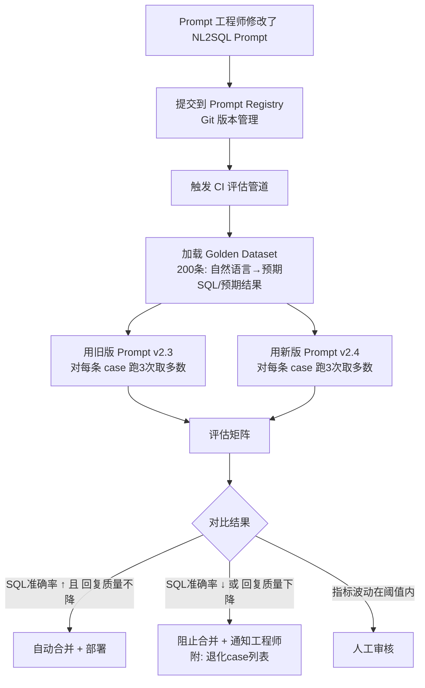

# 05n-Prompt版本管理与AB评估

# 05n · Prompt 版本管理与 A/B 评估框架

> 这个难点的本质是：你改了一版 NL2SQL 的 System Prompt——"把表结构描述改成更口语化的表达，希望能降低幻觉率"——改完之后怎么知道真的变好了还是变差了？不能上线后凭感觉。需要一套用历史真实对话构建的测试集，每次 Prompt 变更自动跑评估，用数据说话。

---

## 为什么难

1.  **评估指标设计**：NL2SQL 的准确率怎么量化？"生成的 SQL 语法正确"是硬指标，"查到的结果跟用户预期一致"是软指标——需要多维度的评估矩阵
    
2.  **测试集构建**：不能靠人工写测试用例——应该从 Agent 生产环境的真实对话日志中采样，构成"输入→期望输出"的 Golden Dataset
    
3.  **A/B 对比的噪声控制**：LLM 本身有随机性（temperature > 0），同一个 Prompt 问两遍可能得到不同结果。怎么排除随机性干扰？
    
4.  **成本控制**：每次评估都要跑 LLM——如果评估集有 200 条 case、每条 case 用新旧两个 Prompt 各跑 3 遍（降噪），那就是 1200 次 LLM 调用。怎么控制评估成本？
    

---

## 技术方案

采用 **Prompt 注册中心 + Golden Dataset + 自动评估管道** 三位一体：


---

## 实现思路

Prompt 注册中心用 YAML 文件 + Git 管理（一条 Prompt 一个文件，描述版本、适用范围、变更记录）。Golden Dataset 从生产日志中周期性采样——收集"用户的自然语言输入 + 最终被采纳的 SQL/结果"。评估管道是一次性脚本，按评估矩阵（SQL 语法正确率、执行结果匹配率、Token 消耗、平均延迟）输出对比报告。

---

## 关键代码示例

```python
# prompt_registry.py - Prompt 版本管理与评估

from dataclasses import dataclass, field
from datetime import datetime
from typing import Optional
import yaml
import json
from pathlib import Path

@dataclass
class PromptVersion:
    """Prompt 版本记录"""
    prompt_id: str              # nl2sql / intent_routing / response_generation
    version: str                # v2.3
    content: str                # 完整 Prompt 文本
    description: str            # 本次变更说明
    author: str
    created_at: str
    parent_version: Optional[str] = None  # 基于哪个版本修改
    metrics: dict = field(default_factory=dict)  # 最后一次评估指标

@dataclass
class GoldenCase:
    """Golden Dataset 中的一条测试用例"""
    case_id: str
    natural_language: str           # 用户原始输入: "近7天空调退单原因分布"
    expected_sql: str               # 期望的 SQL（或 None 如果用结果匹配）
    expected_result_signature: Optional[dict] = None  # 期望的结果特征: {row_count_min:3, key_columns:["category","count"]}
    source_conversation_id: str     # 来源会话 ID（可追溯到原始对话）
    difficulty: str = "easy"        # easy / medium / hard

@dataclass
class EvalReport:
    """单次评估报告"""
    prompt_id: str
    old_version: str
    new_version: str
    total_cases: int
    results: list[dict]             # 每条 case 的详细评估结果
    # 汇总指标
    sql_syntax_pass_rate: float     # SQL 语法正确率 (EXPLAIN 通过)
    result_match_rate: float        # 执行结果匹配率
    avg_tokens_old: int
    avg_tokens_new: int
    avg_latency_ms_old: float
    avg_latency_ms_new: float
    winner: str                     # "new" / "old" / "tie"


class PromptRegistry:
    """Prompt 注册中心"""

    def __init__(self, registry_dir: Path):
        self.registry_dir = registry_dir
        self.registry_dir.mkdir(parents=True, exist_ok=True)

    def save_prompt(self, prompt: PromptVersion):
        file_path = self.registry_dir / f"{prompt.prompt_id}_{prompt.version}.yaml"
        file_path.write_text(
            yaml.dump(prompt.__dict__, allow_unicode=True, default_flow_style=False),
            encoding="utf-8",
        )

    def load_prompt(self, prompt_id: str, version: str) -> PromptVersion:
        file_path = self.registry_dir / f"{prompt_id}_{version}.yaml"
        if not file_path.exists():
            raise FileNotFoundError(f"Prompt {prompt_id} v{version} 不存在")
        data = yaml.safe_load(file_path.read_text(encoding="utf-8"))
        return PromptVersion(**data)

    def list_versions(self, prompt_id: str) -> list[str]:

        versions = [ ]

        for f in self.registry_dir.glob(f"{prompt_id}_v*.yaml"):
            versions.append(f.stem.replace(f"{prompt_id}_", ""))
        return sorted(versions)


class NL2SQLEvaluator:
    """NL2SQL Prompt A/B 评估器"""

    REPEAT_PER_CASE = 3   # 每条 case 重复次数（降噪）

    def __init__(self, llm_client, sql_validator, db_executor):
        self.llm = llm_client
        self.sql_validator = sql_validator
        self.db_executor = db_executor

    async def evaluate(
        self, old_prompt: PromptVersion, new_prompt: PromptVersion,
        test_cases: list[GoldenCase],
    ) -> EvalReport:
        """对两条 Prompt 做 A/B 对比评估"""

        report = EvalReport(
            prompt_id=old_prompt.prompt_id,
            old_version=old_prompt.version,
            new_version=new_prompt.version,
            total_cases=len(test_cases),

            results=[ ],

            sql_syntax_pass_rate=0,
            result_match_rate=0,
            avg_tokens_old=0,
            avg_tokens_new=0,
            avg_latency_ms_old=0,
            avg_latency_ms_new=0,
            winner="tie",
        )


        old_scores = [ ]


        new_scores = [ ]


        for case in test_cases:
            # 对每条 case 用新旧 Prompt 各跑 N 次
            old_runs = await self._run_multiple(
                old_prompt.content, case.natural_language, self.REPEAT_PER_CASE
            )
            new_runs = await self._run_multiple(
                new_prompt.content, case.natural_language, self.REPEAT_PER_CASE
            )

            # 多数投票：取出现次数最多的 SQL
            old_best_sql = self._majority_vote(old_runs)
            new_best_sql = self._majority_vote(new_runs)

            # 评估每条 SQL
            old_score = self._score_sql(old_best_sql, case, old_runs)
            new_score = self._score_sql(new_best_sql, case, new_runs)

            report.results.append({
                "case_id": case.case_id,
                "query": case.natural_language,
                "difficulty": case.difficulty,
                "old_sql": old_best_sql,
                "new_sql": new_best_sql,
                "old_score": old_score,
                "new_score": new_score,
                "winner": "new" if new_score["total"] > old_score["total"] else (
                    "old" if old_score["total"] < old_score["total"] else "tie"
                ),
            })

            old_scores.append(old_score["total"])
            new_scores.append(new_score["total"])

        # 汇总
        report.sql_syntax_pass_rate = sum(
            1 for r in report.results if r["new_score"]["syntax_pass"]
        ) / len(report.results)

        report.avg_tokens_old = int(sum(
            sum(run["tokens"] for run in old_runs) for old_runs in
            [self._run_multiple_cached(case) for case in test_cases]
        ) / len(test_cases) / self.REPEAT_PER_CASE) if test_cases else 0

        old_avg = sum(old_scores) / len(old_scores) if old_scores else 0
        new_avg = sum(new_scores) / len(new_scores) if new_scores else 0

        if new_avg > old_avg * 1.03:  # 新版领先 > 3%
            report.winner = "new"
        elif new_avg < old_avg * 0.97:  # 旧版领先 > 3%
            report.winner = "old"
        else:
            report.winner = "tie"

        return report

    async def _run_multiple(
        self, prompt: str, query: str, n: int
    ) -> list[dict]:
        """用同一个 Prompt 对同一个 query 跑 N 次"""

        runs = [ ]

        for _ in range(n):
            t0 = __import__('time').time()
            full_prompt = prompt + f"\n\n用户问题: {query}\n请生成SQL:"
            response = await self.llm.chat(full_prompt, temperature=0.1)
            sql = self._extract_sql(response)
            latency = (__import__('time').time() - t0) * 1000
            tokens = len(response) // 4  # 粗略 Token 估算
            runs.append({"sql": sql, "latency_ms": latency, "tokens": tokens})
        return runs

    def _majority_vote(self, runs: list[dict]) -> str:
        """多数投票: 返回出现次数最多的 SQL"""
        from collections import Counter
        sqls = [self._normalize_sql(r["sql"]) for r in runs]
        counter = Counter(sqls)
        return counter.most_common(1)[0][0]

    def _score_sql(self, sql: str, case: GoldenCase, runs: list[dict]) -> dict:
        """对一条 SQL 打分"""

        # 语法检查（硬指标）
        syntax_pass, fixed_sql, error = self.sql_validator.validate_and_fix(sql)
        syntax_score = 1.0 if syntax_pass else 0.0

        # 结果匹配检查
        result_score = 0.0
        if syntax_pass and case.expected_result_signature:
            try:
                result = self.db_executor.execute(fixed_sql)
                signature = self._extract_signature(result)
                result_score = self._signature_similarity(
                    signature, case.expected_result_signature
                )
            except Exception:
                result_score = 0.0

        # 延迟得分（归一化，越低越好）
        avg_latency = sum(r["latency_ms"] for r in runs) / len(runs)
        latency_score = max(0, 1.0 - avg_latency / 5000)  # 5秒以上得0分

        # 综合得分
        total = syntax_score * 0.4 + result_score * 0.5 + latency_score * 0.1

        return {
            "syntax_pass": syntax_pass,
            "syntax_score": syntax_score,
            "result_score": result_score,
            "latency_score": latency_score,
            "total": total,
        }

    def _normalize_sql(self, sql: str) -> str:
        """规范化 SQL 用于比较"""
        import re
        sql = re.sub(r'\s+', ' ', sql).strip().upper()
        sql = re.sub(r'LIMIT\s+\d+', 'LIMIT N', sql)
        return sql

    def _extract_sql(self, response: str) -> str:
        """从 LLM 回复中提取 SQL 代码块"""
        import re
        match = re.search(r'```sql\n(.*?)```', response, re.DOTALL)
        if match:
            return match.group(1).strip()
        match = re.search(r'```\n(.*?)```', response, re.DOTALL)
        if match:
            return match.group(1).strip()
        return response.strip()

    def _extract_signature(self, result: list[dict]) -> dict:
        """提取查询结果的特征签名"""
        if not result:

            return {"row_count": 0, "columns": [ ]}

        return {
            "row_count": len(result),
            "columns": list(result[0].keys()),
            "first_row_sample": {k: str(v)[:50] for k, v in result[0].items()},
        }

    def _signature_similarity(self, sig1: dict, sig2: dict) -> float:
        """两个结果签名的相似度 0~1"""
        score = 0.0
        # 行数匹配
        expected_min = sig2.get("row_count_min", 0)
        if sig1["row_count"] >= expected_min:
            score += 0.4
        # 关键列匹配

        key_cols = sig2.get("key_columns", [ ])

        if key_cols and all(col in sig1["columns"] for col in key_cols):
            score += 0.6
        return score


# ===== CI 集成脚本 =====

async def ci_prompt_evaluation(prompt_id: str):
    """CI 管道中自动运行的 Prompt 评估"""

    registry = PromptRegistry(Path("./prompts"))
    evaluator = NL2SQLEvaluator(llm_client, sql_validator, db_executor)

    # 加载 Golden Dataset
    golden_cases = load_golden_dataset("./tests/golden_nl2sql.json")

    # 找到最新版本和上一个版本
    versions = registry.list_versions(prompt_id)
    if len(versions) < 2:
        print("只有一个版本，跳过 A/B 评估")
        return

    old_ver = versions[-2]
    new_ver = versions[-1]

    old_prompt = registry.load_prompt(prompt_id, old_ver)
    new_prompt = registry.load_prompt(prompt_id, new_ver)

    report = await evaluator.evaluate(old_prompt, new_prompt, golden_cases)

    print(f"=== Prompt {prompt_id} A/B 评估报告 ===")
    print(f"旧版: {old_ver} → 新版: {new_ver}")
    print(f"SQL语法通过率: {report.sql_syntax_pass_rate:.1%}")
    print(f"结果匹配率: {report.result_match_rate:.1%}")
    print(f"胜者: {report.winner}")

    # 退化 case 列表
    regressions = [r for r in report.results if r["winner"] == "old"]
    if regressions:
        print(f"\n⚠ 退化 case ({len(regressions)}条):")
        for r in regressions[:5]:
            print(f"  [{r['case_id']}] {r['query'][:50]}")
            print(f"    old: {r['old_sql'][:80]}")
            print(f"    new: {r['new_sql'][:80]}")

    # CI 判定
    if report.winner == "old":
        raise SystemExit("评估未通过：新版 Prompt 不如旧版，阻止合并")
    elif report.winner == "tie":
        print("\n评估结果持平，需人工审核")

    # 更新 Prompt 元数据
    new_prompt.metrics = {
        "sql_syntax_pass_rate": report.sql_syntax_pass_rate,
        "result_match_rate": report.result_match_rate,
        "evaluated_at": datetime.now().isoformat(),
    }
    registry.save_prompt(new_prompt)
```
---

## 涉及业务模块

*   M1 · 退单分析引擎（NL2SQL Prompt 评估的主要受益方）
    
*   M3 · MCP 数据网关（SQL 在 MCP Server 端执行，评估管道使用相同执行环境）