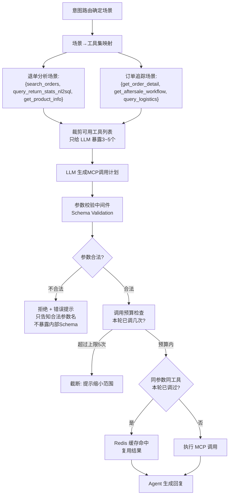

# 05o-Agent行为控制与Tools调用优化

# 05o · Agent 行为控制与 Tools 调用优化

> 这个难点的本质是：Agent 注册了 20+ 个 MCP 工具，LLM 天然有工具滥用倾向——用户问"今天辛苦了"，它可能也去调 MCP 查退单。不是让 Agent 能用到更多工具，而是**管住它什么时候该用什么、不该用什么，以及怎么用得更省**。

---

## 为什么难

1.  **工具滥用**：LLM 看到一个查询类问题，可能把所有 SQL 工具全调一遍，浪费资源
    
2.  **幻觉参数**：LLM 拼 MCP 参数时经常编造不存在的字段名（如 `status="退货"` 而非 `status_code=1`），Schema Validation 必须前置到调用前
    
3.  **调用预算失控**：用户说"帮我做个全量分析"，Agent 可能串行调 15 次 MCP，耗时两分钟。需要硬性预算限制
    
4.  **缓存失效**：多轮追问时，Agent 重复查相同的基础数据（只是换个聚合维度），没做结果缓存
    

---

## 技术方案

采用 **场景化工具集裁剪 + 调用预算管理器 + 参数中间件**：


---

## 实现思路

为 05L 语义路由出的每个场景预定义"工具白名单"，LLM 做决策时只看到 3~5 个工具而不是全部 20 个。参数校验在 MCP 调用前拦截——用 JSON Schema 验证 LLM 生成的参数，不合法直接拒绝并给出合法参数名提示（不暴露完整 Schema）。调用预算用 Redis 做计数，每个对话轮次限制最多 5 次 MCP 调用。

---

## 关键代码示例

```python
# tool_governor.py - 工具调用治理器

from dataclasses import dataclass, field
from typing import Optional
import json
from jsonschema import validate, ValidationError

@dataclass
class ToolWhiteList:
    """场景化的工具白名单"""
    scene: str
    tools: list[str]
    max_calls_per_turn: int = 5

# 场景 → 工具白名单映射
SCENE_TOOL_MAP = {
    "return_analysis": ToolWhiteList(
        scene="退单分析",
        tools=["search_orders", "query_return_stats_nl2sql", "get_product_info"],
        max_calls_per_turn=5,
    ),
    "order_trace": ToolWhiteList(
        scene="订单追踪",
        tools=["get_order_detail", "get_aftersale_workflow", "query_logistics", "get_refund_status"],
        max_calls_per_turn=4,
    ),
    "quality_analysis": ToolWhiteList(
        scene="质量分析",
        tools=["search_orders", "query_return_stats_nl2sql", "get_product_info"],
        max_calls_per_turn=6,
    ),
    "general_query": ToolWhiteList(
        scene="通用查询",
        tools=["search_orders", "query_return_stats_nl2sql", "get_product_info",
               "get_order_detail", "get_aftersale_workflow",
               "query_logistics", "get_refund_status"],
        max_calls_per_turn=3,
    ),
}

@dataclass
class CallBudget:
    """单轮对话的 MCP 调用预算"""
    max_calls: int
    used: int = 0
    call_history: list[dict] = field(default_factory=list)

    def can_call(self) -> bool:
        return self.used < self.max_calls

    def consume(self, tool_name: str, params_hash: str) -> bool:
        if self.used >= self.max_calls:
            return False
        self.used += 1
        self.call_history.append({"tool": tool_name, "params_hash": params_hash})
        return True

    def already_called(self, params_hash: str) -> bool:
        return any(h["params_hash"] == params_hash for h in self.call_history)


class ToolGovernor:
    """Agent 工具调用治理器"""

    def __init__(self, redis_client, mcp_registry: dict):
        self.redis = redis_client
        self.mcp_registry = mcp_registry  # tool_name → param_schema

    def get_scene_tools(self, scene: str) -> ToolWhiteList:
        """根据场景返回可用工具白名单"""
        return SCENE_TOOL_MAP.get(scene, SCENE_TOOL_MAP["general_query"])

    def build_tool_prompt(self, whitelist: ToolWhiteList) -> str:
        """只把白名单内的工具描述注入 LLM Prompt"""
        lines = ["当前场景下可用的 MCP 工具："]
        for tool_name in whitelist.tools:
            schema = self.mcp_registry.get(tool_name, {})
            desc = schema.get("description", "")
            params = schema.get("params", {})
            lines.append(f"- {tool_name}: {desc}")
            for param_name, param_info in params.items():
                required = "必填" if param_info.get("required") else "可选"
                lines.append(f"    {param_name} ({required}): {param_info.get('description', '')}")
        return "\n".join(lines)

    def validate_params(self, tool_name: str, params: dict) -> tuple[bool, str]:
        """JSON Schema 参数校验"""
        schema = self.mcp_registry.get(tool_name)
        if not schema:
            return False, f"未知工具: {tool_name}"

        param_schema = schema.get("params_schema", {})
        try:
            validate(instance=params, schema=param_schema)
            return True, ""
        except ValidationError as e:
            # 只返回合法参数名，不暴露完整 Schema
            valid_params = list(param_schema.get("properties", {}).keys())
            return False, (
                f"参数 '{e.path[0]}' 不合法。{tool_name} 接受的参数: {', '.join(valid_params)}"
            )

    def check_cache(self, tool_name: str, params: dict) -> Optional[dict]:
        """检查 Redis 缓存"""
        cache_key = self._cache_key(tool_name, params)
        cached = self.redis.get(cache_key)
        if cached:
            return json.loads(cached)
        return None

    def set_cache(self, tool_name: str, params: dict, result: dict, ttl: int = 300):
        """写入 Redis 缓存"""
        cache_key = self._cache_key(tool_name, params)
        self.redis.setex(cache_key, ttl, json.dumps(result, default=str))

    def _cache_key(self, tool_name: str, params: dict) -> str:
        params_hash = hash(json.dumps(params, sort_keys=True))
        return f"mcp_cache:{tool_name}:{params_hash}"

    def params_hash(self, params: dict) -> str:
        return str(hash(json.dumps(params, sort_keys=True)))


# ===== 在 Agent 执行循环中集成 =====

governor = ToolGovernor(redis_client, mcp_registry)

async def agent_tool_execution_loop(
    scene: str, user_id: str, turn_id: str
):
    # 1. 确定工具白名单
    whitelist = governor.get_scene_tools(scene)
    budget = CallBudget(max_calls=whitelist.max_calls_per_turn)

    # 2. 注入裁剪后的工具列表到 LLM Prompt
    tool_prompt = governor.build_tool_prompt(whitelist)
    mcp_plan = await llm.plan_tools(tool_prompt, user_query)


    results = [ ]


    for call in mcp_plan.get("calls", [ ]):

        tool_name = call["tool"]
        params = call.get("params", {})

        # 工具白名单检查
        if tool_name not in whitelist.tools:
            results.append({"tool": tool_name, "error": "当前场景不可用此工具"})
            continue

        # 参数校验
        valid, error = governor.validate_params(tool_name, params)
        if not valid:
            results.append({"tool": tool_name, "error": error})
            continue

        # 缓存检查
        cached = governor.check_cache(tool_name, params)
        if cached:
            results.append({"tool": tool_name, "data": cached, "from_cache": True})
            continue

        # 调用预算
        params_hash = governor.params_hash(params)
        if budget.already_called(params_hash):
            results.append({"tool": tool_name, "error": "本轮已执行相同查询，跳过"})
            continue

        if not budget.can_call():
            remaining = whitelist.tools[:len(whitelist.tools)]
            results.append({
                "tool": tool_name,
                "error": f"本轮MCP调用已达上限({budget.max_calls}次)，请缩小查询范围。剩余可用工具: {remaining}"
            })
            break

        # 执行
        budget.consume(tool_name, params_hash)
        result = await mcp_client.call(tool_name, params)
        governor.set_cache(tool_name, params, result)
        results.append({"tool": tool_name, "data": result, "from_cache": False})

    return results
```
---

## 涉及业务模块

*   M1 · 退单分析引擎
    
*   M3 · MCP 数据网关
    
*   M7 · 长期记忆引擎
