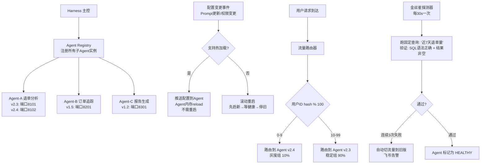

# 05p-多Agent的Harness

# 05p · 多 Agent 的 Harness

> 这个难点的本质是：项目里有退单分析 Agent、订单追踪 Agent、报告生成 Agent 等多个子 Agent。05H 讲了任务怎么拆解编排，但每个子 Agent 自身怎么起停、怎么升级、怎么灰度——需要一个类似 K8s 管 Pod 那样的统一管理层。这就是 Harness。

---

## 为什么难

1.  **Agent 不是无状态服务**：退单分析 Agent 有 Skill 记忆、用户偏好——重启不能丢状态
    
2.  **热更新 vs 冷重启**：改了一版 NL2SQL Prompt（05N），必须重启 Agent 吗？还是能热加载？
    
3.  **多版本灰度**：新版本 Agent 先给 10% 用户用，怎么在不改 Gateway 路由的前提下实现？
    
4.  **健康检查不是简单 ping**：Agent 进程活着 ≠ Agent 能正常工作——需要"金丝雀查询"（定期跑已知正确答案的 query）验证真的正常
    

---

## 技术方案

采用 **Agent 生命周期管理器 + 配置热加载 + 流量灰度路由**：


---

## 实现思路

Harness 本身是一个轻量 Python 进程，用 asyncio 管理子 Agent 的生命周期。配置热加载用文件监视（watchdog）+ Redis Pub/Sub 双通道。流量路由在 Gateway 层做——根据 `user_id` 的 hash 值决定走哪个 Agent 版本。金丝雀探测独立于用户请求，用定时任务跑预定义的测试用例。

---

## 关键代码示例

```python
# agent_harness.py - 多 Agent 运维底座

import asyncio
import hashlib
import json
import os
import signal
import time
from dataclasses import dataclass, field
from enum import Enum
from pathlib import Path
from typing import Optional
import subprocess

class AgentStatus(Enum):
    STARTING = "starting"
    HEALTHY = "healthy"
    DEGRADED = "degraded"    # 金丝雀探测失败，但仍可服务
    UNHEALTHY = "unhealthy"  # 连续失败，已切流
    STOPPED = "stopped"

@dataclass
class AgentInstance:
    """一个子 Agent 实例"""
    agent_id: str
    agent_type: str            # return_analysis / order_trace / report_gen
    version: str
    port: int
    process: Optional[subprocess.Popen] = None
    status: AgentStatus = AgentStatus.STARTING
    canary_failures: int = 0
    canary_max_failures: int = 3
    traffic_weight: float = 1.0
    hot_reload_enabled: bool = True
    config_files: list[str] = field(default_factory=list)

@dataclass
class CanaryProbe:
    """金丝雀探测"""
    probe_id: str
    query: str                       # 测试用的自然语言查询
    expected_tools: list[str]        # 期望调用的工具列表
    min_result_rows: int = 0         # 期望结果最少行数
    timeout: int = 15


class AgentHarness:
    """多 Agent Harness 主控"""

    CANARY_PROBES = {
        "return_analysis": CanaryProbe(
            probe_id="canary-return-001",
            query="近7天退单量",
            expected_tools=["query_return_stats_nl2sql"],
            min_result_rows=0,
            timeout=10,
        ),
        "order_trace": CanaryProbe(
            probe_id="canary-order-001",
            query="查订单202406010001的售后链路",
            expected_tools=["get_order_detail", "get_aftersale_workflow"],
            min_result_rows=1,
            timeout=15,
        ),
    }

    def __init__(self, redis_client, feishu_alerter):
        self.redis = redis_client
        self.alerter = feishu_alerter
        self._instances: dict[str, list[AgentInstance]] = {}  # agent_type → [instances]

    # ===== 生命周期管理 =====

    async def start_agent(self, agent_type: str, version: str,
                          port: int, **env_vars) -> AgentInstance:
        """启动一个子 Agent 进程"""
        instance = AgentInstance(
            agent_id=f"{agent_type}-{version}-{port}",
            agent_type=agent_type,
            version=version,
            port=port,
        )

        cmd = [
            "python", "-m", f"agents.{agent_type}",
            "--port", str(port),
            "--version", version,
        ]
        env = os.environ.copy()
        env.update(env_vars)

        instance.process = subprocess.Popen(
            cmd, env=env,
            stdout=subprocess.PIPE, stderr=subprocess.PIPE,
        )

        # 等待健康检查通过
        healthy = await self._wait_healthy(instance, timeout=30)
        if healthy:
            instance.status = AgentStatus.HEALTHY
            self._register(instance)
        else:
            instance.status = AgentStatus.UNHEALTHY

        return instance

    async def rolling_restart(self, agent_type: str, new_version: str):
        """滚动重启：先启新实例，等健康后才停旧实例"""

        old_instances = self._instances.get(agent_type, [ ])

        new_port = self._next_port(agent_type)

        # 启动新版本
        new_instance = await self.start_agent(agent_type, new_version, new_port)
        if new_instance.status != AgentStatus.HEALTHY:
            await self.alerter.send(f"新版本 {agent_type} {new_version} 启动失败")
            return False

        # 逐步切流量到新版本
        for weight in [0.1, 0.3, 0.6, 1.0]:
            new_instance.traffic_weight = weight
            for old in old_instances:
                old.traffic_weight = 1.0 - weight
            self._publish_traffic_config(agent_type)
            await asyncio.sleep(30)  # 每步观察30秒

        # 停旧实例
        for old in old_instances:
            await self.stop_agent(old)

        return True

    async def stop_agent(self, instance: AgentInstance):
        """优雅停止一个 Agent"""
        if instance.process:
            instance.process.send_signal(signal.SIGTERM)
            try:
                instance.process.wait(timeout=30)
            except subprocess.TimeoutExpired:
                instance.process.kill()
            instance.status = AgentStatus.STOPPED
        self._unregister(instance)

    # ===== 配置热加载 =====

    async def watch_config(self, agent_type: str, config_path: Path):
        """监视配置文件变化，支持热加载"""
        from watchdog.observers import Observer
        from watchdog.events import FileSystemEventHandler

        class ConfigHandler(FileSystemEventHandler):
            def on_modified(self, event):
                if event.src_path.endswith((".yaml", ".yml", ".prompt")):
                    asyncio.create_task(self._reload_config(agent_type, event.src_path))

        observer = Observer()
        observer.schedule(ConfigHandler(), str(config_path.parent), recursive=False)
        observer.start()

    async def _reload_config(self, agent_type: str, config_file: str):
        """向子 Agent 推送热加载指令"""

        instances = self._instances.get(agent_type, [ ])

        for inst in instances:
            if inst.hot_reload_enabled:
                # 通过 Redis Pub/Sub 通知 Agent 重新加载配置
                channel = f"agent:{inst.agent_id}:config_reload"
                self.redis.publish(channel, json.dumps({
                    "file": config_file,
                    "timestamp": time.time(),
                }))

    # ===== 流量路由 =====

    def route_request(self, agent_type: str, user_id: str) -> AgentInstance:
        """根据流量权重路由用户请求到特定 Agent 实例"""

        instances = self._instances.get(agent_type, [ ])

        healthy = [i for i in instances if i.status in (AgentStatus.HEALTHY, AgentStatus.DEGRADED)]

        if not healthy:
            raise RuntimeError(f"{agent_type} 无可用实例")

        # 加权随机：按 traffic_weight 分配
        total_weight = sum(i.traffic_weight for i in healthy)
        target = int(hashlib.md5(user_id.encode()).hexdigest(), 16) % int(total_weight * 100)

        cumulative = 0
        for inst in healthy:
            cumulative += inst.traffic_weight * 100
            if target < cumulative:
                return inst

        return healthy[-1]

    # ===== 金丝雀探测 =====

    async def canary_loop(self, interval: int = 30):
        """每 N 秒对每个 Agent 类型跑金丝雀探测"""
        while True:
            for agent_type, probe in self.CANARY_PROBES.items():

                instances = self._instances.get(agent_type, [ ])

                for inst in instances:
                    if inst.status == AgentStatus.STOPPED:
                        continue
                    await self._run_canary(inst, probe)
            await asyncio.sleep(interval)

    async def _run_canary(self, instance: AgentInstance, probe: CanaryProbe):
        """对单个实例执行金丝雀探测"""
        try:
            result = await asyncio.wait_for(
                self._send_query(instance, probe.query),
                timeout=probe.timeout,
            )

            # 检查结果

            tools_used = result.get("tools_called", [ ])


            rows = len(result.get("data", [ ]))


            if all(t in tools_used for t in probe.expected_tools) and rows >= probe.min_result_rows:
                instance.canary_failures = 0
                if instance.status == AgentStatus.DEGRADED:
                    instance.status = AgentStatus.HEALTHY
                    await self.alerter.send(f"{instance.agent_id} 金丝雀探测恢复，状态恢复为 HEALTHY")
            else:
                instance.canary_failures += 1
                if instance.canary_failures >= instance.canary_max_failures:
                    instance.status = AgentStatus.UNHEALTHY
                    instance.traffic_weight = 0
                    self._publish_traffic_config(instance.agent_type)
                    await self.alerter.send(
                        f"报警: {instance.agent_id} 连续{instance.canary_max_failures}次金丝雀探测失败，已自动切流"
                    )
                elif instance.status == AgentStatus.HEALTHY:
                    instance.status = AgentStatus.DEGRADED

        except asyncio.TimeoutError:
            instance.canary_failures += 1
            # 同上处理...

    def _publish_traffic_config(self, agent_type: str):
        """发布最新流量配置到 Redis（Gateway 读取）"""
        config = {}

        for inst in self._instances.get(agent_type, [ ]):

            config[inst.version] = {
                "port": inst.port,
                "weight": inst.traffic_weight,
                "status": inst.status.value,
            }
        self.redis.setex(f"traffic:{agent_type}", 120, json.dumps(config))

    # ===== 辅助方法 =====

    def _register(self, instance: AgentInstance):

        self._instances.setdefault(instance.agent_type, [ ]).append(instance)


    def _unregister(self, instance: AgentInstance):

        lst = self._instances.get(instance.agent_type, [ ])

        if instance in lst:
            lst.remove(instance)

    async def _wait_healthy(self, instance: AgentInstance, timeout: int) -> bool:
        deadline = time.time() + timeout
        while time.time() < deadline:
            try:
                # HTTP health check
                reader, writer = await asyncio.wait_for(
                    asyncio.open_connection("localhost", instance.port),
                    timeout=2,
                )
                writer.close()
                return True
            except Exception:
                await asyncio.sleep(1)
        return False

    def _next_port(self, agent_type: str) -> int:

        used = {i.port for i in self._instances.get(agent_type, [ ])}

        base = {"return_analysis": 8100, "order_trace": 8200, "report_gen": 8300}
        port = base.get(agent_type, 9000)
        while port in used:
            port += 1
        return port

    async def _send_query(self, instance: AgentInstance, query: str) -> dict:
        """向 Agent 实例发送金丝雀查询"""
        reader, writer = await asyncio.open_connection("localhost", instance.port)
        writer.write(json.dumps({"query": query, "is_canary": True}).encode())
        writer.write(b"\n")
        response = await asyncio.wait_for(reader.readline(), timeout=10)
        writer.close()
        return json.loads(response.decode())
```
---

## 涉及业务模块

*   M1~M4 · 所有 P0 模块（Harness 管理它们的 Agent 实例）
    
*   M9 · 管理后台（运维管理入口）
