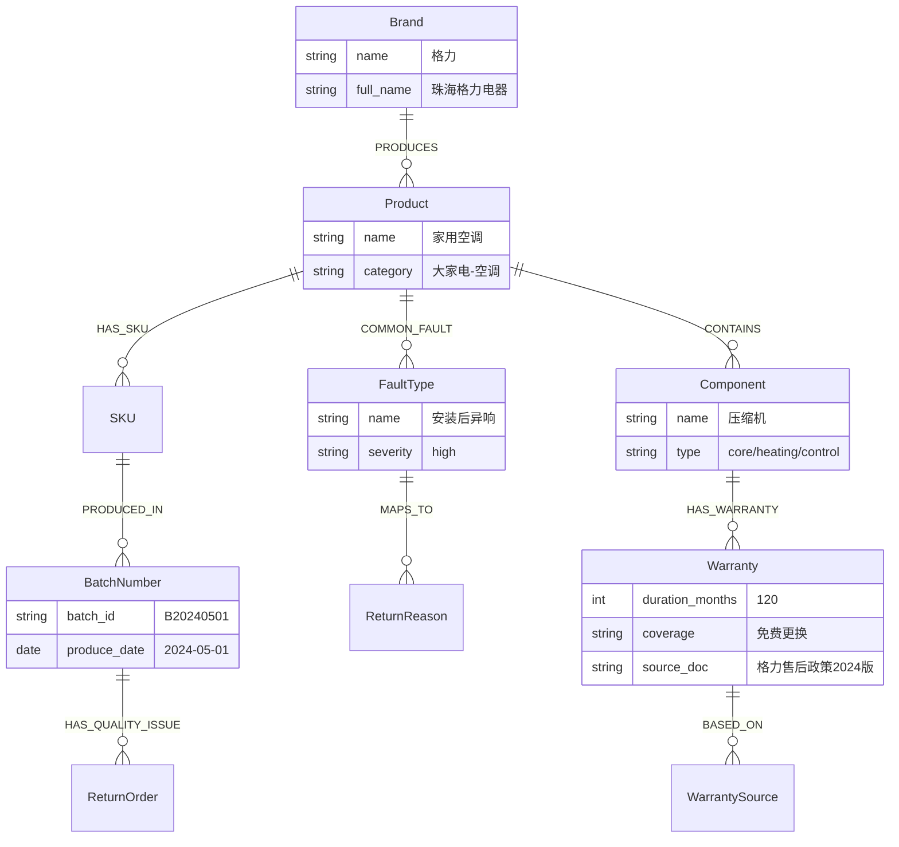

# 05q-售后领域知识图谱

# 05q · 售后领域知识图谱

> 这个难点的本质是：RAG 能搜到"格力空调整机保修 6 年"这段话，但搜不到"格力空调 → 压缩机 → 保修 10 年"这条精确关系。知识图谱把售后领域的实体和关系结构化存储，让 Agent 能走图查询直接定位答案，而不是在文档海洋里捞针。

---

## 为什么难

1.  **实体类型多**：品牌、品类、SKU、部件、故障类型、保修条款、退单原因——七类实体，关系错综
    
2.  **图谱构建**：初始数据从哪来？从苏宁的 SKU 库、品牌售后政策文档、历史退单数据中半自动抽取
    
3.  **跟 RAG 的分工**：什么时候走图查询，什么时候走 RAG？"保修几年"走图，"保修条款原文"走 RAG——需要查询路由
    
4.  **图更新策略**：新品上线、保修政策变更——图谱要跟业务数据同步，不能靠人工手动维护
    

---

## 技术方案

采用 **MySQL 邻接表 + 递归CTE + RAG 互补路由**（不用 Neo4j，零额外依赖）：

```mermaid
flowchart TD
    A[用户提问] --> B{查询意图分析}
    B -->|精确事实类<br/>"海尔冰箱压缩机保修多久"| C[构造SQL递归CTE查询]
    B -->|解释性/开放式<br/>"三包法对空调有什么规定"| D[走 RAG 检索]

    C --> E["MATCH (b:Brand)-[:PRODUCES]->(p:Product)<-[:BELONGS_TO]-(c:Component)
                -[:HAS_WARRANTY]->(w:Warranty)
                WHERE b.name='海尔' AND p.name='冰箱' AND c.name='压缩机'
                RETURN w.duration"]

    E --> F{图查询命中?}
    F -->|是| G[返回精确答案 + 引用来源]
    F -->|否| H[降级: 走 RAG 检索]
    D --> G
    H --> G
```
---

## 图谱 Schema 设计


---

## 实现思路

用 MySQL 8.0 的邻接表 + `WITH RECURSIVE` 递归 CTE 做图关系查询。初始数据从三个来源半自动构建：(1) SKU 库导出品牌-品类-SKU 关系，(2) 品牌售后政策文档用 LLM 做实体关系抽取，(3) 历史退单数据挖掘"故障类型→退单原因→批次号"的关联。查询时用一个轻量的意图分类器判断走图查询还是 RAG。

---

## 关键代码示例

```python
# knowledge_graph.py - 售后领域知识图谱

from dataclasses import dataclass
from typing import Optional, Literal
import sqlalchemy as sa
import json

@dataclass
class GraphQueryResult:
    """图查询结果"""
    answer: str
    source: str               # 引用的节点/关系来源
    confidence: float
    query_type: Literal["graph", "rag", "graph_then_rag"]

class AftersaleKnowledgeGraph:
    """售后领域知识图谱（基于 MySQL 邻接表 + 递归CTE，零额外依赖）"""

    def __init__(self, engine):
        self.engine = engine  # SQLAlchemy engine

    # ===== 精确事实查询 =====

    def query_warranty(self, brand: str, product: str,
                       component: str = None) -> Optional[GraphQueryResult]:
        """查询某品牌某品类/部件的保修期限（JOIN 查表即可，不需递归）"""

        with self.engine.connect() as conn:
            if component:
                result = conn.execute(sa.text("""
                    SELECT w.warranty_months AS duration, w.coverage,
                           ws.doc_name AS source, ws.article_number AS article
                    FROM t_product_brand b
                    JOIN t_product_sku s ON b.brand_id = s.brand_id
                    JOIN t_product_category c ON s.category_l3_code = c.category_code
                    JOIN t_component_warranty w ON c.category_code = w.category_code
                                               AND w.component_name = :component
                    JOIN t_warranty_source ws ON w.source_id = ws.source_id
                    WHERE b.brand_name = :brand AND c.category_name = :product
                    LIMIT 1
                """), brand=brand, product=product, component=component)
            else:
                result = conn.execute(sa.text("""
                    SELECT w.warranty_months AS duration, w.coverage,
                           ws.doc_name AS source, ws.article_number AS article
                    FROM t_product_brand b
                    JOIN t_product_sku s ON b.brand_id = s.brand_id
                    JOIN t_product_category c ON s.category_l3_code = c.category_code
                    JOIN t_product_warranty w ON s.sku_code = w.sku_code
                    JOIN t_warranty_source ws ON w.source_id = ws.source_id
                    WHERE b.brand_name = :brand AND c.category_name = :product
                    LIMIT 1
                """), brand=brand, product=product)

            record = result.fetchone()
            if not record:
                return None

            duration_years = record.duration // 12
            return GraphQueryResult(
                answer=f"{brand}{product}整机保修{duration_years}年。{record.coverage}",
                source=f"《{record.source}》{record.article or ''}",
                confidence=0.95,
                query_type="graph",
            )

    def query_fault_association(self, fault_type: str) -> list[dict]:
        """用递归CTE查询某故障类型关联的SKU和批次（多跳关系）"""
        with self.engine.connect() as conn:
            result = conn.execute(sa.text("""
                WITH RECURSIVE fault_chain AS (
                    -- 起点：故障类型匹配的 SKU
                    SELECT s.sku_code, s.sku_name, c.category_name,
                           f.fault_name, f.severity, 1 AS depth
                    FROM t_sku_fault_map sf
                    JOIN t_product_sku s ON sf.sku_code = s.sku_code
                    JOIN t_product_category c ON s.category_l3_code = c.category_code
                    JOIN t_fault_type f ON sf.fault_id = f.fault_id
                    WHERE f.fault_name = :fault

                    UNION ALL

                    -- 递归：向上追溯到批次和品牌
                    SELECT fc.sku_code, fc.sku_name, fc.category_name,
                           fc.fault_name, fc.severity, fc.depth + 1
                    FROM fault_chain fc
                    JOIN t_product_sku s ON fc.sku_code = s.sku_code
                    WHERE fc.depth < 3
                )
                SELECT b.brand_name AS brand, fc.category_name AS product,
                       fc.sku_code AS sku, bn.batch_id AS batch,
                       COUNT(r.return_id) AS return_count
                FROM fault_chain fc
                JOIN t_product_sku s ON fc.sku_code = s.sku_code
                JOIN t_product_brand b ON s.brand_id = b.brand_id
                LEFT JOIN t_batch_number bn ON s.sku_code = bn.sku_code
                LEFT JOIN t_aftersale_return r ON bn.batch_id = r.batch_id
                GROUP BY b.brand_name, fc.category_name, fc.sku_code, bn.batch_id
                ORDER BY return_count DESC
                LIMIT 10
            """), fault=fault_type)
            return [dict(row._mapping) for row in result]

    def query_product_chain(self, sku_code: str) -> dict:
        """查一个SKU的完整上下游关系链（递归CTE）"""
        with self.engine.connect() as conn:
            result = conn.execute(sa.text("""
                WITH RECURSIVE chain AS (
                    SELECT s.sku_code, s.sku_name, s.brand_id, s.category_l3_code,
                           0 AS depth
                    FROM t_product_sku s WHERE s.sku_code = :sku

                    UNION ALL

                    SELECT c.sku_code, c.sku_name, c.brand_id, c.category_l3_code,
                           c.depth + 1
                    FROM chain c
                    JOIN t_product_sku related
                      ON c.category_l3_code = related.category_l3_code
                    WHERE c.depth < 1
                )
                SELECT b.brand_name AS brand, cat.category_name AS product,
                       GROUP_CONCAT(DISTINCT cw.component_name) AS components,
                       GROUP_CONCAT(DISTINCT ft.fault_name) AS common_faults
                FROM (SELECT DISTINCT sku_code, brand_id, category_l3_code FROM chain) c
                JOIN t_product_brand b ON c.brand_id = b.brand_id
                JOIN t_product_category cat ON c.category_l3_code = cat.category_code
                LEFT JOIN t_component_warranty cw ON cat.category_code = cw.category_code
                LEFT JOIN t_sku_fault_map sf ON c.sku_code = sf.sku_code
                LEFT JOIN t_fault_type ft ON sf.fault_id = ft.fault_id
                GROUP BY b.brand_name, cat.category_name
            """), sku=sku_code)
            record = result.fetchone()
            return dict(record._mapping) if record else {}

    # ===== 图数据半自动构建 =====

    def ingest_from_policy_doc(self, doc_text: str, doc_name: str,
                                llm_client) -> int:
        """从品牌售后政策文档中用LLM抽取实体关系并写入MySQL表"""
        extraction_prompt = f"""..."""  # 同上
        response = llm_client.chat(extraction_prompt)
        data = json.loads(response)

        count = 0
        with self.engine.begin() as conn:

            for w in data.get("warranties", [ ]):

                conn.execute(sa.text("""
                    INSERT INTO t_component_warranty
                        (category_code, component_name, warranty_months, coverage, source_id)
                    SELECT c.category_code, :component, :duration, :coverage, ws.source_id
                    FROM t_product_category c
                    JOIN t_warranty_source ws ON ws.doc_name = :doc_name
                    WHERE c.category_name = :product
                """), component=w["component"], duration=w["duration_months"],
                     coverage=w["coverage"], doc_name=doc_name, product=w["product"])
                count += 1
        return count


# ===== 查询路由器：图 vs RAG =====

class QueryRouter:
    """根据用户问题特征，决定走图查询还是 RAG"""

    GRAPH_PATTERNS = [
        ("保修|质保|三包.*几年|保修.*多久", "warranty"),
        ("什么部件|配件|压缩机|电机|主板.*保修", "component_warranty"),
        ("哪个批次|批次号|同批次", "batch_trace"),
        ("什么型号.*故障|通病|常见问题", "fault_association"),
    ]

    def __init__(self, kg: AftersaleKnowledgeGraph, rag: KnowledgeRAG):
        self.kg = kg
        self.rag = rag

    async def route_and_query(self, query: str, entities: dict) -> GraphQueryResult:
        """先尝试图查询，失败则回退到 RAG"""

        import re
        for pattern, query_type in self.GRAPH_PATTERNS:
            if re.search(pattern, query):
                # 走图查询
                brand = entities.get("brand", "")
                product = entities.get("product", "")
                component = entities.get("component")

                if query_type == "warranty":
                    result = self.kg.query_warranty(brand, product, component)
                    if result:
                        return result
                    # 图查不到，降级 RAG
                    rag_chunks = await self.rag.search(query, entities, top_k=3)
                    if rag_chunks:
                        return GraphQueryResult(
                            answer=f"[RAG降级] {rag_chunks[0][0].content[:200]}",
                            source=rag_chunks[0][0].source_title,
                            confidence=0.7,
                            query_type="graph_then_rag",
                        )

                elif query_type == "batch_trace":
                    results = self.kg.query_fault_association(entities.get("fault_type", ""))
                    if results:
                        formatted = "\n".join(
                            f"{r['brand']} {r['product']} 批次{r.get('batch','未知')} 退单{r['return_count']}件"
                            for r in results[:5]
                        )
                        return GraphQueryResult(
                            answer=formatted,
                            source="知识图谱-退单关联分析",
                            confidence=0.9,
                            query_type="graph",
                        )

        # 没命中任何图查询模式，直接走 RAG
        rag_chunks = await self.rag.search(query, entities, top_k=3)
        if rag_chunks:
            return GraphQueryResult(
                answer=rag_chunks[0][0].content[:300],
                source=rag_chunks[0][0].source_title,
                confidence=0.7,
                query_type="rag",
            )

        return GraphQueryResult(answer="未找到相关信息", source="", confidence=0, query_type="rag")
```
---

## 涉及业务模块

*   M5 · 售后知识 RAG（图谱与 RAG 互补，共用查询路由器）
    
*   M1 · 退单分析引擎（批次关联、故障关联查询）
    
*   M2 · 订单全链路追踪（SKU 上下游关系链查询）