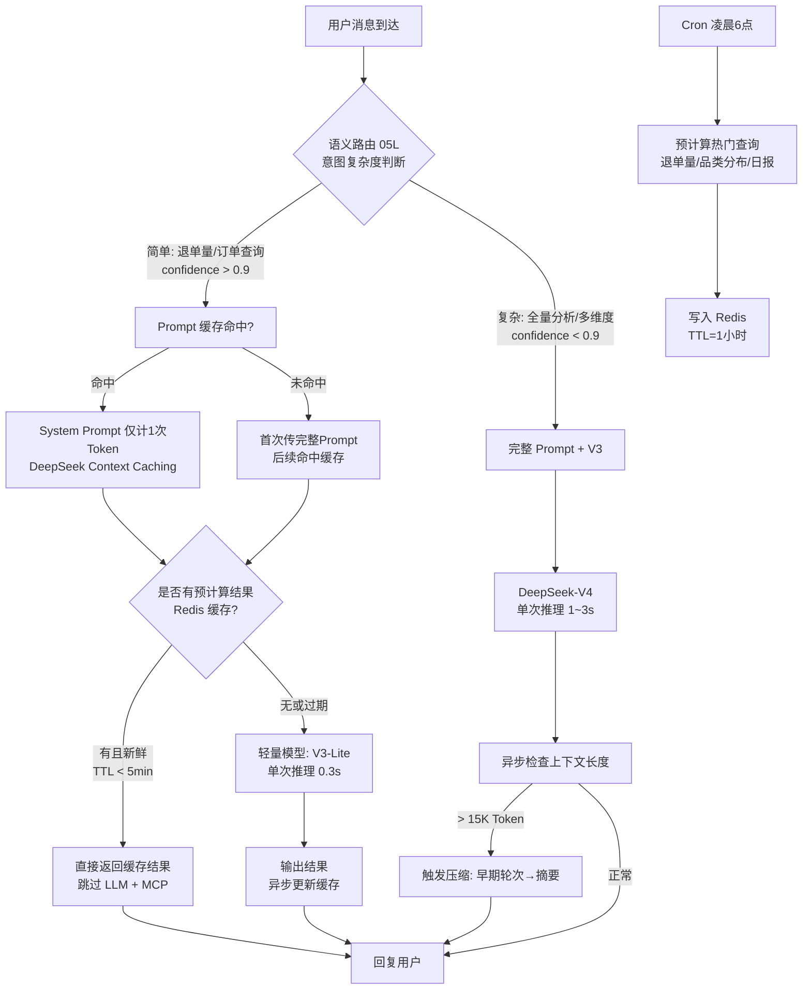

# 05r-Agent推理效率优化

# 05r · Agent 推理效率优化

> 这个难点的本质是：Agent 每回复一句话背后要走"LLM 意图解析→LLM 工具选择→MCP 调用→LLM 结果聚合→LLM 生成回复"至少 3~4 轮 LLM 调用。一次简单查询"退单量多少"耗时 3~5 秒、消耗 800 Token。推理效率优化的目标是把这个数字砍半——简单查询 < 1.5 秒、单次 Token 消耗 < 500。

---

## 为什么难

1.  **System Prompt 冗余**：NL2SQL 的 System Prompt 塞满了完整表结构 Schema（05B），每次对话都重复传，占 Token 大头
    
2.  **大模型小用**：简单查询"退单量多少"也用 DeepSeek-V4——没必要，轻量模型就够了
    
3.  **预热查询缺失**：每天早上运营上班第一问"今天退单量"是实时查，实际应该凌晨 Cron 预计算
    
4.  **上下文膨胀**：多轮对话到 20 轮时，上下文窗口接近 20K Token，LLM 推理变慢且贵
    

---

## 技术方案

四层优化：**Prompt 缓存 → 分层模型 → 结果预计算 → 上下文压缩**：


---

## 实现思路

四层各自独立，可以按需开启：

1.  **Prompt 缓存**：利用 DeepSeek Context Caching API，同一段 System Prompt 多轮复用只计一次 Token
    
2.  **分层模型**：05L 路由判断意图复杂度，简单意图自动降级到 DeepSeek-V4-Lite（快 80%，成本 1/5）
    
3.  **结果预计算**：Cron 在用户使用高峰前预跑高频查询，结果缓存到 Redis
    
4.  **上下文压缩**：05C 的上下文管理模块检测 Token 用量 > 15K 时触发早期轮次压缩
    

---

## 关键代码示例

```python
# inference_optimizer.py - 推理效率四层优化

import time
import hashlib
from dataclasses import dataclass, field
from typing import Optional
import json

@dataclass
class ModelTier:
    """模型分层定义"""
    name: str
    cost_per_1k_tokens: float     # 成本 $
    avg_latency_ms: float         # 平均延迟
    context_window: int           # 上下文窗口
    supports_cache: bool          # 是否支持 Context Caching

MODEL_TIERS = {
    "lite": ModelTier("deepseek-v4-lite", 0.0001, 300, 32768, True),
    "full": ModelTier("deepseek-v4", 0.0005, 1500, 131072, True),
}

@dataclass
class InferenceStats:
    """单次推理的统计信息"""
    model_used: str
    tokens_input: int
    tokens_output: int
    latency_ms: float
    cache_hit: bool = False
    precomputed: bool = False


class InferenceOptimizer:
    """推理效率优化器"""

    def __init__(self, llm_client, redis_client, embedder):
        self.llm = llm_client
        self.redis = redis_client
        self.embedder = embedder
        self._prompt_cache: dict[str, str] = {}  # 本地 LRU 缓存

    # ===== 1. Prompt 缓存 =====

    def get_or_cache_system_prompt(self, scene: str, prompt_template: str,
                                   **kwargs) -> tuple[str, bool]:
        """
        获取 System Prompt，优先走缓存。
        返回 (prompt_text, is_cache_hit)
        """
        cache_key = f"prompt:{scene}:" + hashlib.md5(
            json.dumps(kwargs, sort_keys=True).encode()
        ).hexdigest()[:16]

        # L1: 本地内存缓存
        if cache_key in self._prompt_cache:
            return self._prompt_cache[cache_key], True

        # L2: Redis 缓存
        cached = self.redis.get(cache_key)
        if cached:
            rendered = cached.decode("utf-8") if isinstance(cached, bytes) else cached
            self._prompt_cache[cache_key] = rendered
            return rendered, True

        # 未命中：渲染完整 Prompt
        rendered = prompt_template.format(**kwargs)
        self.redis.setex(cache_key, 3600, rendered)
        self._prompt_cache[cache_key] = rendered
        return rendered, False

    # ===== 2. 分层模型路由 =====

    def select_model(self, scene: str, complexity: float) -> ModelTier:
        """
        根据场景和复杂度选择模型。
        complexity: 0~1，来自05L路由器的置信度/复杂度评分
        """
        # 简单查询 → Lite 模型
        if complexity > 0.85 and scene in ("return_analysis", "order_trace"):
            return MODEL_TIERS["lite"]

        # 明确简单场景 → Lite
        if scene in ("simple_query", "greeting"):
            return MODEL_TIERS["lite"]

        # 其他 → Full 模型
        return MODEL_TIERS["full"]

    # ===== 3. 结果预计算 =====

    async def precompute_hot_queries(self):
        """Cron 定时任务：预计算高频查询结果"""

        hot_queries = [
            {"scene": "return_analysis", "query": "今天退单量多少",
             "tool": "query_return_stats_nl2sql", "params": {"group_by": "category", "date_range_days": 1}},
            {"scene": "return_analysis", "query": "近7天退单趋势",
             "tool": "query_return_stats_nl2sql", "params": {"group_by": "day", "date_range_days": 7}},
            {"scene": "return_analysis", "query": "各品类退单分布",
             "tool": "query_return_stats_nl2sql", "params": {"group_by": "category", "date_range_days": 1}},
        ]

        for query in hot_queries:
            try:
                result = await mcp_client.call(query["tool"], **query["params"])
                cache_key = f"precomputed:{query['scene']}:" + hashlib.md5(
                    json.dumps(query["params"], sort_keys=True).encode()
                ).hexdigest()[:16]
                self.redis.setex(cache_key, 3600, json.dumps(result, default=str))
            except Exception as e:
                # 预计算失败不阻塞
                continue

    def get_precomputed(self, scene: str, params: dict) -> Optional[dict]:
        """尝试命中预计算结果"""
        cache_key = f"precomputed:{scene}:" + hashlib.md5(
            json.dumps(params, sort_keys=True).encode()
        ).hexdigest()[:16]
        cached = self.redis.get(cache_key)
        if cached:
            return json.loads(cached.decode("utf-8") if isinstance(cached, bytes) else cached)
        return None

    # ===== 4. 上下文压缩触发器 =====

    def should_compress(self, context: dict, threshold_tokens: int = 15000) -> bool:
        """
        判断当前上下文是否需要压缩。
        当 Token 估算超过阈值时返回 True。
        """
        estimated_tokens = self._estimate_tokens(context)
        return estimated_tokens > threshold_tokens

    def _estimate_tokens(self, context: dict) -> int:
        """快速估算当前上下文的 Token 数量（不需要调 API）"""
        total_chars = 0

        # System Prompt
        total_chars += len(context.get("system_prompt", ""))

        # 历史轮次

        for turn in context.get("recent_turns", [ ]):

            total_chars += len(turn.get("user_msg", ""))
            total_chars += len(turn.get("assistant_reply", ""))

        # 压缩历史

        for summary in context.get("compressed_history", [ ]):

            total_chars += len(summary)

        # 中文: 约 1.5 字符 = 1 Token
        return int(total_chars / 1.5)

    # ===== 全流程集成 =====

    async def optimized_inference(
        self, user_query: str, scene: str, complexity: float,
        context: dict, execute_fn, **params
    ) -> tuple[str, InferenceStats]:
        """
        优化后的推理全流程。
        四层优化按顺序叠加：
        1. 预计算命中 → 跳过 LLM + MCP
        2. Prompt 缓存 → 减少 Token
        3. 分层模型 → 选便宜的
        4. 上下文压缩 → 按需触发
        """

        # 1. 预计算检查
        precomputed = self.get_precomputed(scene, params)
        if precomputed:
            stats = InferenceStats(
                model_used="cache",
                tokens_input=0,
                tokens_output=0,
                latency_ms=1,
                precomputed=True,
            )
            return self._format_result(precomputed, scene), stats

        # 2. Prompt 缓存
        base_prompt = SCENE_PROMPTS.get(scene, SCENE_PROMPTS["default"])
        system_prompt, cache_hit = self.get_or_cache_system_prompt(
            scene, base_prompt, **params
        )

        # 3. 分层模型选择
        model = self.select_model(scene, complexity)

        # 4. 上下文压缩检查
        if self.should_compress(context):
            compressed = self._compress_context(context)
            context = compressed

        # 执行推理
        t0 = time.time()

        full_prompt = f"{system_prompt}\n\n"
        if context.get("compressed_history"):
            full_prompt += "历史会话摘要:\n"
            full_prompt += "\n".join(context["compressed_history"][-3:])
            full_prompt += "\n\n"
        full_prompt += f"用户: {user_query}"

        response = await self.llm.chat(
            full_prompt,
            model=model.name,
            max_tokens=500,
        )

        latency = (time.time() - t0) * 1000
        tokens_input = self._estimate_tokens({"system_prompt": full_prompt})
        tokens_output = self._estimate_tokens({"recent_turns": [{"assistant_reply": response}]})

        stats = InferenceStats(
            model_used=model.name,
            tokens_input=tokens_input,
            tokens_output=tokens_output,
            latency_ms=latency,
            cache_hit=cache_hit,
        )

        return response, stats

    def _compress_context(self, context: dict) -> dict:
        """压缩上下文：将早期轮次转为摘要"""

        turns = context.get("recent_turns", [ ])

        if len(turns) > 4:
            to_compress = turns[:-3]
            summary = f"已完成的{turns.__len__() - 3}轮对话中，用户主要咨询了{context.get('slots', {}).get('topic', '')}相关问题。"

            context["compressed_history"] = context.get("compressed_history", [ ]) + [summary]

            context["recent_turns"] = turns[-3:]
        return context

    def _format_result(self, data: dict, scene: str) -> str:
        """将缓存数据格式化为自然语言回复"""
        # 简单格式化逻辑（实际实现会根据 scene 选择不同的模板）
        return json.dumps(data, ensure_ascii=False, default=str)


# ===== 性能基准记录 =====

class InferenceBenchmark:
    """推理效率基准测试"""

    def __init__(self, optimizer: InferenceOptimizer):
        self.optimizer = optimizer
        self._baseline: dict[str, dict] = {}

    async def benchmark(self, test_cases: list[dict]) -> dict:
        """跑基准测试，收集各场景的延迟+Token数据"""
        results = {}

        for case in test_cases:
            scene = case["scene"]

            stats_list = [ ]


            for _ in range(3):  # 每个 case 跑 3 次取平均
                _, stats = await self.optimizer.optimized_inference(
                    user_query=case["query"],
                    scene=scene,
                    complexity=case.get("complexity", 0.5),
                    context={},
                    execute_fn=None,
                    **case.get("params", {}),
                )
                stats_list.append(stats)

            avg_latency = sum(s.latency_ms for s in stats_list) / len(stats_list)
            avg_tokens = sum(s.tokens_input + s.tokens_output for s in stats_list) / len(stats_list)

            results[scene] = {
                "avg_latency_ms": avg_latency,
                "avg_tokens": avg_tokens,
                "model": stats_list[0].model_used,
                "cache_hit_rate": sum(1 for s in stats_list if s.cache_hit) / len(stats_list),
            }

        return results
```
---

## 四层优化的预期效果

| 优化层 | 适用场景 | 预期效果 |
| --- | --- | --- |
| Prompt 缓存 | 所有场景 | System Prompt Token 节省 90%（首次全量，后续仅计增量） |
| 分层模型 | 简单查询（退单量/订单追踪） | 延迟从 1.5s → 0.3s，成本降至 1/5 |
| 结果预计算 | 高频固定查询（日报数据） | 延迟从 3s → 1ms，完全跳过 LLM+MCP |
| 上下文压缩 | 超 15K Token 的长会话 | Token 消耗减少 40%~60% |

---

## 涉及业务模块

*   M1 · 退单分析引擎
    
*   M8 · 定时报告推送
