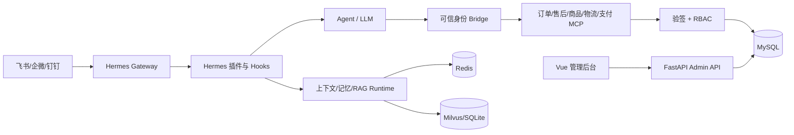

#### 架构运行

###### gateway如何拦截处理IM平台数据？
主要是由上游Hermes gateway完成接入IM平台,并把平台信息、真实发送者ID、会话类型、session id之类的信息写入请求级上下文变量。配置完整时会首先会通过插件注册的前置中间件完成信息的拦截,然后在统一身份路由中去做信息解析,根据平台与用户id去查绑定表得到内部逻辑用户。映射完成后,所有上下文、长期记忆跟权限处理都用内部hermes_user_id。然后这里呢会根据用户信息的类型,私聊通过redis键创建或者复用逻辑会话,群聊则在redis键中用namespace根据群、平台、用户做分级。
每个agent回合还会通过redisNX EX获取随即令牌、自动续租并通过Lua比较后释放分布式租约,避免同一逻辑用户跨平台并发覆盖上下文。如果未绑定、停用、身份不可信、租约冲突或丢失的情况下,hook会在工具执行前阻断调用并最终输出为固定拒绝文案。
如果在agent loop中调用MCP时,桥阶层又会从gateway中请求及上下文中重新读取原始可信身份,签发绑定具体工具再通过解析用户的上下文重查绑定关系，然后加载用户、角色权限、数据范围实现。

IM Webhook 是即时通讯平台向我们服务端推送事件的一种机制。比如用户在飞书、企微里发消息后，平台会通过 HTTP Webhook 把消息事件推到 Gateway，Gateway 做验签、消息解析和会话路由，然后把请求交给 Agent 执行。执行完成之后，再通过 IM 平台提供的发送消息 API 把结果回复给用户。