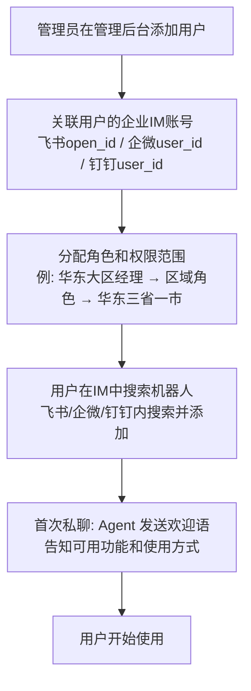
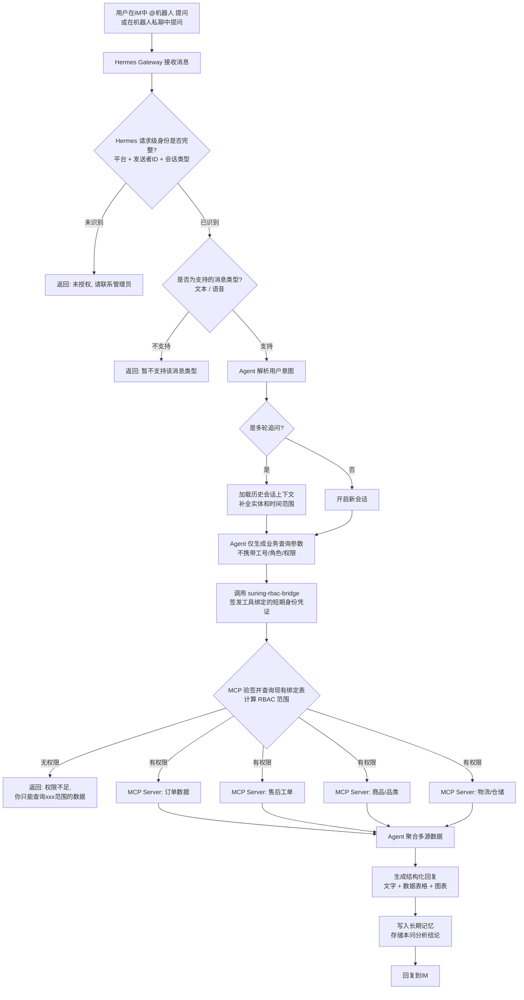
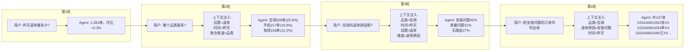
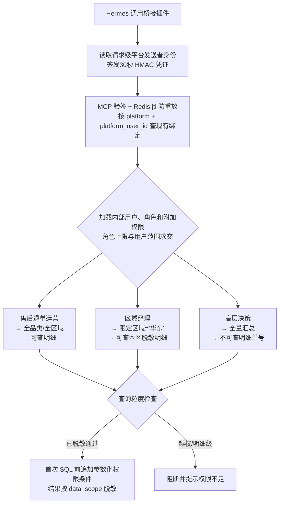

# 02-使用人群与操作流程

# 02 · 使用人群与操作流程

> 这篇文档讲的是"谁在用、怎么用"。每个人打开这个系统看到的东西不一样——同样问"退单量多少"，全国运营总监看到的数字跟华东大区经理看到的不一样，权限控制了数据范围。

---

## 一、使用人群

所有用户均为苏宁内部员工，通过飞书/企微/钉钉的企业账号认证后使用。按角色分为五类：

| 角色 | 典型岗位 | 核心诉求 | 数据权限范围 | 可查订单范围 |
| --- | --- | --- | --- | --- |
| 售后运营 | 售后运营经理/专员 | 退单趋势、品类分布、SLA时效 | 全品类、全区域 | 全部 |
| 客服管理 | 客服主管/组长 | 单订单全链路、投诉追溯 | 本团队服务范围 | 本团队关联订单 |
| 品控/供应链 | 质量工程师、采购经理 | 退单原因分析、高退货SKU识别 | 对应品类 | 对应品类订单 |
| 区域管理 | 大区经理/城市经理 | 本区售后指标、仓储物流时效 | 本区域数据 | 本区域订单 |
| 高层决策 | 总监/VP/总经理 | 成本趋势、满意度、大盘概览 | 全量脱敏汇总 | 汇总级（不可查单） |

---

## 二、操作流程

### 2.1 首次接入流程

### 2.2 日常使用主流程

### 2.3 多轮追问流程

---

## 三、权限控制流程

---

## 四、群聊 vs 私聊行为差异

| 场景 | 群聊 @机器人 | 私聊机器人 |
| --- | --- | --- |
| 权限判定 | 以 @者 的身份计算 | 以聊天对象身份计算 |
| 回复可见性 | 全群可见 | 仅自己可见 |
| 敏感数据 | 自动脱敏（如隐藏用户手机号中间四位） | 按角色展示完整程度 |
| 会话上下文 | 群会话独立，不同群不串 | 个人会话独立 |
| 图表展示 | 降级为文字摘要（部分IM群聊不支持图表） | 展示完整图表 |
