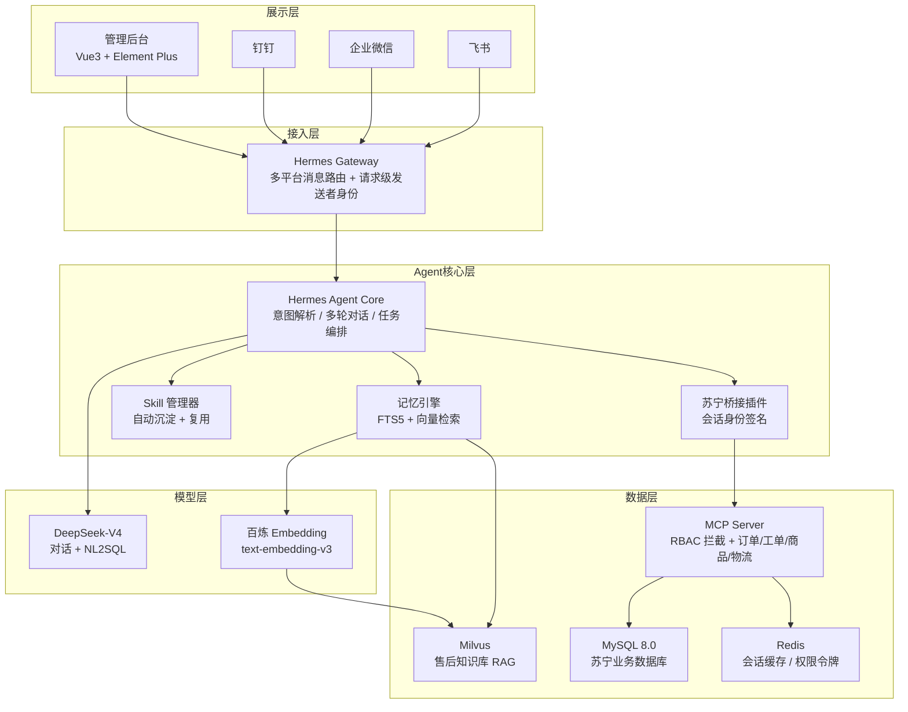

# 03-技术选型方案

# 03 · 技术选型方案

> 这篇文档讲的是"用什么技术搭这个系统"。技术栈的核心选型逻辑是：以 Hermes Agent 开源框架为骨架，围绕它做苏宁业务层的定制和扩展——不改框架本身，而是通过 MCP 协议和插件机制把苏宁的业务能力接进去。

---

## 一、技术栈总览


---

## 二、逐层选型说明

### 2.1 Agent 框架：Hermes Agent

| 维度 | 说明 |
| --- | --- |
| 选型 | Hermes Agent（Nous Research，MIT 开源） |
| 版本 | 最新 stable（≥ v0.15） |
| 语言 | Python 3.12+ |
| 核心理由 | 自带持久记忆（FTS5）、多平台 Gateway（飞书/企微/钉钉原生支持）、MCP 协议集成、Skill 自进化、子 Agent 编排——全部内置，不需要从零搭建 Agent 框架 |
| 不自研的理由 | Hermes 已是 18 万 Star 的成熟项目。内置能力还包括：语音消息转录（依赖系统 ffmpeg）、多平台 Gateway（飞书/企微/钉钉/微信等原生支持），无需额外开发消息路由层 |

### 2.2 大语言模型：DeepSeek-V4

| 维度 | 说明 |
| --- | --- |
| 选型 | DeepSeek-V4（API 接入） |
| 其他可选 | 百炼（通义千问）、Kimi/Moonshot |
| 核心理由 | 中文 NL2SQL 能力业界领先，推理能力强（适合复杂分析链），上下文窗口大（128K，适合多轮会话），推理成本低。简单查询场景可降级使用 DeepSeek-V4-Lite，延迟更低、成本更省 |
| 切换方式 | Hermes 通过 `hermes model` 命令即可切换模型，不绑定单一厂商 |

### 2.3 Embedding 模型：百炼 text-embedding-v3

| 维度 | 说明 |
| --- | --- |
| 选型 | 阿里云百炼平台 text-embedding-v4 |
| 维度 | 1024 维 |
| 核心理由 | 中文语义理解强，支持长文本截断策略，与国内云环境网络延迟低 |

### 2.4 向量数据库：Milvus

| 维度 | 说明 |
| --- | --- |
| 选型 | Milvus Standalone |
| 版本 | 以官方最新部署脚本为准 |
| 核心理由 | 存储售后知识库（三包法条款、品牌保修政策、维修手册、历史案例分析），支撑 RAG 检索。同时存储长期记忆的语义向量（与 FTS5 关键词索引互补），两个 Collection 物理隔离 |

### 2.5 MCP 服务框架：FastMCP

| 维度 | 说明 |
| --- | --- |
| 选型 | FastMCP（Python MCP SDK） |
| 核心理由 | 轻量、支持异步、天然兼容 Hermes 的 MCP Client。每类业务数据封装为一个 MCP Tool |

MCP Server 规划：

```plaintext
mcp-suning/
├── order_server.py      # 订单查询工具集
├── aftersale_server.py  # 售后工单工具集
├── product_server.py    # 商品/品类工具集
├── logistics_server.py  # 物流/仓储工具集
├── auth_middleware.py   # RBAC 权限拦截中间件
└── config.py            # 数据库连接配置
```

### 2.6 关系型数据库：MySQL 8.0

| 维度 | 说明 |
| --- | --- |
| 选型 | MySQL 8.0 |
| 连接方式 | 只读副本连接，MCP Server 层面限制 SELECT only |
| 核心理由 | 苏宁现有业务系统使用 MySQL，MCP 直接连现有库的表或只读视图，不新建数据表（除模拟数据外）。开发和生产统一用 MySQL，通过 SQLAlchemy 连接，避免方言差异 |

> **关于 FTS5**：Hermes Agent 框架内置了 SQLite FTS5 作为 Agent 自身记忆的关键词检索引擎（存储对话摘要、用户偏好等非业务数据）。这是 Hermes 自带的、封装好的内部机制，不对外暴露，与苏宁业务数据库无关。业务数据查询走 MCP → MySQL，Agent 记忆检索走 Hermes 内置 → FTS5，两者互不干扰。

### 2.7 图关系查询

| 维度 | 说明 |
| --- | --- |
| 选型 | MySQL 邻接表 + `WITH RECURSIVE` 递归 CTE |
| 核心理由 | 品牌→品类→部件→保修条款的四层关系查询用递归 CTE 即可实现，不需要额外部署图数据库。MySQL 8.0 原生支持 `WITH RECURSIVE`，多跳查询性能满足售后场景的 QPS 要求 |
| 举例 | 查"格力空调压缩机保修多久"本质是品牌表→品类表→部件表→保修表的三次 JOIN + 一次递归 |

### 2.8 缓存与会话：Redis

| 维度 | 说明 |
| --- | --- |
| 选型 | Redis 7.x |
| 用途 | 多轮对话上下文暂存、权限令牌缓存、热点查询结果缓存、Celery Broker |

### 2.9 可观测性

| 维度 | 说明 |
| --- | --- |
| 选型 | OpenTelemetry + Hermes 内置日志 |
| 核心理由 | OTel 是 CNCF 孵化项目、行业标准，不引入厂商锁定。Hermes 自带结构化日志输出，叠加 OTel Span 做 Agent 调用链的 Trace→Span 关联。不引入 Langfuse 等额外 Agent 可观测平台，降低运维依赖 |

### 2.10 前端管理后台：Vue 3 + Vite + Element Plus

| 维度 | 说明 |
| --- | --- |
| 选型 | Vue 3 + Vite + Element Plus |
| 用途 | 用户权限配置、MCP Server 注册/状态监控、对话日志审计、Skill 管理 |
| 备注 | 轻量后台，不涉及复杂交互，核心交互在 IM 端 |

### 2.11 异步任务：Celery + Redis

| 维度 | 说明 |
| --- | --- |
| 选型 | Celery + Redis（broker） |
| 用途 | 复杂分析任务异步执行（月度报告生成、大批量数据聚合），避免阻塞对话响应 |

### 2.12 图表生成：matplotlib

| 维度 | 说明 |
| --- | --- |
| 选型 | matplotlib 3.x（无 GUI 后端 Agg） |
| 用途 | 服务端生成退单趋势图、品类分布图、柱状图、饼图，输出为 PNG bytes 通过 IM 上传接口发送 |

### 2.13 IM 平台接入

| 平台 | 接入方式 | 认证方式 |
| --- | --- | --- |
| 飞书 | 飞书开放平台 Bot 事件 | Hermes 已验证的发送者 `open_id` → 桥接签名 → 现有平台绑定表 |
| 企业微信 | 企微应用消息事件 | Hermes 已验证的发送者 `userid` → 桥接签名 → 现有平台绑定表 |
| 钉钉 | 钉钉机器人消息事件 | Hermes 已验证的发送者 `unionid/userid` → 桥接签名 → 现有平台绑定表 |

这里的 OAuth/应用访问令牌只用于机器人调用平台 API，不作为业务数据权限主体。
RBAC 不接收模型传入的工号、角色或用户 Token，也不需要新增外部身份绑定表。

---

## 三、技术选型决策原则

1.  **不重复造轮子**：Hermes 已有的能力（记忆/技能/编排/Gateway）直接用，不在项目内重新实现
    
2.  **MCP 为边界**：Agent 与苏宁业务系统的唯一交互方式是通过 MCP 协议，不直连数据库做 SQL 拼接
    
3.  **模型可替换**：大模型和 Embedding 模型通过 Hermes 的 Provider 机制接入，不硬编码
    
4.  **Python 全栈后端**：Agent + MCP Server + 异步任务全部 Python，降低技术栈复杂度
