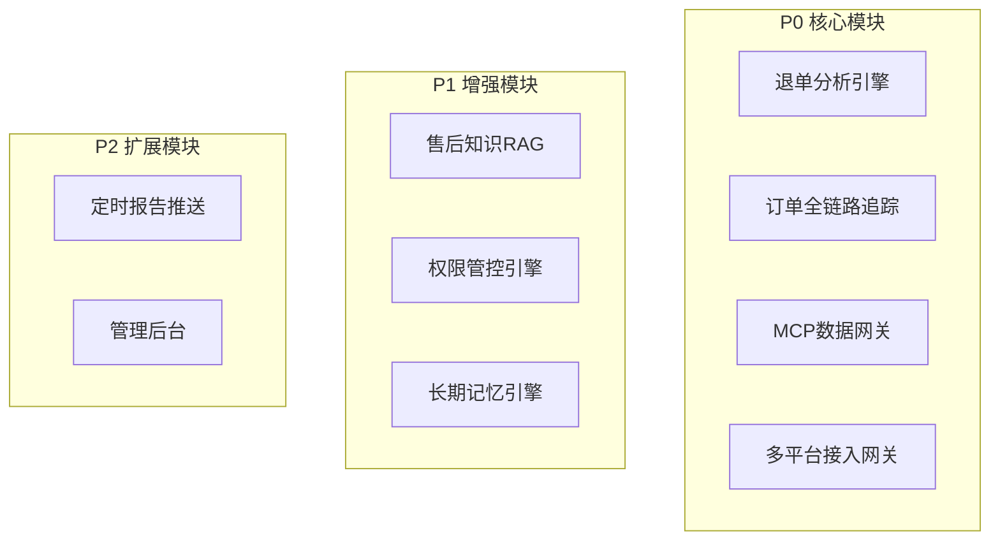

# 04-核心业务模块

# 04 · 核心业务模块

> 这篇文档把整个系统拆成九个功能模块，每个模块说清楚干什么、为什么是核心、涉及哪些技术。P0 是最小可用版本必须上线的，P1 是核心体验依赖的，P2 是锦上添花。

---

## 一、模块总览

---

## 二、逐模块说明

### M1 · 退单分析引擎（P0）

| 维度 | 说明 |
| --- | --- |
| 职责 | 支持自然语言驱动的退单数据分析：趋势、品类分布、原因归类、高退货SKU识别、区域对比 |
| 为什么核心 | 这是最高频的使用场景，售后运营每天打开 Agent 第一件事就是问退单数据。如果这个模块不好用，整个项目就失败了一半 |
| 涉及技术 | NL2SQL、MCP 订单查询、MCP 商品查询、多轮上下文、图表生成 |
| 典型提问 | "昨天退单量"、"空调退单原因分布"、"近30天退单率最高的10个SKU"、"华南区退单同比趋势" |

### M2 · 订单全链路追踪（P0）

| 维度 | 说明 |
| --- | --- |
| 职责 | 输入订单号，跨系统串起售后全节点时间线：申请→审核→上门→签收→质检→退款，定位卡点 |
| 为什么核心 | 客服主管处理投诉升级时最依赖的能力，也是最能体现 Agent "多系统串联"优势的场景 |
| 涉及技术 | MCP 多源并联调用、时间线聚合、SLA 计算、异常节点高亮 |
| 典型提问 | "查订单 S2024060100123 售后链路"、"这个订单卡在哪了"、"退款到哪一步了" |

### M3 · MCP 数据网关（P0）

| 维度 | 说明 |
| --- | --- |
| 职责 | 统一封装苏宁业务数据库的只读查询接口，以 MCP 协议暴露给 Agent。包含：订单查询、工单查询、商品/品类查询、物流仓储查询 |
| 为什么核心 | 这是 Agent 连接真实世界的"手"。MCP 网关设计的好坏直接决定了 Agent 能查到什么、查得多快、数据质量如何。没有这个网关，Agent 就是个空壳 |
| 涉及技术 | FastMCP、MySQL 只读连接、SQL 安全校验、连接池管理、超时控制 |
| 接口清单 | `search_orders` / `get_order_detail` / `trace_order_timeline` / `get_aftersale_workflow` / `query_return_stats_nl2sql` / `query_sku_return_rate` / `query_aftersale_nl2sql` / `get_product_info` / `query_logistics` / `get_refund_status` |

### M4 · 多平台接入网关（P0）

| 维度 | 说明 |
| --- | --- |
| 职责 | 对接飞书/企微/钉钉三个IM平台，统一消息收发、用户身份映射、OAuth认证 |
| 为什么核心 | 这是用户跟 Agent 对话的"嘴"和"耳朵"。不能接入IM，整个系统就没有入口 |
| 涉及技术 | Hermes Gateway 原生支持、飞书开放平台 API、企微应用 API、钉钉机器人 API、OAuth 2.0 |
| 备注 | 利用 Hermes 自带的多平台 Gateway，不需要额外开发消息路由层 |

### M5 · 售后知识 RAG（P1）

| 维度 | 说明 |
| --- | --- |
| 职责 | 将国家三包法、各品牌售后条款、常见故障排查手册、以旧换新政策等文档向量化存入 Milvus，支撑 Agent 在做分析时引述法规条款、解释退单原因、回答政策类问题 |
| 为什么核心 | 数据分析不能只看数字，还要能解释"为什么"。比如退单原因里"安装问题"占比高，Agent 应该能检索出该品牌安装规范条款，辅助判断是用户操作问题还是师傅安装问题 |
| 涉及技术 | Milvus、百炼 Embedding、文档切片策略、混合检索（向量+关键词） |
| 知识库内容 | 三包法全文、家电品类保修标准、品牌特殊条款、苏宁自有售后政策 |

### M6 · 权限管控引擎（P1）

| 维度 | 说明 |
| --- | --- |
| 职责 | 三层权限控制：用户→角色→数据范围。在 MCP 调用层面自动注入权限过滤条件，确保不同角色的用户只能看到自己有权看到的数据 |
| 为什么核心 | 没有权限管控，这个系统根本不可能在企业内上线——售后数据涉及用户隐私、经营数据、供应链信息 |
| 涉及技术 | RBAC 模型、MCP 拦截中间件、SQL 行级过滤、权限策略缓存（Redis） |
| 权限矩阵 | 运营=全量、区域经理=本区、品控=对应品类、高层=汇总脱敏、客服=本团队 |

### M7 · 长期记忆引擎（P1）

| 维度 | 说明 |
| --- | --- |
| 职责 | 基于 Hermes 内置的 FTS5 记忆系统，存储历史分析结果的结构化摘要，支持跨会话检索和上下文召回 |
| 为什么核心 | 没有记忆的话，Agent 每次都是"新来的"。运营昨天刚分析过空调退单的结论，今天问"空调退单还是安装问题为主吗"——Agent 应该能检索到昨天的分析结论并引用，而不是重新跑一遍 |
| 涉及技术 | FTS5 全文检索、对话摘要自动生成、记忆时效衰减策略、用户偏好学习 |
| 记忆类型 | 分析结论记忆、用户偏好记忆、查询模式记忆、高频问题记忆 |

### M8 · 定时报告推送（P2）

| 维度 | 说明 |
| --- | --- |
| 职责 | 利用 Hermes 的 Cron 调度能力，在指定时间自动生成售后数据日报/周报，推送到指定 IM 群 |
| 为什么核心 | 从"人找数据"升级到"数据找人"的最后一环——每天早上一打开飞书，售后核心指标已经推送到群里了 |
| 涉及技术 | Hermes Cron、报告模板引擎、图表预生成 |
| 报告类型 | 日报（退单量+异常预警）、周报（趋势+品类+区域）、月度简报 |

### M9 · 管理后台（P2）

| 维度 | 说明 |
| --- | --- |
| 职责 | Web 端配置管理界面：用户权限分配、MCP Server 注册/状态、对话日志审计、Skill 管理 |
| 为什么核心 | 开发调试和运维管理需要可视化界面，不能用命令行管理一切 |
| 涉及技术 | Vue 3 + Vite + Element Plus |
| 页面清单 | 用户管理、角色权限、MCP服务管理、对话日志、系统监控 |

---

## 三、模块与业务场景的交叉覆盖

每个业务场景至少被一个模块支撑，每个模块至少支撑一个业务场景：

| 业务场景 | M1退单分析 | M2全链路 | M3网关 | M4接入 | M5 RAG | M6权限 | M7记忆 | M8报告 | M9后台 |
| --- | --- | --- | --- | --- | --- | --- | --- | --- | --- |
| 晨会问数 | ✓ |  | ✓ | ✓ |  | ✓ | ✓ | ✓ |  |
| 投诉处理 |  | ✓ | ✓ | ✓ |  | ✓ | ✓ |  |  |
| 质量分析 | ✓ |  | ✓ | ✓ | ✓ | ✓ | ✓ |  |  |
| 区域时效 | ✓ |  | ✓ | ✓ |  | ✓ | ✓ |  |  |
| 月度复盘 | ✓ |  | ✓ | ✓ |  | ✓ |  | ✓ |  |
