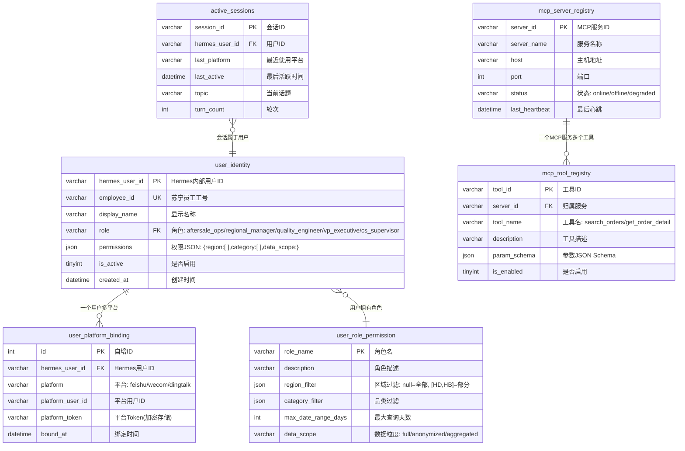

# 06-数据库设计与模拟数据

# 06 · 数据库设计与模拟数据

> 这篇文档包含三块：业务数据库表结构（仿真苏宁售后数据）、Agent 自身管理库表结构、以及用于开发的模拟数据。所有表均为只读连接设计——Agent 不写入业务数据。

---

## 6a. 数据库表结构

### 业务数据表关系（苏宁仿真库）

```mermaid
erDiagram
    t_order_main ||--o{ t_order_item : "一个订单包含多个SKU"
    t_order_main ||--o{ t_aftersale_return : "一个订单多条退单"
    t_order_item }o--|| t_product_sku : "订单明细关联SKU"
    t_aftersale_return ||--o{ t_aftersale_workflow : "一条退单多个流转节点"
    t_aftersale_return ||--o| t_payment_refund : "一条退单一笔退款"
    t_aftersale_return }o--|| t_product_sku : "退单关联SKU"
    t_aftersale_return ||--o{ t_logistics_trace : "一条退单多个物流节点"
    t_product_sku }o--|| t_product_brand : "SKU属于品牌"
    t_product_sku }o--|| t_product_category : "SKU属于品类"
    t_aftersale_workflow }o--|| t_service_engineer : "工单指派师傅"

    t_order_main {
        bigint order_id PK "订单ID"
        varchar user_id "用户ID"
        varchar channel "渠道: online/offline/phone"
        varchar region_code "区域编码: HD=华东"
        varchar city_code "城市编码: NJ=南京"
        decimal order_amount "订单金额"
        varchar pay_method "支付方式"
        bigint create_time "下单时间(Unix秒)"
        varchar order_status "订单状态"
    }

    t_order_item {
        bigint order_id FK "关联订单ID"
        varchar sku_code FK "商品SKU编码"
    }

    t_aftersale_return {
        bigint return_id PK "退单ID"
        bigint order_id FK "关联订单ID"
        varchar user_id "用户ID"
        varchar sku_code FK "商品SKU编码"
        varchar return_type "类型: refund/replace/repair"
        varchar return_reason_code "退单原因编码"
        varchar return_reason_desc "退单原因描述"
        varchar return_status "状态: 0待审1通过2驳回3完成"
        bigint return_amount "退款金额(分)"
        bigint create_time "申请时间(Unix秒)"
        bigint update_time "更新时间(Unix秒)"
        varchar operator_id "操作员工号"
        varchar batch_id "关联批次号"
    }

    t_aftersale_workflow {
        bigint workflow_id PK "工单ID"
        bigint return_id FK "关联退单ID"
        varchar step_name "步骤名: 审核/取件/签收/质检/退款"
        varchar step_status "步骤状态: pending/doing/done"
        varchar engineer_id FK "处理师傅ID"
        bigint step_time "步骤时间(Unix秒)"
        varchar remark "备注"
    }

    t_product_sku {
        varchar sku_code PK "SKU编码"
        varchar product_name "商品名称"
        varchar brand_id FK "品牌ID"
        varchar category_l3_code FK "三级品类编码"
        bigint price "售价(分)"
        int warranty_months "保修月数"
    }

    t_product_category {
        varchar category_code PK "品类编码"
        varchar category_name "品类名称: 空调/冰箱/洗衣机"
        varchar parent_code "父级编码"
        int level "层级: 1/2/3"
    }

    t_product_brand {
        varchar brand_id PK "品牌ID"
        varchar brand_name "品牌名称: 美的/格力/海尔"
        varchar service_policy "品牌售后政策"
    }

    t_logistics_trace {
        bigint trace_id PK "轨迹ID"
        bigint return_id FK "关联退单ID"
        varchar node_type "节点: pickup/transit/arrive/sign"
        varchar node_desc "节点描述"
        varchar operator_name "操作人"
        bigint node_time "节点时间(Unix秒)"
    }

    t_payment_refund {
        bigint refund_id PK "退款ID"
        bigint return_id FK "关联退单ID"
        bigint refund_amount "退款金额(分)"
        varchar refund_method "退款方式: 原路退回/余额/银行卡"
        bigint refund_time "退款时间(Unix秒)"
        varchar refund_status "状态: pending/success/failed"
    }

    t_service_engineer {
        varchar engineer_id PK "师傅ID"
        varchar name "姓名"
        varchar skill_level "技能等级: A/B/C"
        varchar service_region "服务区域编码"
        varchar phone "联系电话"
        float avg_rating "平均评分"
        int current_orders "当前待处理工单数"
    }

    t_fault_type {
        int fault_id PK "故障类型ID"
        varchar fault_name "故障名称: 安装后异响"
        varchar severity "严重程度: high/medium/low"
        varchar category_code FK "适用品类"
    }

    t_component_warranty {
        int warranty_id PK "保修ID"
        varchar category_code FK "品类编码"
        varchar component_name "部件名称: 压缩机"
        int warranty_months "保修月数: 120"
        varchar coverage "保修范围: 免费更换"
        int source_id FK "条款来源ID"
    }

    t_warranty_source {
        int source_id PK "来源ID"
        varchar doc_name "文档名称: 格力售后政策2024版"
        varchar article_number "条款编号: 第一条第二款"
    }

    t_product_warranty {
        int id PK "ID"
        varchar sku_code FK "SKU编码"
        int warranty_months "整机保修月数"
        int source_id FK "条款来源ID"
    }

    t_sku_fault_map {
        int id PK "ID"
        varchar sku_code FK "SKU编码"
        int fault_id FK "故障类型ID"
        int occur_count "发生次数"
    }

    t_batch_number {
        varchar batch_id PK "批次号: B20240501"
        varchar sku_code FK "SKU编码"
        date produce_date "生产日期"
        int total_quantity "总产量"
    }
```



### Agent 管理库表关系


---

## 6b. 模拟数据 SQL

```sql
-- ============================================
-- 苏宁售后仿真数据 - 模拟数据插入脚本
-- ============================================

-- 品类数据
INSERT INTO t_product_category VALUES
('C1', '大家电', NULL, 1),
('C1-AC', '空调', 'C1', 2),
('C1-AC-WG', '壁挂式空调', 'C1-AC', 3),
('C1-AC-CB', '柜式空调', 'C1-AC', 3),
('C1-AC-CN', '中央空调', 'C1-AC', 3),
('C1-RF', '冰箱', 'C1', 2),
('C1-RF-DOOR', '多门冰箱', 'C1-RF', 3),
('C1-WM', '洗衣机', 'C1', 2),
('C1-WM-FRONT', '滚筒洗衣机', 'C1-WM', 3),
('C1-TV', '电视', 'C1', 2),
('C2', '3C数码', NULL, 1),
('C2-MB', '手机', 'C2', 2);

-- 品牌数据
INSERT INTO t_product_brand VALUES
('B001', '格力', '空调整机保修6年，压缩机保修10年'),
('B002', '美的', '空调整机保修6年，主要部件3年'),
('B003', '海尔', '整机3年保修，主要部件6年'),
('B004', '海信', '电视整机1年，主要部件3年'),
('B005', '华为', '手机整机1年，电池6个月');

-- SKU数据
INSERT INTO t_product_sku VALUES
('SKU-AC-GL-15P', '格力1.5匹变频冷暖壁挂空调 KFR-35GW', 'B001', 'C1-AC-WG', 329900, 72),
('SKU-AC-MD-15P', '美的1.5匹一级能效变频挂机 KFR-35GW/N8MXC1', 'B002', 'C1-AC-WG', 299900, 72),
('SKU-AC-HR-3P', '海尔3匹变频柜机 KFR-72LW', 'B003', 'C1-AC-CB', 559900, 36),
('SKU-AC-GL-3P', '格力3匹云锦II柜机 KFR-72LW', 'B001', 'C1-AC-CB', 699900, 72),
('SKU-RF-HR-450', '海尔450升十字对开门冰箱 BCD-450', 'B003', 'C1-RF-DOOR', 429900, 36),
('SKU-WM-MD-10', '美的10公斤滚筒洗衣机 MG100V', 'B002', 'C1-WM-FRONT', 249900, 36),
('SKU-TV-HX-65', '海信65英寸4K智能电视 65E3F', 'B004', 'C1-TV', 329900, 12),
('SKU-MB-HW-P60', '华为P60 Pro 256G 羽砂黑', 'B005', 'C2-MB', 498800, 12);

-- 服务师傅数据
INSERT INTO t_service_engineer VALUES
('E001', '刘建国', 'A', 'NJ', '13800000001', 4.8, 3),
('E002', '张明强', 'A', 'NJ', '13800000002', 4.6, 5),
('E003', '李大力', 'B', 'HZ', '13800000003', 4.5, 2),
('E004', '王伟', 'A', 'SH', '13800000004', 4.9, 1),
('E005', '赵刚', 'C', 'NJ', '13800000005', 4.2, 7),
('E006', '陈小军', 'B', 'SH', '13800000006', 4.7, 3),
('E007', '周师傅', 'A', 'HZ', '13800000007', 4.4, 4),
('E008', '吴天佑', 'B', 'NJ', '13800000008', 4.3, 6);

-- 知识图谱相关表
INSERT INTO t_fault_type VALUES
(1, '安装后异响', 'high', 'C1-AC'),
(2, '制冷效果差', 'high', 'C1-AC'),
(3, '不制冷/不制热', 'high', 'C1-AC'),
(4, '噪音过大', 'medium', 'C1-WM'),
(5, '漏水/漏液', 'high', 'C1-AC'),
(6, '遥控器失灵', 'low', 'C1-AC'),
(7, '屏幕坏点', 'medium', 'C2-MB'),
(8, '屏幕漏光', 'medium', 'C1-TV'),
(9, '信号不稳定', 'medium', 'C2-MB'),
(10, '外观划痕', 'low', 'C1-RF');

INSERT INTO t_warranty_source VALUES
(1, '格力电器售后服务政策（2024版）', '第一条'),
(2, '格力电器售后服务政策（2024版）', '第一条第二款'),
(3, '美的电器售后服务政策', '第一条'),
(4, '海尔电器售后服务政策', '第一条'),
(5, '部分商品修理更换退货责任规定', '第十一条');

INSERT INTO t_component_warranty VALUES
(1, 'C1-AC-WG', '压缩机', 120, '免费更换', 2),
(2, 'C1-AC-WG', '电机', 72, '免费维修', 1),
(3, 'C1-AC-CB', '压缩机', 120, '免费更换', 2),
(4, 'C1-AC-CB', '电机', 72, '免费维修', 1),
(5, 'C1-RF-DOOR', '压缩机', 36, '免费更换', 5),
(6, 'C1-WM-FRONT', '电机', 36, '免费更换', 3),
(7, 'C1-TV', '屏幕', 12, '免费更换', 5);

INSERT INTO t_product_warranty VALUES
(1, 'SKU-AC-GL-15P', 72, 1),
(2, 'SKU-AC-MD-15P', 72, 3),
(3, 'SKU-AC-HR-3P', 36, 4),
(4, 'SKU-AC-GL-3P', 72, 1),
(5, 'SKU-RF-HR-450', 36, 4),
(6, 'SKU-WM-MD-10', 36, 3),
(7, 'SKU-TV-HX-65', 12, 5);

INSERT INTO t_sku_fault_map VALUES
(1, 'SKU-AC-GL-15P', 1, 12),
(2, 'SKU-AC-GL-15P', 2, 8),
(3, 'SKU-AC-GL-15P', 5, 3),
(4, 'SKU-AC-MD-15P', 2, 6),
(5, 'SKU-AC-MD-15P', 3, 4),
(6, 'SKU-AC-HR-3P', 2, 3),
(7, 'SKU-WM-MD-10', 4, 5),
(8, 'SKU-TV-HX-65', 8, 2),
(9, 'SKU-MB-HW-P60', 7, 3),
(10, 'SKU-MB-HW-P60', 9, 2);

INSERT INTO t_batch_number VALUES
('B20240501', 'SKU-AC-GL-15P', '2024-05-01', 5000),
('B20240515', 'SKU-AC-GL-15P', '2024-05-15', 5000),
('B20240602', 'SKU-AC-GL-15P', '2024-06-02', 3000),
('B20240510', 'SKU-MB-HW-P60', '2024-05-10', 2000);

-- 退单数据关联批次
UPDATE t_aftersale_return SET batch_id = 'B20240501' WHERE return_id IN (1, 5, 11);
UPDATE t_aftersale_return SET batch_id = 'B20240515' WHERE return_id IN (6, 8);
UPDATE t_aftersale_return SET batch_id = 'B20240602' WHERE return_id = 13;
UPDATE t_aftersale_return SET batch_id = 'B20240510' WHERE return_id IN (3, 14);

-- 订单数据（近30天）
INSERT INTO t_order_main VALUES
(202406010001, 'U12001', 'online', 'HD', 'NJ', 329900, '微信支付', UNIX_TIMESTAMP('2024-06-01 10:23:00'), 'completed'),
(202406010002, 'U12002', 'offline', 'HD', 'SH', 559900, '银行卡', UNIX_TIMESTAMP('2024-06-01 11:15:00'), 'completed'),
(202406010003, 'U12003', 'phone', 'HD', 'HZ', 299900, '支付宝', UNIX_TIMESTAMP('2024-06-01 14:30:00'), 'completed'),
(202406020001, 'U12004', 'online', 'HD', 'NJ', 498800, '花呗', UNIX_TIMESTAMP('2024-06-02 09:00:00'), 'completed'),
(202406020002, 'U12005', 'online', 'HD', 'NJ', 249900, '微信支付', UNIX_TIMESTAMP('2024-06-02 10:45:00'), 'completed'),
(202406020003, 'U12006', 'offline', 'HD', 'SH', 329900, '银行卡', UNIX_TIMESTAMP('2024-06-02 13:20:00'), 'completed'),
(202406020004, 'U12007', 'online', 'HD', 'HZ', 329900, '支付宝', UNIX_TIMESTAMP('2024-06-02 15:00:00'), 'completed'),
(202406030001, 'U12008', 'online', 'HD', 'NJ', 559900, '微信支付', UNIX_TIMESTAMP('2024-06-03 08:30:00'), 'completed'),
(202406030002, 'U12009', 'online', 'HD', 'SH', 699900, '银行卡', UNIX_TIMESTAMP('2024-06-03 11:00:00'), 'completed'),
(202406030003, 'U12010', 'phone', 'HD', 'NJ', 299900, '支付宝', UNIX_TIMESTAMP('2024-06-03 14:15:00'), 'completed'),
(202406040001, 'U12011', 'online', 'HD', 'HZ', 429900, '微信支付', UNIX_TIMESTAMP('2024-06-04 09:30:00'), 'completed'),
(202406040002, 'U12012', 'online', 'HD', 'NJ', 329900, '花呗', UNIX_TIMESTAMP('2024-06-04 10:00:00'), 'completed'),
(202406040003, 'U12013', 'offline', 'HD', 'SH', 249900, '银行卡', UNIX_TIMESTAMP('2024-06-04 15:45:00'), 'completed'),
(202406050001, 'U12014', 'online', 'HD', 'NJ', 329900, '支付宝', UNIX_TIMESTAMP('2024-06-05 11:20:00'), 'completed'),
(202406050002, 'U12015', 'online', 'HD', 'SH', 498800, '微信支付', UNIX_TIMESTAMP('2024-06-05 13:00:00'), 'completed');

-- 订单-SKU明细：每行代表订单包含的一个 SKU，用作 SKU 退单订单率的分母。
INSERT INTO t_order_item (order_id, sku_code) VALUES
(202406010001, 'SKU-AC-GL-15P'),
(202406010002, 'SKU-AC-GL-15P'),
(202406010003, 'SKU-AC-MD-15P'),
(202406020001, 'SKU-MB-HW-P60'),
(202406020002, 'SKU-WM-MD-10'),
(202406020003, 'SKU-TV-HX-65'),
(202406020004, 'SKU-AC-GL-15P'),
(202406030001, 'SKU-AC-HR-3P'),
(202406030002, 'SKU-AC-GL-3P'),
(202406030003, 'SKU-AC-MD-15P'),
(202406040001, 'SKU-RF-HR-450'),
(202406040002, 'SKU-AC-GL-15P'),
(202406040003, 'SKU-WM-MD-10'),
(202406050001, 'SKU-AC-GL-15P'),
(202406050002, 'SKU-MB-HW-P60');

-- 退单数据
INSERT INTO t_aftersale_return VALUES
(1, 202406010001, 'U12001', 'SKU-AC-GL-15P', 'refund', 'R001', '安装后异响严重', 1, 329900, UNIX_TIMESTAMP('2024-06-05 08:30:00'), UNIX_TIMESTAMP('2024-06-05 08:30:00'), NULL),
(2, 202406010003, 'U12003', 'SKU-AC-MD-15P', 'refund', 'R002', '制冷效果差', 1, 299900, UNIX_TIMESTAMP('2024-06-04 16:00:00'), UNIX_TIMESTAMP('2024-06-04 16:00:00'), NULL),
(3, 202406020001, 'U12004', 'SKU-MB-HW-P60', 'refund', 'R003', '屏幕有坏点', 1, 498800, UNIX_TIMESTAMP('2024-06-05 09:00:00'), UNIX_TIMESTAMP('2024-06-05 09:00:00'), NULL),
(4, 202406020002, 'U12005', 'SKU-WM-MD-10', 'refund', 'R004', '噪音过大', 2, 249900, UNIX_TIMESTAMP('2024-06-03 14:20:00'), UNIX_TIMESTAMP('2024-06-04 10:00:00'), NULL),
(5, 202406010001, 'U12001', 'SKU-AC-GL-15P', 'refund', 'R001', '安装后异响严重（二次报修）', 1, 329900, UNIX_TIMESTAMP('2024-06-06 09:00:00'), UNIX_TIMESTAMP('2024-06-06 09:00:00'), NULL),
(6, 202406020004, 'U12007', 'SKU-AC-GL-15P', 'replace', 'R005', '不制冷', 1, 0, UNIX_TIMESTAMP('2024-06-03 10:00:00'), UNIX_TIMESTAMP('2024-06-03 10:00:00'), NULL),
(7, 202406030001, 'U12008', 'SKU-AC-HR-3P', 'refund', 'R002', '制冷效果达不到预期', 1, 559900, UNIX_TIMESTAMP('2024-06-05 11:00:00'), UNIX_TIMESTAMP('2024-06-05 11:00:00'), NULL),
(8, 202406030002, 'U12009', 'SKU-AC-GL-3P', 'refund', 'R001', '安装不当导致漏水', 1, 699900, UNIX_TIMESTAMP('2024-06-04 08:00:00'), UNIX_TIMESTAMP('2024-06-04 08:00:00'), NULL),
(9, 202406030003, 'U12010', 'SKU-AC-MD-15P', 'refund', 'R006', '七天无理由退货', 1, 299900, UNIX_TIMESTAMP('2024-06-05 15:00:00'), UNIX_TIMESTAMP('2024-06-05 15:00:00'), NULL),
(10, 202406040001, 'U12011', 'SKU-RF-HR-450', 'refund', 'R007', '外观有划痕', 1, 429900, UNIX_TIMESTAMP('2024-06-05 10:00:00'), UNIX_TIMESTAMP('2024-06-05 10:00:00'), NULL),
(11, 202406040002, 'U12012', 'SKU-AC-GL-15P', 'refund', 'R008', '室内机漏水', 1, 329900, UNIX_TIMESTAMP('2024-06-05 07:30:00'), UNIX_TIMESTAMP('2024-06-05 07:30:00'), NULL),
(12, 202406040003, 'U12013', 'SKU-WM-MD-10', 'refund', 'R006', '七天无理由退货', 3, 249900, UNIX_TIMESTAMP('2024-06-05 13:00:00'), UNIX_TIMESTAMP('2024-06-05 13:00:00'), NULL),
(13, 202406050001, 'U12014', 'SKU-AC-GL-15P', 'repair', 'R009', '遥控器失灵', 1, 0, UNIX_TIMESTAMP('2024-06-06 08:00:00'), UNIX_TIMESTAMP('2024-06-06 08:00:00'), NULL),
(14, 202406050002, 'U12015', 'SKU-MB-HW-P60', 'refund', 'R010', '信号不稳定', 1, 498800, UNIX_TIMESTAMP('2024-06-05 16:00:00'), UNIX_TIMESTAMP('2024-06-05 16:00:00'), NULL),
(15, 202406020003, 'U12006', 'SKU-TV-HX-65', 'refund', 'R011', '屏幕漏光', 1, 329900, UNIX_TIMESTAMP('2024-06-04 12:00:00'), UNIX_TIMESTAMP('2024-06-04 12:00:00'), NULL);

-- 售后工单流转数据
INSERT INTO t_aftersale_workflow VALUES
(1, 1, '用户提交退货申请', 'done', NULL, UNIX_TIMESTAMP('2024-06-05 08:30:00'), '安装后异响'),
(2, 1, '客服审核', 'done', NULL, UNIX_TIMESTAMP('2024-06-05 10:00:00'), '审核通过'),
(3, 1, '物流上门取件', 'done', 'E001', UNIX_TIMESTAMP('2024-06-06 09:00:00'), '取件完成'),
(4, 1, '仓库签收入库', 'done', NULL, UNIX_TIMESTAMP('2024-06-07 14:00:00'), '南京江宁仓'),
(5, 1, '仓库质检', 'pending', NULL, NULL, '待检测'),
(6, 2, '用户提交退货申请', 'done', NULL, UNIX_TIMESTAMP('2024-06-04 16:00:00'), '制冷差'),
(7, 2, '客服审核', 'done', NULL, UNIX_TIMESTAMP('2024-06-04 18:00:00'), '审核通过'),
(8, 2, '物流上门取件', 'done', 'E003', UNIX_TIMESTAMP('2024-06-05 10:00:00'), '取件完成'),
(9, 2, '仓库签收入库', 'done', NULL, UNIX_TIMESTAMP('2024-06-06 16:00:00'), '杭州仓'),
(10, 2, '仓库质检', 'done', NULL, UNIX_TIMESTAMP('2024-06-07 11:30:00'), '质检合格'),
(11, 2, '退款处理', 'done', NULL, UNIX_TIMESTAMP('2024-06-07 14:00:00'), '退款成功'),
(12, 3, '用户提交退货申请', 'done', NULL, UNIX_TIMESTAMP('2024-06-05 09:00:00'), '屏幕坏点'),
(13, 3, '客服审核', 'done', NULL, UNIX_TIMESTAMP('2024-06-05 10:30:00'), '审核通过');

-- 物流轨迹数据
INSERT INTO t_logistics_trace VALUES
(1, 1, 'pickup', '上门取件', '刘建国', UNIX_TIMESTAMP('2024-06-06 09:00:00')),
(2, 1, 'transit', '运输中-到达南京分拣中心', '系统', UNIX_TIMESTAMP('2024-06-06 18:00:00')),
(3, 1, 'arrive', '到达南京江宁仓', '系统', UNIX_TIMESTAMP('2024-06-07 14:00:00')),
(4, 2, 'pickup', '上门取件', '李大力', UNIX_TIMESTAMP('2024-06-05 10:00:00')),
(5, 2, 'transit', '运输中-到达杭州分拣中心', '系统', UNIX_TIMESTAMP('2024-06-05 20:00:00')),
(6, 2, 'arrive', '到达杭州仓', '系统', UNIX_TIMESTAMP('2024-06-06 16:00:00'));

-- 支付退款数据
INSERT INTO t_payment_refund VALUES
(1, 2, 299900, '原路退回', UNIX_TIMESTAMP('2024-06-07 14:00:00'), 'success'),
(2, 4, 249900, '原路退回', UNIX_TIMESTAMP('2024-06-05 16:00:00'), 'success');

-- ============================================
-- Agent 管理库数据
-- ============================================

-- 角色权限
INSERT INTO user_role_permission VALUES
('aftersale_ops', '售后运营', NULL, NULL, 365, 'full'),
('regional_manager', '区域经理', '{"HD":["NJ","SH","HZ","SZ"]}', NULL, 90, 'anonymized'),
('quality_engineer', '品控工程师', NULL, '["空调","冰箱","洗衣机"]', 90, 'full'),
('vp_executive', '高层决策', NULL, NULL, 365, 'aggregated'),
('cs_supervisor', '客服主管', '{"HD":["NJ","SH"]}', NULL, 30, 'anonymized');

-- 用户数据
INSERT INTO user_identity VALUES
('U-H001', 'E10001', '张建国', 'aftersale_ops', '{"data_scope":"full"}', 1, NOW()),
('U-H002', 'E10002', '李美玲', 'regional_manager', '{"region":["HD"]}', 1, NOW()),
('U-H003', 'E10003', '王小明', 'quality_engineer', '{"categories":["空调","冰箱"]}', 1, NOW()),
('U-H004', 'E10004', '陈总监', 'vp_executive', '{"data_scope":"aggregated"}', 1, NOW()),
('U-H005', 'E10005', '赵敏', 'cs_supervisor', '{"region":["NJ"]}', 1, NOW());

-- 平台绑定（模拟三个平台的绑定关系）
INSERT INTO user_platform_binding VALUES
(1, 'U-H001', 'feishu', 'ou_feishu_zhang', 'tok_enc_001', NOW()),
(2, 'U-H002', 'wecom', 'limeiling', 'tok_enc_002', NOW()),
(3, 'U-H003', 'dingtalk', 'ding_wangxm', 'tok_enc_003', NOW()),
(4, 'U-H001', 'wecom', 'zhangjianguo', 'tok_enc_004', NOW()),
(5, 'U-H004', 'feishu', 'ou_feishu_chen', 'tok_enc_005', NOW()),
(6, 'U-H005', 'feishu', 'ou_feishu_zhao', 'tok_enc_006', NOW());

-- MCP 服务注册
INSERT INTO mcp_server_registry VALUES
('mcp-order', '订单数据服务', '10.0.1.10', 8101, 'online', NOW()),
('mcp-aftersale', '售后工单服务', '10.0.1.11', 8102, 'online', NOW()),
('mcp-product', '商品品类服务', '10.0.1.12', 8103, 'online', NOW()),
('mcp-logistics', '物流轨迹服务', '10.0.1.13', 8104, 'online', NOW()),
('mcp-payment', '支付退款服务', '10.0.1.14', 8105, 'online', NOW());

-- MCP 工具注册
INSERT INTO mcp_tool_registry VALUES
('tool-001', 'mcp-order', 'search_orders', '按条件搜索订单列表', '{"status":"string","category":"string","date_range_days":"int"}', 1),
('tool-002', 'mcp-order', 'get_order_detail', '获取订单详情', '{"order_id":"bigint"}', 1),
('tool-003', 'mcp-aftersale', 'get_aftersale_workflow', '获取售后工单流转全链路', '{"return_id":"bigint"}', 1),
('tool-004', 'mcp-aftersale', 'query_return_stats_nl2sql', '退单数据聚合统计', '{"group_by":"string","date_range_days":"int","category":"string"}', 1),
('tool-010', 'mcp-aftersale', 'query_sku_return_rate', 'SKU退单订单率统计', '{"date_range_days":"int","limit":"int","category":"string"}', 1),
('tool-005', 'mcp-product', 'get_product_info', '获取商品/SKU信息', '{"sku_code":"string"}', 1),
('tool-006', 'mcp-logistics', 'query_logistics', '查询物流轨迹', '{"return_id":"bigint"}', 1),
('tool-007', 'mcp-payment', 'get_refund_status', '获取退款状态', '{"return_id":"bigint"}', 1),
('tool-008', 'mcp-aftersale', 'query_aftersale_nl2sql', '自然语言售后聚合分析', '{"question":"string"}', 1);
```
---

## 6c. 非 SQL 模拟数据

非 SQL 模拟数据文件放置在 `backend/mock-files/` 目录下：

### backend/mock-files/三包法-节选.txt

```plaintext
中华人民共和国产品质量法（节选）

第二十三条 生产者应当对其生产的产品质量负责。产品质量应当符合下列要求：
（一）不存在危及人身、财产安全的不合理的危险；
（二）具备产品应当具备的使用性能；
（三）符合在产品或者其包装上注明采用的产品标准。

部分商品修理更换退货责任规定（三包规定）

第二条 本规定所称部分商品，系指《实施三包的部分商品目录》中所列产品。
目录由国务院产品质量监督管理部门会同商业主管部门、工业主管部门共同制定和调整。

第五条 销售者应当履行下列义务：
（一）不能保证实施三包规定的，不得销售目录所列产品；
（二）保持销售产品的质量；
（三）执行进货检查验收制度；
（四）产品出售时，应当开箱检验，正确调试，介绍使用维护事项、三包方式及修理单位；
（五）妥善处理消费者的查询、投诉，并提供服务。

第十条 产品自售出之日起15日内，发生性能故障，消费者可选择换货或者修理。
换货时，销售者应当免费为消费者调换同型号同规格的产品。

第十一条 在三包有效期内，修理两次，仍不能正常使用的产品，
凭修理者提供的修理记录和证明，由销售者负责为消费者免费调换同型号同规格的产品。

家用电冰箱三包有效期：整机1年，主要部件3年
家用空调器三包有效期：整机1年，主要部件3年
家用洗衣机三包有效期：整机1年，主要部件3年
彩色电视机三包有效期：整机1年，主要部件3年
```

### backend/mock-files/格力售后政策.txt

```plaintext
格力电器售后服务政策（2024版）

一、保修期限
1. 家用空调：整机免费保修6年，压缩机免费保修10年
2. 商用空调：整机免费保修18个月
3. 上述保修期自购买发票开具之日起计算

二、安装服务承诺
1. 全国范围内免费送货上门
2. 免费标准安装（含3米铜管）
3. 超标准安装按《格力空调安装收费标准》收取材料费
4. 安装完成后72小时内电话回访

三、退换货政策
1. 自购买之日起7天内，产品出现性能故障，可退货、换货或修理
2. 自购买之日起15天内，产品出现性能故障，可换货或修理
3. 自购买之日起1年内，经两次修理仍不能正常使用的，可换货

四、不属于免费保修范围
1. 消费者因使用、维护、保管不当造成损坏的
2. 非格力授权服务商拆动造成损坏的
3. 无三包凭证及有效发票的
4. 因不可抗力造成损坏的
```

### backend/mock-files/苏宁售后管理制度.txt

```plaintext
苏宁易购售后管理制度（内部文件·节选）

第一章 售后类型定义
1.1 退货（refund）：商品退回，全额退款
1.2 换货（replace）：同型号同规格更换
1.3 维修（repair）：商品维修后返还用户

第二章 售后时效标准（SLA）
2.1 退货申请审核：自用户提交起24小时内完成
2.2 上门取件：审核通过后48小时内完成
2.3 仓库质检：签收后48小时内完成
2.4 退款处理：质检通过后24小时内完成
2.5 全流程时效：不超过7个自然日
2.6 维修上门时效：城市区域2小时响应，乡镇区域24小时响应

第三章 退单原因编码
R001 - 安装问题（安装不当、安装后异常）
R002 - 制冷/制热效果差
R003 - 外观缺陷（屏幕坏点、划痕等）
R004 - 噪音过大
R005 - 不制冷/不制热
R006 - 七天无理由退货
R007 - 外观有瑕疵
R008 - 漏水/漏液
R009 - 功能故障（遥控器失灵等）
R010 - 性能故障（信号不稳定等）
R011 - 显示异常（屏幕漏光等）

第四章 客服升级规则
4.1 SLA超时48小时未处理，自动升级至主管
4.2 同一订单3次以上投诉，升级至经理
4.3 VIP用户投诉，直接升级至客服主管
4.4 涉及人身安全的投诉，立即升级至总监
```
