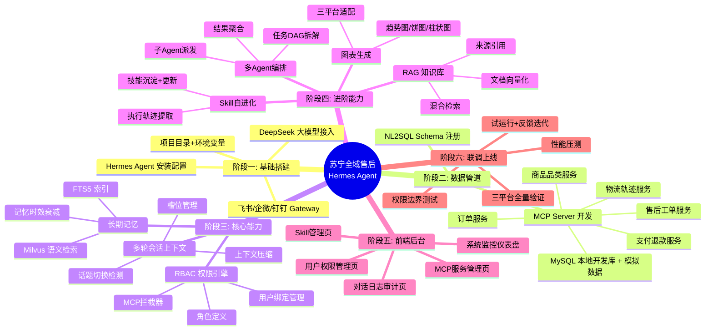

# 10-项目总结与开发路线图

# 10 · 项目总结与开发路线图

> 最后一篇。回顾整个项目的全貌、梳理开发路线、列出核心注意事项。新人接手项目可以从这里看起。

---

## 一、项目全貌回顾

苏宁全域售后 Hermes Agent 是一个**部署在苏宁内部、面向运营/管理团队、接入飞书/企微/钉钉三个IM平台的对话式售后数据智能体**。它不是在做一个新的客服系统，而是给现有售后团队配一个"会聊天的数据分析师"——

*   早上在群里问一句就知道昨天退单情况，不用等 BI 出报表
    
*   用户投诉升级，一句话拉出订单的完整售后链路，不用翻三四个系统
    
*   发现某型号退货异常，几轮追问就能定位到具体批次号，不用导 Excel 手动做透视
    
*   数据权限自动管控，华东经理看不到华南的数据，高层只能看汇总不能查个人订单
    

技术底座是基于 Hermes Agent（Nous Research 开源，18万 Star），利用它自带的持久记忆、多平台 Gateway、MCP 集成、Skill 自进化能力，上层通过 MCP 协议封装苏宁业务数据库，加上 RBAC 权限引擎、NL2SQL 语义转换、RAG 知识检索、多 Agent 任务编排——把 Agent 框架的通用能力注入到苏宁的售后场景里。

---

## 二、开发路线图

---

## 三、核心注意事项清单

### 安全

*   MCP Server 只暴露只读接口，任何情况下不允许执行 DROP/DELETE/UPDATE
    
*   权限过滤在 MCP 拦截器硬编码执行，不能依赖 Agent 自觉
    
*   用户平台绑定必须在管理后台由管理员操作，不支持用户自助绑定
    
*   数据库连接使用只读副本账号，密码通过环境变量注入不入代码库
    

### 性能

*   所有 MCP 查询强制加 LIMIT（默认500，最大1000）和时间范围（默认近30天）
    
*   多 MCP 调用走 asyncio 并发，不串行等待
    
*   Redis 缓存热点查询结果（TTL 5分钟），避免重复查库
    
*   会话上下文超过10轮自动压缩，避免 Token 窗口溢出
    

### 运维

*   MCP Server 和 Hermes Gateway 都应该有健康检查端点
    
*   所有服务日志统一输出到 `~/.hermes/logs/`，带时间戳和请求ID方便追踪
    
*   知识库文档更新后需要重新跑入库脚本
    
*   Hermes Agent 版本更新前先在 staging 环境验证兼容性
    

### 业务

*   退单原因编码要与苏宁现有系统的编码保持一致，对不上就查不出结果
    
*   不同品类的 SLA 标准不同，配置在常量文件中而不是硬编码到代码里
    
*   客服主管的"本团队"权限范围需要在用户绑定时明确指定（部门ID或服务区域）
    
*   图表在群聊中发送时注意某些 IM 平台对图片大小的限制（飞书 max 10MB，企微 max 2MB）
    

### 扩展

*   新品类上线只需在权限策略中添加品类编码，无需改代码
    
*   新增 MCP Server 只需实现 FastMCP 接口 + 注册到管理后台，Agent 自动发现新工具
    
*   Skill 自进化是渐进的——系统上线前两周可能没有 Skill，运营用多了自然沉淀
    

---

## 四、项目交付物清单

| 文档 | 说明 |
| --- | --- |
| 01-业务背景与需求分析.md | 为什么做、做什么场景、解决什么问题 |
| 02-使用人群与操作流程.md | 谁用、怎么用、权限怎么控 |
| 03-技术选型方案.md | 用什么技术、为什么选它 |
| 04-核心业务模块.md | 系统拆成哪几个模块 |
| 05-技术重难点/ | 18个核心技术难点的深入拆解 |
| 06-数据库设计与模拟数据.md | 表结构 + 模拟数据SQL |
| 07-前端页面提示词/ | 5个管理后台页面的AI编码提示词 |
| 08-部署依赖清单.md | 运行所需的所有组件和配置 |
| 09-QuickStart/ | 从零搭建到联调验收的完整指引 |
| 10-项目总结与开发路线图.md | 本文档 |
| backend/mock-files/ | 模拟数据文件（三包法、品牌政策等） |

---

## 五、关键指标

| 指标 | 上线前基线 | 目标 | 衡量方式 |
| --- | --- | --- | --- |
| 日常数据查询耗时 | 半天（提需求→BI出数） | < 30 秒 | Agent 对话日志统计 |
| 异常发现延迟 | 3~7 天（周报/月报） | 当天 | 运营反馈 |
| 单订单全链路查询 | 10 分钟+（跨系统翻查） | < 10 秒 | Agent 对话日志统计 |
| BI 团队临时取单需求 | 日均 15+ | 日均 < 5 | BI 团队工单统计 |
| 用户满意度 | 无 | ≥ 4.2/5 | IM 内嵌满意度调查 |
