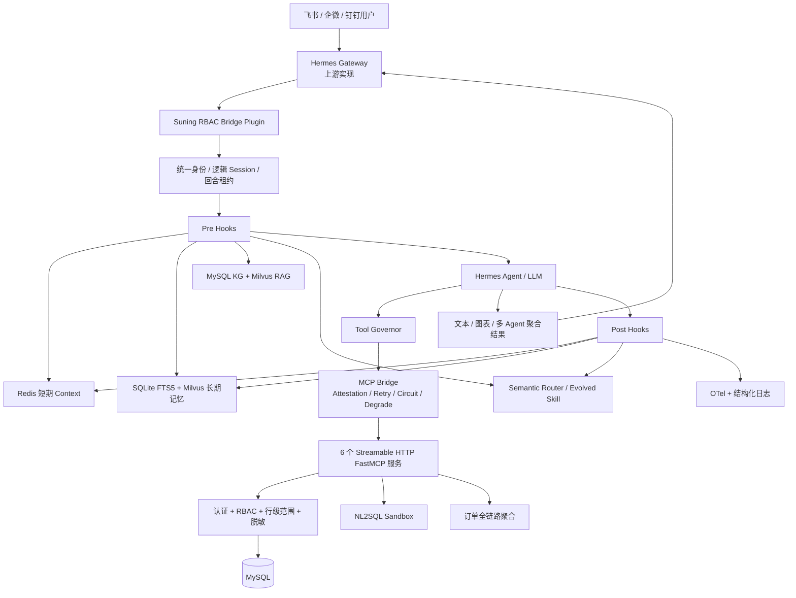
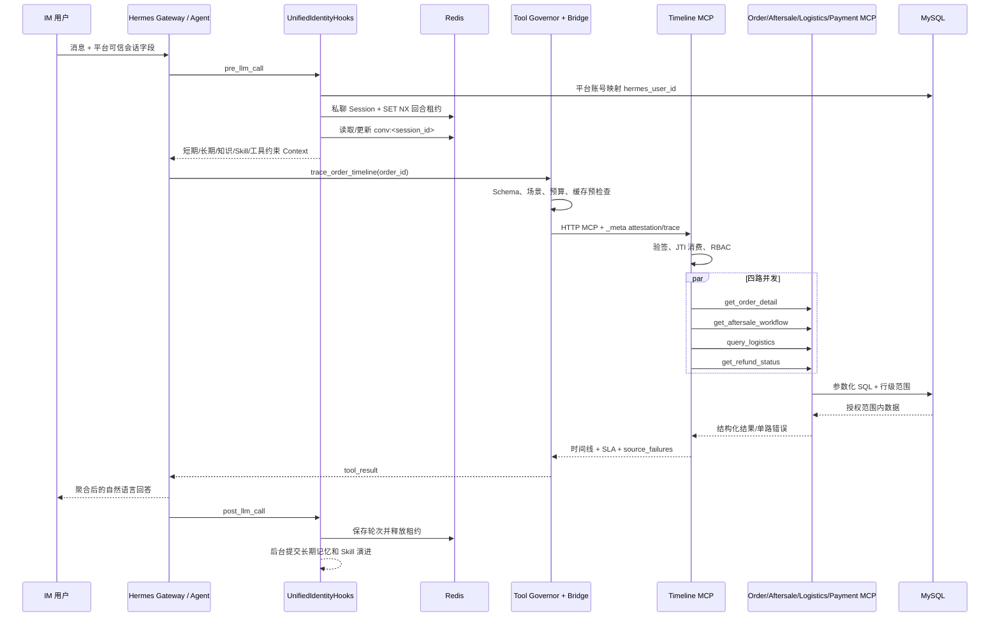
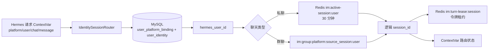
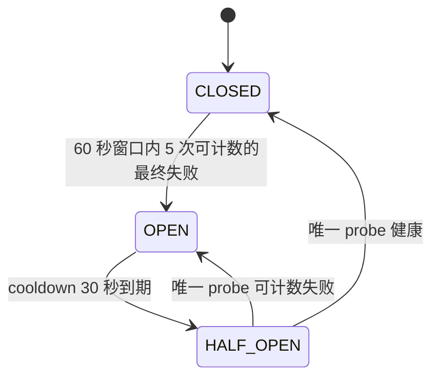

# Suning Hermes Agent 完整实现说明

> 本文基于当前仓库代码、`docs/` 设计资料、测试与 `digestion.md` 编写。代码是最终事实来源。Hermes Gateway 与主 Agent Loop 属于上游 Hermes，本仓库通过插件注册 Hook 和 Tool，不重复实现 IM Gateway 或通用 LLM 工具循环。

## 1. 系统全局架构

本项目面向苏宁售后只读查询：统一飞书、企微、钉钉身份与会话，把短期上下文、长期记忆、知识检索和 Skill 注入 Hermes Agent，再通过受治理的私有 MCP 查询订单、退单、商品、物流、退款及跨系统时间线。安全边界放在模型之外：身份来自 Hermes 请求上下文，权限由 MCP 服务端从 MySQL 重新计算，SQL 只接收服务端生成的数据范围。



边界如下：

- `.hermes/plugins/suning-rbac-bridge/` 是线上插件入口，注册 10 个业务 MCP Tool、图表 Tool、复杂分析 Tool 和统一 Hook。
- `packages/suning-context-runtime/` 实现短期上下文、长期记忆、RAG、知识图谱和公共模型调用。
- `backend/mcp_suning/` 运行 8101～8106 六个 HTTP MCP 服务，并实现认证、RBAC、业务 SQL、时间线聚合和服务端 Trace。
- `backend/nl2sql/` 只服务受限售后聚合查询；明确业务 API 继续使用参数化固定 SQL。
- `backend/src/suning_hermes_agent/` 中的系统级 Harness、通用推理优化器和管理 API 是后端能力；其中 Harness 和通用推理优化器未接入插件 `register()` 主链路。

## 2. 一次完整请求如何执行

以“订单 123456 的售后现在卡在哪里”为例：



关键步骤：

| 步骤 | 输入 | 实际处理 | 输出与关键代码 |
|---|---|---|---|
| 请求进入 | Hermes 的 `session_id/sender_id` 及请求级平台字段 | 插件不接管 IM 网络接入，只消费 Gateway 的可信 ContextVar | `.hermes/plugins/suning-rbac-bridge/__init__.py::register` |
| 身份与会话 | 平台、外部用户、聊天类型 | MySQL 绑定查内部用户；私聊恢复 30 分钟活跃 Session，群聊按平台/群/用户隔离 | `IdentitySessionRouter.resolve` |
| 并发保护 | 逻辑 Session | Redis `SET NX EX` 获取 5 分钟令牌租约，每 100 秒续租 | `ConversationTurnLease` |
| Context | 当前消息、旧槽位 | LLM 结构化提取，Pydantic、话题字段白名单、数据库值白名单、0.7 置信度门槛 | `ConversationHooks.pre_llm_call` |
| 增强注入 | 内部用户与槽位 | 长期记忆、KG/RAG、Skill、Tool 白名单按顺序拼接 | `UnifiedIdentityHooks.pre_llm_call` |
| Tool 决策 | Agent 生成的工具名和业务参数 | Prompt 软约束；Bridge 前做开关、Schema、场景、缓存、去重和预算硬检查 | `ToolGovernor.preflight` |
| MCP | Tool、参数、可信请求身份 | 每次真实 attempt 签发新 HMAC/JTI；Streamable HTTP 调用 | `bridge.invoke_business_tool` |
| 服务端安全 | `_meta["suning/authn"]` | 验签、一次性消费、内部用户映射、角色与用户范围求交、群聊收窄 | `authorize_mcp_request_with_principal` |
| 数据查询 | `safe_filters` | 固定 SQL、受限 NL2SQL 或四路时间线聚合 | `backend/mcp_suning/servers/` |
| 回答后 | 用户问题、最终回答、槽位 | 保存短期历史；后台提交长期记忆和 Skill 演进；结束 Trace、释放租约 | `UnifiedIdentityHooks.post_llm_call` |

失败路径默认保守：身份不可信时覆盖为固定未授权回复；同一逻辑会话已有回合时立即提示稍后重试；租约丢失后阻断 Tool 且不写 Context；单个 Context/Memory/RAG/Skill Hook 故障只跳过对应增强；MCP 故障按工具等级返回降级信封或安全错误。

## 3. Agent 核心运行机制

### 作用与边界

Agent 的通用消息循环、模型调用和 tool-result 再推理由上游 Hermes 提供。当前仓库真正控制的是“模型调用前注入什么、模型能看到哪些本地 Tool、Tool 真正执行前如何硬校验、回答后保存什么”。因此不能从本仓库声称存在自研的通用 Agent Loop。

### Prompt 和 Context 的构建

`UnifiedIdentityHooks.pre_llm_call()` 按固定顺序组合：

```text
ConversationHooks（短期槽位和历史）
→ LongTermMemoryHooks（用户私有历史结论）
→ KnowledgeHooks（KG 或 RAG 事实）
→ SkillEvolutionHooks（高置信 Skill 工作流）
→ ToolGovernor（本场景工具白名单与预算）
→ Hermes 本轮 LLM Context
```

这几类内容只是上下文，不是可信身份或权限。用户本轮明确表达优先于旧槽位；实时 Tool 结果优先于长期记忆；KG/RAG 要求来源约束；Skill 只是执行建议，仍需通过 Tool Governor 和 MCP RBAC。

### 执行路径

- 普通问答：没有业务数据需求时，Agent 可直接生成文本，不调用 Tool。
- 业务查询：Agent 调用 `TOOL_SPECS` 中的工具，经 Governor、Bridge、MCP、RBAC 后把 `tool_result` 交还 Agent 生成最终答复。
- 政策/保修问题：`KnowledgeHooks` 在首次 LLM 前按关键词触发 KG/RAG，不要求模型先发 Tool。
- 复杂分析：模型显式调用 `orchestrate_aftersale_analysis`；该本地 Tool 规划 DAG、启动 Leaf Agent、聚合压缩摘要，再把结构化报告交还主 Agent。
- 图表：模型先取得授权后的聚合数据，再调用本地 `send_aftersale_chart`；收件目标只从可信 Session 读取。

失败时 Hermes 仍可基于可用 Context 或结构化降级信封回答。当前代码没有统一的“复杂度分类器自动切换普通/复杂路径”；复杂分析是否调用编排 Tool 仍由主 Agent 的工具选择决定。

关键代码：`.hermes/plugins/suning-rbac-bridge/__init__.py::register`、`identity_session.py::UnifiedIdentityHooks`、`bridge.py::invoke_business_tool`。

## 4. 用户身份、Session 与多轮隔离



### 身份来源

Bridge 只读取 Hermes 设置的 `HERMES_SESSION_PLATFORM`、`HERMES_SESSION_USER_ID`、`HERMES_SESSION_CHAT_TYPE`、`HERMES_SESSION_MESSAGE_ID` 等请求级值。支持 `feishu/wecom/dingtalk`；Cron 只有在 `HERMES_CRON_SESSION=1` 且 Session 以 `cron_` 开头时，才能使用配置的固定服务主体。

平台外部 ID 通过 `user_platform_binding` 关联 `user_identity`，只有绑定存在且 `is_active` 为真才得到内部 `hermes_user_id`。跨平台身份合并依赖显式绑定，不根据姓名、手机号或模型推断。

### Session 规则

- 私聊：Redis 键 `im:active-session:<hermes_user_id>` 保存随机逻辑 Session，TTL 1800 秒；每次消息刷新 TTL，所以同一人在三个平台私聊可延续同一上下文。
- 群聊：逻辑键为 `im:group:<platform>:<原始session>:<hermes_user_id>`，不恢复私聊 Context，不同群成员也互相隔离。
- 短期 Context：键为 `conv:<logical_session_id>`，TTL 3600 秒。

### 并发隔离

每个完整 Agent 回合对 `im:turn-lease:<session_id>` 执行 `SET NX EX 300`。默认等待时间为 0，即已有回合时立即拒绝；守护线程每 `300/3=100` 秒用“值仍等于自己的随机 Token”Lua 脚本续租。Tool 前、持久化前都会重新确认所有权；释放也用比较 Token 的 Lua，避免旧回合删除新锁。

身份、路由、租约、Trace 和 API Span 保存在 `ContextVar` 中，隔离并发异步请求。LLM 不传可信身份，因为模型参数可被提示词或用户内容影响；身份必须来自 Gateway 请求上下文，并在 MCP 服务端再次映射。

失败路径：未绑定/停用/平台无效返回固定未授权文案；Redis Session 路由失败拒绝请求；租约忙返回“正在处理中”；续租失败覆盖本轮回答并禁止写回旧状态。

关键代码：`identity_session.py::IdentitySessionRouter`、`ConversationTurnLease`、`UnifiedIdentityHooks`。

## 5. Memory 与 Context 管理

### 短期上下文

`ConversationContext` 保存 `session_id`、`user_id`、`slots(topic, filters)`、`slot_confidence`、`turn_count`、`compressed_history` 和 `recent_turns`。

回答前流程：

```text
Redis load_context
→ 绑定 hermes_user_id，发现同 Session 不同用户则重建空 Context
→ LLM 结构化提取 topic/new_filters/confidence
→ Pydantic 范围校验
→ MySQL 业务值白名单规范化（缓存 300 秒）
→ confidence < 0.7 时保留旧 topic 且不写新增槽位
→ 新 topic 与旧 topic 不同则清空旧槽位
→ 连续话题合并本轮增量槽位
→ 保存 Redis 并生成 Prompt Context
```

话题只允许 `return_analysis/return_case/order_query/product_query/general`，每个话题又有独立可用字段集合；数字字段如 `date_range_days` 限 1～365、`limit` 限 1～100。品类、区域、品牌、原因、状态和 SKU 必须命中 MySQL 白名单。

回答后 `turn_count += 1`，最终回答前 500 字作为 `last_reply_summary`，同时保存本轮原文。只有 `turn_count > 10` 才压缩旧轮次，保留最近 3 轮；摘要模型最多输出 600 Token，Prompt 要求 400 汉字以内。注入时最多取最近 3 条历史摘要和 3 轮原文。

### 长期记忆写入

长期记忆只接受 `return_analysis` 和 `order_trace` 两个归一化主题。回答后快照被提交到单线程 `ThreadPoolExecutor(max_workers=1)`，不阻塞用户回复。

记录门槛同时满足：

```text
should_record == true
AND normalize(topic) 属于允许主题
AND confidence >= LONG_MEMORY_MIN_CONFIDENCE（默认 0.7）
AND conclusion 非空
```

`memory_key = SHA256(user_id + normalized topic + canonical entities + canonical filters)`；相同键更新原记录、`version + 1`，不同用户天然隔离。SQLite `memories` 是权威记录，`memories_fts` 由触发器同步；向量写入失败时保留 SQLite/FTS5。

### 长期记忆召回

查询文本由当前消息、topic、entities、filters 拼成。FTS5 与 Milvus 各召回 `top_k * 2`（默认 6）候选，分别做 0～1 归一化：BM25 越小越好，COSINE 越大越好。

```text
combined = 0.5 * keyword_score + 0.5 * semantic_score
age_days = max(0, now - updated_at) / 86400
final = combined * exp(-ln(2) * age_days / half_life_days)
```

默认半衰期 30 天，最终 Top3。Milvus 或 Embedding 故障时只用 FTS5；SQLite 检索故障时仍可尝试向量回表；召回整体故障只跳过记忆增强。Milvus 还按 `user_id` 过滤，SQLite 回表再次校验用户。

存储默认值：SQLite `~/.hermes/state/suning_business_memory.db`，Milvus collection `memory_vectors`，Embedding `text-embedding-v3`，Embedding 超时 10 秒、Milvus 超时 5 秒、提取 LLM 超时 20 秒。

关键代码：`context.py::ContextManager`、`slots.py::SlotExtractor`、`memory_hooks.py::LongTermMemoryHooks`、`long_memory_pipeline.py`、`long_memory_retriever.py`、`long_memory_store.py`。

## 6. Tool 调用与 Tool Governor

### 三层约束

1. 注册白名单：只有 `TOOL_SPECS` 中的业务 Tool 被暴露给模型。
2. 参数白名单：JSON Schema 使用 `additionalProperties: false`，限制类型、必填和值域。
3. 服务端安全：MCP 再做身份认证、RBAC、SQL 范围和脱敏；前两层不能替代这一层。

### 场景和预算

`ConversationHooks` 先提取并保存本轮 topic，Governor 再读取该 topic 选择白名单：

| 场景 | 最大真实 MCP 调用数/回合 | 主要工具 |
|---|---:|---|
| `return_analysis` | 5 | 订单搜索、两种 NL2SQL、SKU 退单率、商品 |
| `return_case` / `order_query` | 4 | 订单详情、工单、物流、退款、时间线 |
| `product_query` | 3 | 商品详情 |
| 未知 / `general` | 3 | 常用订单、退单、商品、物流、退款工具；不含时间线和自由问句 NL2SQL |

预算没有单独计算 `remaining_budget` 字段；实际逻辑是 Redis `INCR mcp:budget:<SHA256(session,turn)>`，首次设置 TTL 600 秒，`used <= max_calls_per_turn` 才允许。缓存命中发生在预算前，因此不消耗调用数。同一回合的相同 `tool + canonical params` 还会在进程内集合中去重。

### Preflight 顺序

```text
管理员 Redis 开关
→ 场景白名单
→ JSON Schema
→ 同用户成功结果缓存
→ 同回合相同调用去重
→ Redis 调用预算
→ 真实 MCP
```

成功结果缓存键包含 `platform:external_subject + tool + params` 的 SHA-256，TTL 300 秒，不缓存错误或降级信封。管理员工具开关使用 `mcp:tool:enabled:<tool>`；Redis 读取失败时开关 fail-open。已建立回合后预算 Redis 故障则 fail-closed；若上下文 Hooks 根本未注册，则没有 TurnState，Governor 只执行工具开关和 Schema 校验。

软校验来自 `build_tool_prompt()`，硬校验来自 `preflight()`。Tool Governor 只包在 `invoke_business_tool()` 的 MCP 工具上；图表与复杂分析本地 Tool 仍受统一身份租约 Hook 保护，但不走这一套 MCP 预算/缓存。

关键代码：`schemas.py::TOOL_SPECS`、`tool_governor.py::SCENE_TOOL_MAP/ToolGovernor`、`bridge.py::invoke_business_tool`。

## 7. MCP 架构与业务工具调用

```text
Hermes Agent Tool
→ 插件 handler
→ invoke_business_tool
→ MCPCallManager
→ mcp.ClientSession + streamable_http_client
→ FastMCP Server Tool
→ authorize_mcp_request
→ 固定 SQL / NL2SQL / 聚合逻辑
→ MCP structuredContent
→ Hermes tool_result
```

当前六个服务全部使用 Streamable HTTP，没有 stdio MCP 实现：

| 端口 | 服务 | 工具 |
|---:|---|---|
| 8101 | `mcp-order` | `search_orders`、`get_order_detail` |
| 8102 | `mcp-aftersale` | `query_return_stats_nl2sql`、`query_aftersale_nl2sql`、`query_sku_return_rate`、`get_aftersale_workflow` |
| 8103 | `mcp-product` | `get_product_info` |
| 8104 | `mcp-logistics` | `query_logistics` |
| 8105 | `mcp-payment` | `get_refund_status` |
| 8106 | `mcp-order-timeline` | `trace_order_timeline` |

业务能力放在 MCP 后面，是为了让每个入口都经过同一认证与行级权限边界，而不是让 Agent 直接持有数据库连接。Agent 参数只包含订单号、时间范围、品类等业务输入；`_meta` 由 Bridge 追加：

```json
{
  "suning/authn": "<HMAC attestation>",
  "suning/trace_id": "<business trace id>",
  "traceparent": "<W3C trace context>"
}
```

普通 Tool 使用参数化固定 SQL。`query_return_stats_nl2sql` 把结构化维度转换为受控自然语言后走 Lite Pipeline；`query_aftersale_nl2sql` 接受不超过 500 字的自由售后聚合问题；`query_sku_return_rate` 使用固定 SQL，公式为 `100 * COUNT(DISTINCT returned order) / COUNT(DISTINCT order)`。

时间线 MCP 是 MCP 调 MCP：顶层凭证已经被一次性消费，不能复用，因此 `mint_delegated_attestation()` 为订单、工单、物流、支付四路各签新 JTI，并保持同一外部主体和 Trace。

关键代码：`bridge.py`、`backend/mcp_suning/servers/*.py`、`timeline/gateway.py`。

## 8. MCP 身份认证、RBAC 与数据权限

### 凭证与认证

Bridge 签发 `v1.<payload>.<HMAC-SHA256>`，密钥至少 32 字节，默认有效期 30 秒。Claims 包括：

```text
iss, aud, identity_issuer, platform, sub, chat_type, message_id,
tool, iat, exp, jti
```

服务端要求 `iss=suning-rbac-bridge`、`aud=suning-mcp`、`identity_issuer` 与配置一致、`tool` 与当前工具一致；允许 5 秒时钟偏差，凭证总寿命不得超过 60 秒。`jti` 用 Redis `SET NX EX` 一次性消费。默认 `SUNING_AUTHN_REQUIRE_REDIS=true`，所以 Redis 未配置或不可用时认证拒绝，而不是放行。

### 授权和行级范围

```text
AuthenticatedPrincipal
→ user_platform_binding + user_identity
→ UserContext（内部用户、角色、用户级范围）
→ user_role_permission
→ PermissionPolicy（角色级范围）
→ 角色范围 ∩ 用户范围
→ 校验请求范围不能越权
→ safe_filters
→ build_scope_clause
→ 参数化 WHERE
→ mask_sensitive_data
```

区域、城市做精确交集；品类支持父编码包含子编码，即 `candidate == allowed OR candidate LIKE allowed-%`。空交集直接拒绝。`date_range_days = min(请求天数或角色默认上限, role.max_date_range_days)`。数据粒度取更严格者：`aggregated < anonymized < full`；群聊最多收窄到 `anonymized`。

`aggregated` 用户只能调用三种聚合 Tool：两种 NL2SQL 和 SKU 退单率；不能访问订单/退款明细。非 `full` 结果会递归遮蔽手机号、人员 ID 和金额。SQL 范围使用绑定参数生成区域/城市 `IN` 与品类精确/子类条件，不拼接模型文本。

这不仅是 Tool 权限：同一个允许调用的 Tool 最终看到哪些地区、城市、品类和日期行，由 SQL WHERE 决定，所以属于行级数据安全。模型即使伪造 `user_context/data_scope/allowed_*`，`PermissionInterceptor` 也会先删除这些控制字段，再由服务端重建。

失败路径：签名、工具绑定、时效、JTI、用户绑定、角色配置、范围交集任一失败都在业务查询前拒绝；群聊不会扩大粒度；结果脱敏在返回前统一执行。

关键代码：`bridge.py::mint_attestation`、`security/attestation.py::verify_attestation`、`security/rbac.py`。

## 9. MCP 重试、熔断与降级

### Retry

只有 `TIMEOUT` 且 ToolSpec 明确 `retry_on_timeout=true` 才重试。连接拒绝、权限拒绝、远端 Tool 错误、非法响应不重试。每次 attempt 上限 10 秒；`MAX_RETRIES=3` 表示初始调用后最多再重试 3 次，即最多 4 次真实请求。

第 `retry_count` 次等待：

```text
delay = 1 * 2^retry_count + uniform(0, 0.2)
```

因此三次退避约为 1、2、4 秒，各加 0～200ms 抖动。每个 attempt 都重新建立 MCP Session 并签发新 attestation/JTI。HALF_OPEN 不重试。

### Circuit Breaker

熔断按稳定 `server_id` 保存，所以同一服务的多个 Tool 共享状态。Redis 键为 `suning:mcp:cb:<server_id>:{failures,state,cooldown,probe}`。



只有最终 `TIMEOUT/CONNECTION_REFUSED/MALFORMED_RESPONSE` 计入失败；合法空结果、权限拒绝、远端业务错误和时间线 `partial/source_failures` 不计。成功删除失败计数。状态键 TTL 120 秒、失败窗口 60 秒、OPEN 冷却 30 秒、跨进程 probe 租约 15 秒。Redis 故障时 Circuit Store fail-open，继续尝试真实 MCP。

### Degrade

- L1 辅助数据：`get_aftersale_workflow/get_product_info/query_logistics`，失败返回 `tool_result(status=degraded)`，允许其他分析继续。
- L2 核心数据：订单、统计、SKU 退单率、退款和时间线，失败返回带“当前结果不完整”的结构化降级信封。
- L3 关键数据：代码会返回 `tool_error`，但当前 `TOOL_SPECS` 没有工具配置为 L3。

允许空结果的 Tool 会把协议级空值视作成功；L2 空结果会返回 `status=empty, available=true`，明确区别“查无记录”和“服务不可用”。复杂分析 Prompt 要求保留 `tool_name/degrade_level/available/notice`，L2 不得改写成无数据。

时间线内部四路下游调用不经过插件 `MCPCallManager`，而是由 `OrderTimelineTracker` 统一 10 秒超时并保留单路失败；顶层 `trace_order_timeline` 自身仍受插件重试和熔断保护。

关键代码：`mcp_resilience.py::MCPCallManager/CircuitStore`、`schemas.py::ToolSpec`、`bridge.py::_hermes_result`。

## 10. RAG 实现

### 入库

```text
mock-files/*.txt
→ TextLoader
→ 按空行保留自然段
→ 超过 800 字符时 RecursiveCharacterTextSplitter
→ chunk_overlap = 0
→ KnowledgeChunk + 文件级 metadata
→ text-embedding-v3
→ Milvus knowledge_chunks
```

当前只有三个登记来源：三包法节选、格力售后政策、苏宁售后管理制度。`chunk_size=800` 是代码固定默认值，仓库没有实验记录证明它是 Recall 最优值；零重叠是当前实现，不应把 `digestion.md` 中列举的 Parent-Child、Semantic、多粒度切块写成已实现能力。

metadata 包括 `chunk_id/content/doc_type/category/brand/effective_date/expire_date/source_title/article_number`。`chunk_id` 是 `SHA256(filename:index:content)`；正文最大 4096 字符。Milvus 使用 AUTOINDEX + COSINE，向量维度由首次 Embedding 动态确定并校验。

### 查询和重排

只有问题命中保修、三包、退换货、政策、维修、安装、SLA 等关键词时才检索。品类、品牌、部件用确定性词典提取，并可从当前会话的品类/品牌槽位补全。

Milvus 候选数为 `max(10, top_k * 3)`，默认 Top3，因此先取 10 条。余弦值先映射到 `[0,1]`：`semantic=(cosine+1)/2`，再计算：

```text
base = 0.7 * semantic + 0.3 * keyword_coverage
```

关键词覆盖率是用户中文连续文本的二字切分和英文词在正文/标题/条款/品类/品牌中的命中数除以总词数。随后乘业务权重：品类相同 1.5、品类冲突 0.3、品牌相同 1.3；品牌政策/苏宁制度/维修手册/国家法规/FAQ 分别乘 1.0/0.9/0.8/0.7/0.5；未生效或过期再乘 0.1。

排序后优先选不同 `source_title`，不足 TopK 再补同来源片段。格式化 Context 要求回答逐条标 `[知识来源N]`，片段不支持结论时必须说明。

### 评估现状

Top-K 表示最终注入模型的片段数，配置被限制在 1～5。当前仓库有排序和 Hook 测试，但没有 Recall@K 计算器、标注数据集或线上检索质量仪表盘；`Recall@K = TopK 中命中的相关文档数 / 全部相关文档数` 只是可采用的评估定义，不是当前已运行能力。

失败路径：知识 Hook 初始化失败不影响业务 Tool；单轮 Embedding/Milvus/KG 查询异常只记录日志并跳过知识注入，没有本地 RAG 关键词后备库。

关键代码：`backend/scripts/ingest_knowledge.py`、`knowledge_rag.py::KnowledgeRAG`、`knowledge_hooks.py`。

## 11. 售后知识图谱

图谱不是独立图数据库，而是把现有 MySQL 外键和邻接关系当作图：品牌→SKU→品类/父品类，SKU→整机保修→条款来源，品类→部件保修→条款来源，SKU→故障映射→故障类型，SKU→批次→退单。

### 精确查询

- `query_warranty`：品牌和品类必填；有部件时查 `t_component_warranty`，否则查 `t_product_warranty`；返回期限、覆盖范围和条款来源，置信度固定 0.95。
- `query_fault_association`：递归 CTE 从故障所属品类向下展开最多 3 层，再关联 SKU、品牌、批次和退单，按 `COUNT(DISTINCT return_id)` 降序取 Top10；路由结果最多展示 5 条，置信度固定 0.9。
- `query_product_chain`：递归 CTE 从 SKU 三级品类向上追溯最多 3 层，聚合品牌、品类链、部件保修和常见故障。当前 QueryRouter 没有调用该方法，它是可直接复用的图查询能力。
- `ingest_from_policy_doc`：LLM 抽取品类—部件—期限—来源 JSON 后事务写 MySQL；当前没有部署脚本把它自动接到知识入库流程。

### KG/RAG 路由

`QueryRouter.GRAPH_PATTERNS` 用正则识别保修/部件、批次、故障关联问题。精确关系问题先查图，图中无记录时走 RAG，开放解释类问题直接 RAG。原因是保修期限、SKU/批次/故障关系能通过 SQL 得到确定事实，而政策解释需要原文上下文和引用。

`GraphQueryResult` 字段来源：`answer` 由 SQL 行或首条 RAG 片段生成；`source` 来自条款表或知识片段标题；`confidence` 当前是代码固定值（图保修 0.95、图故障 0.9、RAG 0.7、无结果 0），不是训练出的概率；`query_type` 标识 `graph/rag/graph_then_rag`。

失败路径：图查询无数据回退 RAG；整个知识 Hook 抛错则不注入任何知识 Context。当前 `extract_entities` 只确定性提取品类、品牌、部件，故障实体通常由完整原问题交给 SQL 模糊匹配。

关键代码：`knowledge_graph.py::AftersaleKnowledgeGraph/QueryRouter`、`knowledge_hooks.py`。

## 12. NL2SQL

```text
用户售后聚合问题
→ Git YAML Prompt v1.0
→ 注入 Schema / JOIN / 品类编码映射
→ DeepSeek SQL Generator
→ SQLValidator.validate_and_fix
→ PermissionInterceptor 生成 safe_filters
→ SQLValidator.inject_rbac
→ ReadOnlyExecutor: MAX_EXECUTION_TIME + EXPLAIN + SELECT
→ 脱敏结果
```

### 生成范围

Schema 只登记退单、订单、SKU、品类、品牌五张表。退单表必须作为事实表，并强制关联订单与 SKU。Prompt 要求单条聚合 SELECT、金额分转元、最近 N 天以表中最大时间为基准、最多 1000 行，不让模型生成 RBAC。

`NL2SQLPipeline.max_attempts=2`。首次校验或数据库执行失败后，把错误文本追加到用户 Prompt 再生成一次；两次仍失败抛 `ValueError`。模型温度 0、最大输出 1200 Token、SDK `max_retries=2`；Pipeline 的两次生成与模型 SDK 重试是不同层次。

### Sandbox 规则

- 只允许一条 `SELECT`，禁止注释、`;`、`SELECT *`、CROSS JOIN 和写入/DDL/高风险函数。
- 表必须在 Registry，且必须包含退单、订单、SKU；JOIN 条件和别名必须匹配登记关系。
- `alias.column` 必须登记；SELECT 中必须有 `COUNT/SUM/AVG`。
- 禁止输出订单号、用户/员工/电话等敏感字段，禁止直接输出退单/金额明细；维度字段要求 `GROUP BY`。
- 必须有 WHERE；缺少退单时间条件时自动补最近 30 天。
- 缺少 LIMIT 时补 500，超过 1000 截成 1000。
- RBAC 再注入区域、城市、父子品类和角色最大日期范围。

`ReadOnlyExecutor` 设置 MySQL `MAX_EXECUTION_TIME=5000ms`，同一连接先 `EXPLAIN` 再执行 SELECT。部署账号只读权限由配置保证，代码不动态切换数据库用户。

### Prompt A/B

`PromptRegistry` 用 `nl2sql_vX.Y.yaml` 管理完整 Prompt；运行时不是自动取最新版本，而是读取 `NL2SQL_PROMPT_VERSION`（默认 v1.0），所以候选 YAML 不会自动上线。

GoldenCase 必须包含自然语言、来源会话、难度，以及期望 SQL 或结果签名。每个新旧 Prompt 对每个 Case 默认生成 3 次，规范化空白/大小写并忽略 LIMIT 数字后多数投票。

```text
latency_score = max(0, 1 - avg_latency_ms / 5000)
total = 0.4 * syntax_pass + 0.5 * result_score + 0.1 * latency_score
```

结果签名得分：达到最小行数得 0.4，包含全部关键列得 0.6。新版综合平均必须比旧版高 3% 以上才判 `new`；CI 通过还要求语法通过率和结果匹配率都不下降，且至少一个严格提升。CLI 通过返回 0、退化返回 1、持平返回 2，并把新版语法/结果指标写回 YAML。

失败路径：危险 SQL 在执行前拒绝；数据库错误最多触发一次再生成；无更高候选版本时评估脚本直接跳过。仓库没有内置生产 Golden Dataset，只提供格式、评估器和测试。

关键代码：`schema_registry.py`、`sql_sandbox.py`、`pipeline.py`、`executor.py`、`prompt_registry.py`。

## 13. 多 Agent 协作

复杂分析通过本地 Tool `orchestrate_aftersale_analysis` 显式进入：


任务类型只允许趋势、品类、原因、成本、图表建议五种，任务数 1～5，ID 有固定正则，依赖必须存在且无环。Planner LLM 上限 1200 Token、20 秒；失败或非法 JSON 时使用固定五节点 DAG。工具参数 `date_range_days` 限 1～90，默认 30。

ready 条件是 `task.dependencies ⊆ completed`。同一拓扑层用 `asyncio.gather` 并发；全局超时 120 秒，普通节点默认 30 秒且模型只能把它收窄到 5～30 秒。图表节点不启动 Agent，只依据前置摘要生成文字建议。

Leaf Agent 只得到：自己的目标、原问题、时间范围和依赖节点不超过 1800 字的摘要；允许 Toolset 只有 `suning_business`，角色固定 `leaf`。每个查询节点 Prompt 限最多调用一次最匹配工具，禁止发送图片或消息。Harness 等待超时会主动 cancel。

节点状态为 `pending/running/success/failed/timeout`。失败节点不阻断独立分支；依赖节点会看到“前置结果暂不可用”。聚合器只收到每个节点的状态与压缩摘要，不接收完整工具轨迹，既减少 Token，也避免把子 Agent 的长上下文和注入内容再次扩散。

聚合 LLM 上限 1800 Token、25 秒，输出再截到 6000 字；失败时确定性拼接各节点摘要。最终 Tool 返回 `completed` 或 `partial`、不可用章节、节点状态和 Harness 快照。

关键代码：`orchestration.py::TaskOrchestrator`、`.hermes/plugins/.../harness.py::AgentHarness`。

## 14. Harness、灰度与运行实例治理

仓库中有两种不同 Harness，必须区分。

### 已接入复杂分析的调用级 Harness

插件 `harness.py` 使用 Hermes `SubagentLifecycleService`：`launch → wait → timeout cancel → result`。状态是 `STARTING/RUNNING/HEALTHY/UNHEALTHY/STOPPED`，只管理一次复杂分析中的 Leaf Agent，不管理独立进程、灰度或版本流量。这一套已由 `orchestration.py` 实际调用。

### 独立的系统级进程 Harness

`backend/src/suning_hermes_agent/agent_harness.py` 实现并有测试，但当前仓库没有实例化它的启动入口，插件 `register()` 也不引用它，且它要启动的 `agents.<agent_type>` 模块不在本仓库。因此以下是“已实现的可复用治理模块”，不是当前请求主链路正在运行的组件：

- `start_agent`：子进程启动后最多等 30 秒 TCP 健康，再注册并发布 Redis 流量配置。
- `rolling_restart`：新版本按 10%→30%→60%→100% 权重，每档观察 30 秒，完成后停旧进程。
- `route_request`：只选 `HEALTHY/DEGRADED` 且权重大于 0 的实例；`MD5(user_id) % 10000 / 10000 * total_weight` 落入累计权重区间，因此同一用户稳定路由。
- `canary_loop`：默认每 30 秒执行固定业务探针；一次失败从 HEALTHY 变 DEGRADED，默认连续 3 次失败变 UNHEALTHY、权重归零并告警。
- `watch_config`：每秒轮询 `.yaml/.yml/.prompt` 的 mtime，变更后 Redis publish 热加载消息。
- 流量配置键 `traffic:<agent_type>` TTL 120 秒；进程 SIGTERM 后最多等 30 秒再 kill。

原设计章节把系统级 Harness 描述成整体 Agent 运行底座；当前实际线上复杂分析使用的是 Hermes 托管 Leaf 生命周期，系统级进程 Harness 仍需外部启动器和 Agent 模块接线后才会生效。

关键代码：插件 `harness.py`（当前调用级）、后端 `agent_harness.py`（未接线的系统级）。

## 15. Skill、Semantic Router 与自进化

### Skill 消费

自动 Skill 存在 `.hermes/skills/evolved/<skill_id>/SKILL.md`，Markdown 中嵌 JSON，保存名称、描述、版本、触发句、工作流、依赖 Tool、输出模板、时间、使用次数、质量分和启用状态。

启动时每个 Skill 的 `trigger_patterns` 批量 Embedding，取平均重心并 L2 归一化；所有重心堆为 `N×D` NumPy 矩阵。请求 Query 也归一化，`similarities = matrix @ query_vector`，取 Top1。只有余弦相似度 `>= 0.85`、Skill 启用且 `required_mcp_tools` 都在当前插件暴露集合中，才注入工作流；否则 fallback 普通 LLM 规划。命中 Skill 不绕过 Tool Governor、参数 Schema 或 RBAC。

### Skill 生产与维护

回答前记录问题和开始时间，Tool 前记录工具名与参数，回答后形成最多 10 轮的 `ExecutionTrace`。复杂度为：

```text
complexity = min(turns / 5, 1) * 0.3
           + min(mcp_calls / 5, 1) * 0.4
           + min(duration_seconds / 60, 1) * 0.3
```

低于 0.4 直接跳过；达到门槛后由宿主 LLM 在 20 秒、1200 Token 内抽取通用参数化工作流。候选必须 `should_create_skill=true` 且名称、描述、至少一个合法 Tool 步骤非空。

候选描述与已有 Skill 描述做 Embedding 余弦比较：最高相似度 `> 0.8` 更新已有 Skill（版本和 usage_count 加一，合并触发句，替换工作流）；否则用技能名 SHA-256 前 12 位创建目录。写入在后台 asyncio Task 或单线程执行器中进行，不阻塞回复；成功后刷新路由索引。

Semantic Router 是消费机制，阈值 0.85；Skill Evolution 是生产/更新机制，复杂度阈值 0.4、去重阈值严格大于 0.8。Embedding 或文件失败时路由回退正常 LLM，演进失败只记录日志。管理 API 可原子编辑、启停和删除 Skill，但自动演进只处理含合法 JSON 块的 evolved Skill。

关键代码：`skill_evolution.py::SemanticRouter/SkillEvolutionEngine/SkillEvolutionHooks`、`backend/src/suning_hermes_agent/admin/skills.py`。

## 16. Agent 推理效率优化

当前代码有三类已经接入主链的优化：

1. Tool 成功结果缓存：Governor 按身份、Tool、参数缓存 300 秒，命中跳过 MCP 且不耗本轮预算。
2. 退单热点预计算：售后 MCP 对“按品类 1 天”和“按日 7 天”两个精确参数组合使用 Redis 缓存，TTL 3600 秒；键包含完整 `safe_filters`，避免跨权限复用。只有数据库内部 Cron 用户 `U-SVC-CRON` 会写缓存，普通请求只读；缓存故障回退在线查询。
3. 固定维度统计走 `nl2sql_lite_pipeline`，自由售后分析走 full Pipeline。但默认配置中 `DEEPSEEK_LITE_MODEL` 与 `DEEPSEEK_MODEL` 都是 `deepseek-v4-flash`，只有部署时配置不同模型才产生实际分层。

`backend/src/suning_hermes_agent/inference_optimizer.py` 还实现了通用四层优化和 Benchmark，但没有被插件、MCP 服务或管理 API 实例化；同内容的 `gg.py` 是完全重复文件，也没有导出。不能把以下能力写成当前主请求必经链路：

- System Prompt 的进程内 + Redis 双层缓存，TTL 3600 秒。
- `complexity > 0.85` 且场景是退单/订单，或场景为简单问候时选择 Lite，否则 Full。
- 估算 Token 为字符数除以 1.5；超过 15000 Token 时用确定性一句话摘要早期轮次并保留 3 轮。
- 预计算命中时直接 JSON 返回，输入输出 Token 为 0。
- Benchmark 每个 Case 跑 3 次，汇总平均 latency、输入输出 Token、模型和 cache hit rate。

该通用优化器的 `InferenceStats` 没有 cost 字段；`ModelTier.cost_per_1k_tokens` 也未用于统计。因此当前 Benchmark 不计算实际费用。真正线上 LLM Token 与缓存命中 Token 由 Observability Hook 从模型 API usage 记录。

关键代码：`tool_governor.py`、`servers/aftersale.py`（已接入）；`inference_optimizer.py`（独立、未接线）。

## 17. Prompt 管理

当前只有 NL2SQL Prompt 具备正式版本注册机制，文件位于 `backend/nl2sql/prompts/nl2sql_v1.0.yaml`。`PromptVersion` 保存 ID、版本、完整内容、描述、作者、创建时间、父版本和评估指标；Git 负责 diff、审查和回滚，`PromptRegistry` 负责格式与路径安全。

版本必须匹配 `v数字(.数字)*`。Pipeline 显式读取配置的已部署版本，而不是 `load_latest()`；上线新版本需要：

```text
新增 YAML 候选
→ 准备脱敏 Golden Dataset
→ python -m nl2sql.prompt_evaluation --dataset ...
→ A/B 门禁通过
→ Git 审查合并
→ 配置 NL2SQL_PROMPT_VERSION
→ 重启 aftersale MCP
```

回滚只需把配置改回旧 YAML 版本并重启。CLI 会更新候选 YAML 的评估指标，但不会自动修改生产配置。短期 Context、记忆提取、RAG 引用、多 Agent、Skill 等 Prompt 当前写在 Python 代码中，没有统一 PromptRegistry、A/B 或动态回滚机制。

关键代码：`prompt_registry.py::PromptRegistry/NL2SQLEvaluator`、`prompt_evaluation.py`、`pipeline.py`。

## 18. Observability 与 Trace

```text
Agent 回合 root span
├─ llm.api_request（每次真实模型 API）
├─ mcp.<tool>（一次逻辑 MCP 调用，含 retry_count）
└─ Timeline MCP root span
   ├─ mcp.get_order_detail
   ├─ mcp.get_aftersale_workflow
   ├─ mcp.query_logistics
   └─ mcp.get_refund_status
```

插件生成 16 位十六进制业务 `trace_id`，存 ContextVar、Span attribute 和 `_meta["suning/trace_id"]`；真正的 OTel 父子关系通过 `propagate.inject/extract` 生成 W3C `traceparent`。OTLP Endpoint 配置后使用 BatchSpanProcessor 导出，否则只保留结构化日志。

LLM Span 记录 model、prompt/completion/total tokens、DeepSeek prompt cache hit/miss tokens、真实 API duration 和 error。MCP Span 记录 Tool、Server、返回行数、success、retry_count、failure_type、circuit_state、degrade_level、degraded 和 error。当前重试只生成一个逻辑 MCP Span，不为每个 attempt 单独建 Span；attempt 次数由 `retry_count` 判断。

回合结束生成 `suning_agent_trace` JSON：总耗时、总 LLM Token、缓存命中/未命中 Token、MCP 调用/失败数、最慢 Span、响应字数。墙钟超过 30 秒或总 LLM Token 超过 50000 时额外写 `suning_agent_trace_alert`。管理后台从 Hermes 结构化日志读取这些事件。

排障顺序：先按 `trace_id` 找回合摘要，看 `slowest_span` 和 MCP 失败数；再看对应 MCP Span 的 failure type、retry、circuit、degrade 和 server；跨时间线时沿 `traceparent` 查看四路子 Span；最后结合服务日志中的 RBAC/数据库错误。权限拒绝不会计入 Circuit 故障，应从服务端认证日志定位。

实现差异：`backend/mcp_suning/servers/timeline.py` 成功分支在 `try` 中直接 `return`，其 `else: finish_trace(success=True)` 当前不会执行；失败分支会正常结束服务端 Trace。插件侧顶层 Agent/MCP Span 仍会结束，但时间线服务端成功 root span 的收尾存在代码缺口。

关键代码：插件 `observability.py`、`identity_session.py` 的 API Hooks、后端 `mcp_suning/observability.py`。

## 19. 数据存储职责

| 存储 | 实际保存的数据 | 关键键/结构 | 选择原因与失败行为 |
|---|---|---|---|
| MySQL | 订单、退单、商品、品牌、品类、工单、物流、退款、保修、故障、批次；用户绑定和角色权限；MCP 管理注册信息 | 业务表、`user_identity`、`user_platform_binding`、`user_role_permission` | 权威业务与权限数据；通过参数化 SQL、JOIN 和递归 CTE 查询，故障时对应业务能力失败 |
| Redis | 活跃私聊 Session、回合租约、短期 Context、JTI 防重放、Tool 开关/预算/结果缓存、MCP Circuit、热点统计、系统 Harness 流量配置 | `im:*`、`conv:*`、`suning:authn:jti:*`、`mcp:*`、`suning:mcp:cb:*` | 跨进程短期协调和 TTL 状态；不同功能分别 fail-open 或 fail-closed，不能一概而论 |
| Milvus | 用户长期记忆向量、售后知识片段向量及知识原文元数据 | `memory_vectors`、`knowledge_chunks` | COSINE 语义召回；长期记忆可降级 FTS5，知识 RAG 当前无本地向量后备 |
| SQLite | 长期记忆权威表和 FTS5；管理后台另只读 Hermes `state.db` 的会话审计 | `memories`、`memories_fts`、`~/.hermes/state/suning_business_memory.db` | 本地轻量持久化与关键词召回；长期记忆写入失败不影响已返回回答 |
| 文件/Git | NL2SQL Prompt、Evolved Skill、mock 政策文档、结构化日志 | YAML、`SKILL.md`、txt、日志 | 可审查、可版本化；Skill 写入使用每 Skill 独立目录 |
| OTel Collector | 导出的 Trace Span | OTLP HTTP `4318/v1/traces` | 跨进程调用链观察；未启动时不阻断业务 |

MySQL/Redis Compose 只绑定本机端口，Redis 开启 AOF；Milvus 独立 Compose 使用 etcd 和 MinIO。项目没有把完整业务初始化 Schema 放进当前 `infra/mysql`，其中主要是 Compose 和增量迁移，部署需要已有业务库。

## 20. IM 与结果输出

IM 文本接收和普通回复由上游 Hermes Gateway 完成；本仓库统一消费三平台可信 Session 字段。普通 MCP 结果回到 Agent 后由模型转成文本；图表 Tool 用 Matplotlib Agg 在内存生成 desktop `10×6` 和 mobile `6×8` PNG，DPI 120。

图表类型支持折线、柱状、横条、饼图、箱线和表格。显式 `chart_type` 优先，否则按 `data_kind` 映射；都未给时，标签不超过 5 个选饼图，否则横条。标签最多 20 项；飞书图片上限 10MB，企微/钉钉 2MB。

- 飞书：使用应用凭据上传两张 PNG，得到 image_key 后以富文本回复当前 `message_id`。
- 企微：只发 mobile PNG；因 Hermes 接口只接文件路径，使用临时文件交给当前 AI Bot WebSocket，`finally` 立即删除。
- 钉钉：当前代码已通过 Stream 客户端上传 PNG 为 MediaID，再由企业机器人向当前私聊/群聊发送 Markdown 图片。
- 发送失败或平台不支持：返回 Top5 文字摘要；输入数据无效则 `tool_error`，避免把坏数据伪装成发送成功。

当前代码与旧文档冲突：README 和 `.env.example` 仍写“钉钉只能文字降级”，但 `DingTalkBotImageAdapter.send()` 已实现真实上传发送，本文以代码为准。

收件目标必须来自 `HERMES_SESSION_CHAT_ID/MESSAGE_ID/CHAT_TYPE/PROFILE`，Schema 没有 recipient 参数。这避免模型或用户提示词把授权数据发送给任意第三方。

关键代码：`charting.py::ChartFactory/FeishuImageAdapter/WeComBotImageAdapter/DingTalkBotImageAdapter/send_aftersale_chart`。

## 21. 十条核心链路

1. IM 可信会话字段 → 平台绑定 → `hermes_user_id` → 逻辑 Session。
2. 逻辑 Session → Redis Token 租约 → 单会话完整 Agent 回合串行化。
3. 用户消息 → 槽位提取 → 数据库白名单 → Redis 短期 Context → Prompt。
4. 用户与槽位 → SQLite FTS5 + Milvus → 融合/时间衰减 → Top3 长期记忆。
5. 知识问题 → 规则路由 → MySQL KG 精确关系或 Milvus RAG → 带来源 Context。
6. Agent Tool → Governor → Attestation → HTTP MCP → 服务端 RBAC → 行级 SQL → 脱敏结果。
7. 自然语言聚合 → 版本化 Prompt → SQL Sandbox → RBAC 注入 → EXPLAIN/SELECT。
8. 订单 ID → 四个私有 MCP 并发 → `return_id` 对齐 → 时间线/SLA/部分失败。
9. 复杂问题 → Planner DAG → Hermes Leaf Agent → 压缩摘要 → Aggregator/partial 报告。
10. 回合轨迹 → 复杂度门禁 → Skill 抽取/去重/版本化 → Semantic Router 复用。

## 22. 最值得阅读的核心代码

1. `.hermes/plugins/suning-rbac-bridge/__init__.py`
   - 核心原因：唯一线上装配入口。
   - 重点看：Tool、Hook、Redis、Context/Memory/RAG/Skill 的失败隔离与注册顺序。

2. `.hermes/plugins/suning-rbac-bridge/identity_session.py`
   - 核心原因：决定身份、Session、并发和全部 Hook 顺序。
   - 重点看：`IdentitySessionRouter`、`ConversationTurnLease`、`UnifiedIdentityHooks`。

3. `packages/suning-context-runtime/src/suning_context_runtime/context.py` 与 `slots.py`
   - 核心原因：决定多轮槽位继承、话题切换、历史压缩和置信度边界。
   - 重点看：`prepare_turn`、`compress_history`、`SlotExtractor.extract`。

4. `.hermes/plugins/suning-rbac-bridge/tool_governor.py`
   - 核心原因：决定模型调用哪些 MCP、每轮调用多少次以及何时复用缓存。
   - 重点看：`SCENE_TOOL_MAP`、`preflight`、预算和缓存键。

5. `.hermes/plugins/suning-rbac-bridge/bridge.py` 与 `mcp_resilience.py`
   - 核心原因：Agent 到私有 MCP 的唯一线上桥接边界。
   - 重点看：`mint_attestation`、`invoke_business_tool`、`MCPCallManager.call`。

6. `backend/mcp_suning/security/attestation.py` 与 `rbac.py`
   - 核心原因：真正的数据安全根。
   - 重点看：JTI 防重放、内部用户映射、范围求交、群聊收窄、`build_scope_clause`。

7. `backend/mcp_suning/servers/aftersale.py`
   - 核心原因：同时展示固定 SQL、Lite NL2SQL、Full NL2SQL、热点缓存和 RBAC。
   - 重点看：四个 Tool 的边界和 `safe_filters` 使用方式。

8. `backend/nl2sql/sql_sandbox.py` 与 `pipeline.py`
   - 核心原因：决定动态 SQL 能否执行。
   - 重点看：结构校验、自动修正、RBAC 注入和两次生成。

9. `packages/suning-context-runtime/src/suning_context_runtime/long_memory_pipeline.py` 与 `long_memory_retriever.py`
   - 核心原因：决定什么形成长期记忆以及怎样召回。
   - 重点看：写入门禁、稳定键、双路融合和时间衰减。

10. `knowledge_rag.py` 与 `knowledge_graph.py`
    - 核心原因：解释 KG 精确查询和 RAG 原文检索的分工。
    - 重点看：`KnowledgeRAG._score`、`QueryRouter.route_and_query`。

11. `backend/mcp_suning/timeline/tracker.py`
    - 核心原因：最完整的跨系统聚合实现。
    - 重点看：四路超时、`return_id` 对齐、去重、SLA 和 derived 卡点。

12. `.hermes/plugins/suning-rbac-bridge/orchestration.py` 与插件 `harness.py`
    - 核心原因：当前真正接入的多 Agent 路径。
    - 重点看：DAG 校验、拓扑层并发、Leaf 生命周期、聚合 fallback。

13. `.hermes/plugins/suning-rbac-bridge/skill_evolution.py`
    - 核心原因：串起 Skill 消费和生产闭环。
    - 重点看：SemanticRouter 阈值、复杂度公式、去重与文件写入。

14. `.hermes/plugins/suning-rbac-bridge/observability.py`
    - 核心原因：把 LLM、MCP、Token、缓存和故障汇总成一次可定位回合。
    - 重点看：API Hook Span、Trace 传播和 `finish_trace`。

## 23. 项目技术总结

当前项目已经形成一条完整的售后 Agent 工程链：Hermes 提供 IM Gateway 和 Agent Loop；插件先统一身份、Session 和回合互斥，再把结构化短期 Context、用户长期记忆、KG/RAG 事实和可复用 Skill 注入模型；模型选择的业务 Tool 在 Bridge 层接受场景、Schema、预算、缓存和容错治理；MCP 服务端重新认证并从 MySQL 计算 RBAC 与行级范围；固定 SQL、受限 NL2SQL 或跨系统聚合只返回授权且脱敏的数据；最后由 Agent 生成文本、图表或复杂分析报告，并把本轮状态、记忆、Skill 和 Trace 写回相应存储。

真正决定系统可信度的不是 Prompt，而是三条代码边界：Hermes ContextVar 提供可信外部身份，MCP attestation/JTI 保证身份未被篡改或重放，服务端 RBAC/SQL Scope 保证最终数据行不会越权。Context、Memory、RAG 和 Skill 都只能增强模型判断，不能扩大权限。

实现成熟度也有明确边界：调用级多 Agent、Tool Governor、MCP resilience、长期记忆、KG/RAG、NL2SQL、图表和 OTel 已接入插件主链；系统级进程 Harness与通用 `InferenceOptimizer` 目前是独立实现；RAG 没有 Recall@K 评测器；成功时间线服务端 Span 存在未收尾缺口；部分 README/环境注释落后于钉钉图表代码。后续演进应优先补这些真实接线或可观测缺口，而不是再增加新的抽象层。

