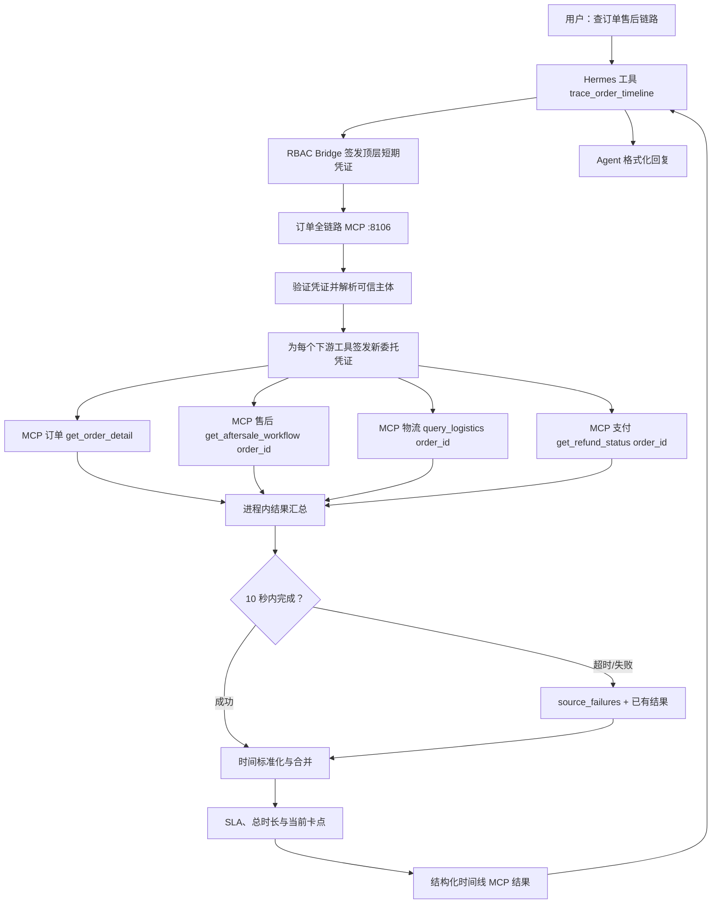

# 跨系统订单全链路的实现

## 1. 文档目的与结论先行

本文说明当前项目如何把订单、售后工单、逆向物流和支付退款四个 MCP 服务的数据，在一次用户查询中聚合为可追溯的售后时间线，并给出当前卡点、阶段 SLA 和部分失败信息。

这套实现的核心取舍如下：

- 对 Hermes 只暴露一个高层工具：`trace_order_timeline(order_id)`；模型不需要自行串行调用四个底层工具。
- 聚合服务在一个 10 秒的整体超时窗口内并发请求四个私有 MCP；任何单路超时或异常都只标记为 `source_failures`，其他已完成来源仍会返回。
- 聚合服务不直接查询业务表。它在验证顶层身份后，为每个下游工具签发新的、一次性的短期委托凭证；下游 MCP 仍独立执行原有 RBAC、行级过滤和脱敏。
- 所有事件统一为 `time / source / return_id / status / description` 的时间线节点；时间缺失的待处理节点不会伪造成当前时间，而是固定放在时间线末尾并用前置节点计算滞留。
- SQLite、Milvus 或长期记忆不参与本功能。这里的“链路”是对实时业务 MCP 的一次性聚合，历史记忆只能作为 Agent 的补充参考。

当前实现以代码为准。设计来源是 [`05d-跨系统订单全链路串联.md`](./05-技术重难点/05d-跨系统订单全链路串联.md)。

## 2. 服务边界与接口适配

设计文档以 `order_id` 为入口，要求四路 MCP 并行。但是原有三个下游工具只接受 `return_id`：

| 服务 | 聚合调用的工具 | 原有主标识 | 当前兼容入口 | 返回的主要数据 |
| --- | --- | --- | --- | --- |
| 订单 | `get_order_detail` | `order_id` | `order_id` | 订单创建时间、关联退单类型、SKU 品类等 |
| 售后 | `get_aftersale_workflow` | `return_id` | `return_id` 或 `order_id`，二选一 | 申请、审核、质检等工单步骤 |
| 物流 | `query_logistics` | `return_id` | `return_id` 或 `order_id`，二选一 | 上门取件、运输、仓库到达轨迹 |
| 支付 | `get_refund_status` | `return_id` | `return_id` 或 `order_id`，二选一 | 退款金额、方式、时间、状态 |

如果聚合器先调用订单服务，再用返回的 `return_id` 调用其余三个服务，会把链路变为串行，无法满足设计中的并发要求。因此本次扩展了后三个既有 MCP 工具：它们收到 `order_id` 时在自身受 RBAC 保护的关联查询内解析 `t_aftersale_return.order_id -> return_id`。调用者必须提供且只能提供一个标识，避免含义模糊。

当前模拟系统没有独立的仓储 MCP。售后工单里的“仓库签收入库”“仓库质检”等步骤会被标准化为 `source="warehouse"`。这不是虚构第五码源；它表示当前部署中仓储事实仍由售后工单服务提供。以后接入独立仓储 MCP 时，只需增加第五个 fetcher，并让其事实节点参与相同的合并规则。

一个订单可以关联多条退单。因此订单 MCP 返回 `returns` 数组，物流与支付 MCP 在按 `order_id` 调用时也会返回所有受权退单的轨迹或退款记录。聚合后的每个节点都带 `return_id`，去重、阶段 SLA 和当前卡点均按退单隔离；不能把不同 `return_id` 的节点拼成一条因果链。多退单订单的 `total_duration_hours` 与 `total_sla_status` 返回 `null / unknown`，调用方应按节点的 `return_id` 分别阅读。

## 3. 总体数据链路

`trace_order_timeline` 由 Hermes 插件的业务桥接暴露。用户身份并不属于模型可填写的参数，只有 `order_id` 可由模型提供。



聚合服务位于 [`backend/mcp_suning/servers/timeline.py`](../backend/mcp_suning/servers/timeline.py)，纯数据合并逻辑位于 [`backend/mcp_suning/timeline/tracker.py`](../backend/mcp_suning/timeline/tracker.py)。

## 4. 身份、权限与下游委托

### 4.1 顶层工具的授权

`trace_order_timeline` 先调用 `authorize_mcp_request_with_principal`：

1. 验证 Hermes Bridge 签发的 HMAC 凭证、目标工具绑定、有效期与 JTI 防重放。
2. 通过平台主体映射内部用户，加载角色、区域、城市、品类和数据粒度权限。
3. 为当前工具计算 `safe_filters`；汇总权限用户仍不能调用明细全链路工具。
4. 将聚合结果按照 `safe_filters["data_scope"]` 脱敏。

与普通工具相比，该函数额外返回已验证的 `AuthenticatedPrincipal`。这不是把原始 token 传给下游，而是为后续受控委托保留已经确认的用户身份。

### 4.2 为什么不能复用顶层凭证

现有凭证有两个安全属性：它绑定单一工具名，且 JTI 只能使用一次。因此为 `trace_order_timeline` 签发的凭证既不能拿去调用 `query_logistics`，也不应被四路调用重复使用。

聚合服务通过 `mint_delegated_attestation` 为四个固定下游工具分别创建新 token：

```text
顶层 token：tool = trace_order_timeline，jti = A

下游 token 1：tool = get_order_detail，jti = B
下游 token 2：tool = get_aftersale_workflow，jti = C
下游 token 3：tool = query_logistics，jti = D
下游 token 4：tool = get_refund_status，jti = E
```

五个 token 的 `platform`、外部用户、会话类型、消息 ID 和身份命名空间一致；每个下游服务仍调用自己的 `authorize_mcp_request`。因此聚合层无法通过传入用户 ID 绕过 RBAC，也不会因某一路服务返回数据就把数据授权给另一路。

`TimelineMCPGateway` 的工具名和端点是代码固定的，不接受模型指定 URL、工具名或身份字段。相关实现见 [`timeline/gateway.py`](../backend/mcp_suning/timeline/gateway.py) 和 [`security/attestation.py`](../backend/mcp_suning/security/attestation.py)。

## 5. 并发、结果汇总与降级

### 5.1 一次整体超时，不是四次串行超时

`OrderTimelineTracker.trace` 为四个 fetcher 同时创建 `asyncio.Task`，然后使用一次 `asyncio.wait(..., timeout=10)` 等待：

```text
t=0s    order / aftersale / logistics / payment 同时发起
t<=10s  已完成的来源返回负载或错误文本
t=10s   仍未完成的任务取消，并记为“调用超时”
t=10s+  聚合已成功来源，立即返回
```

因此四个服务都慢到接近 10 秒时，调用方最多等待约 10 秒，不是 40 秒。`ORDER_TIMELINE_TIMEOUT_SECONDS` 可在环境变量中调整，但代码会把非正配置限制到最小 0.1 秒。

### 5.2 结果汇总与部分失败语义

每个并发任务直接返回“负载或错误文本”。成功负载按来源放入 `payloads`，失败转换为 `SourceFailure`；这个简单的内存汇总不依赖任务完成顺序，也不引入额外的事件总线对象。

下游失败不会让 `trace_order_timeline` 直接抛出并丢失结果。例如物流超时而售后、订单、支付成功时，结果大致为：

```json
{
  "success": true,
  "partial": true,
  "source_failures": [
    {"source": "logistics", "message": "调用超时"}
  ],
  "timeline": ["订单、申请、审核等仍可用节点"]
}
```

Agent 应在回复中说明“物流服务暂时未返回”，而不能把缺失轨迹描述成“没有物流记录”。只有全部来源均无可聚合节点时，`success` 才是 `false`。

## 6. 时间线标准化与合并规则

### 6.1 标准节点

MCP 对外节点遵循参考方案的精简结构：

```text
{time, source, return_id, status, description, sla_status, duration_hours}
```

其中 `return_id` 是为多退单订单保留的唯一扩展字段；`phase`、原始步骤状态和 SLA 锚点只在服务内部计算，不返回给模型。服务类型、品类和审核后响应 SLA 写在申请节点的 `description` 中。`time` 是上海时区 ISO 8601 文本；空值表示来源没有发生时间，不会被替换成查询时刻。

### 6.2 时间格式

`parse_timestamp` 支持：

- Unix 秒；大于等于 `100_000_000_000` 的数值按 Unix 毫秒处理；
- ISO 8601，例如 `2024-06-01T14:23:05Z`、带 `+08:00` 的文本；
- MySQL 常见格式，例如 `2024-06-01 22:23:05`。

带时区的值先转换为 `Asia/Shanghai`；不带时区的 MySQL 文本按上海本地时间解释。不可解析时间保持为 `None`，排序时排在已有时间事件之后。

### 6.3 各来源到阶段的映射

| 来源 | 典型原始字段 | 生成阶段 | 合并说明 |
| --- | --- | --- | --- |
| 订单 | `create_time` | `other` | 记录订单创建；在工单不可用时可回退生成申请、审核节点 |
| 售后 | `step_name`、`step_time`、`step_status` | 申请、审核、质检等 | 名称含“仓库”“质检”“检测”时来源改为 `warehouse` |
| 物流 | `node_desc`、`node_time` | 取件、入库 | 有物流轨迹时，工单中的取件/入库镜像步骤不再重复加入 |
| 支付 | `refund_time`、`refund_status` | 退款 | 退款成功终结链路；待退款会成为当前卡点候选 |

节点按时间排序。相同 `return_id + phase + timestamp` 的镜像事实会去重；优先级依次为支付、物流、仓储、售后、订单。这能避免“物流上门取件”和“工单记录上门取件”以同一业务事实重复展示，同时保留不同退单即使同一时刻处于相同阶段的独立事实。

## 7. SLA 与卡点计算

### 7.1 默认阶段 SLA

`SLAConfig` 定义在 `timeline/tracker.py`，单位均为小时：

| 阶段 | 默认时限 |
| --- | ---: |
| 申请 → 审核 | 24 |
| 审核 → 上门取件 | 48 |
| 取件 → 仓库签收 | 72 |
| 仓库签收 → 质检完成 | 48 |
| 质检完成 → 退款 | 24 |
| 申请 → 全流程完成 | 168（7 天） |

规则表支持按 `(return_type, category_code)` 覆盖。当前已配置 `repair + C1-AC*`（空调维修）的审核后响应时限为 2 小时；未配置的服务类型和品类使用默认值。后续增加更多品类 SLA 时只需在 `SLA_OVERRIDES` 增加显式条目，不需要改聚合算法。

### 7.2 节点和总流程状态

阶段耗时达到 SLA 的 80% 时标记为 `warning`，超过阈值标记为 `overrun`，否则为 `normal`。缺少前置时间时标记为 `unknown`。每个实际完成节点的 `duration_hours` 始终表示与上一有时间节点的间隔；当前卡点的滞留时长直接写入 `description`。

当前卡点选择规则为：

1. 优先最后一个 `pending`、`doing`、`processing` 或无时间的节点；
2. 若没有显式待办且退款未成功，则选择最后一个完成节点，并计算它等待下一阶段的时长；
3. 退款成功后不再标记当前卡点；
4. 对当前卡点，把“已滞留 N 小时”追加到 `description`，并用该等待时长覆盖其卡点 SLA 状态。

以“仓库签收后存在无时间的仓库质检待检测”为例：质检节点的前置锚点是签收时间，系统计算 `now - 仓库签收时间`，使用 48 小时的“签收→质检”规则。这避免了原始设计示例中“空时间节点回退到当前时间”导致滞留永远为 0 的问题。

## 8. 对 Hermes 与 Agent 的返回

桥接插件将 `trace_order_timeline` 作为普通异步业务工具注册。模型拿到的是结构化工具结果，负责将其组织为用户可读时间线；聚合服务不会自行生成最终自然语言回复。

典型响应的主要字段如下：

```json
{
  "success": true,
  "order_id": 202406010001,
  "partial": false,
  "source_failures": [],
  "timeline": [
    {
      "time": "2024-06-01T10:00:00+08:00",
      "source": "aftersale",
      "return_id": 1,
      "status": "用户提交退货申请",
      "sla_status": "normal",
      "duration_hours": 1.0
    },
    {
      "time": null,
      "source": "warehouse",
      "return_id": 1,
      "status": "仓库质检",
      "description": "待检测 [当前卡点，已滞留73.0小时]",
      "sla_status": "overrun",
      "duration_hours": null
    }
  ],
  "current_bottleneck": {"...": "与当前节点相同"},
  "total_duration_hours": 125.0,
  "total_sla_status": "overrun"
}
```

推荐 Agent 回复时遵循以下优先级：先展示时间线和当前卡点，再说明总 SLA；如果 `partial=true`，明确列出失败来源；如果实时结果与长期记忆中的旧订单结论冲突，以本工具的实时结果为准。

### 8.1 回复边界

`source_failures` 只列调用失败的来源。某来源没有失败但时间线没有对应节点时，只能说“本次授权查询未返回记录”，不能断言业务从未发生。`current_bottleneck.source="derived"` 表示它由最后确认节点和 SLA 推导，不是来源系统返回的实际节点。`total_duration_hours` 的口径是“售后申请至终态或当前时刻”，不是下单至结束。退单状态节点只陈述状态码映射，支付退款节点才是退款事实。

## 9. 配置、部署与迁移

新增环境变量位于 [`backend/.env.example`](../backend/.env.example)：

```dotenv
SUNING_MCP_ORDER_URL=http://127.0.0.1:8101/mcp
SUNING_MCP_AFTERSALE_URL=http://127.0.0.1:8102/mcp
SUNING_MCP_LOGISTICS_URL=http://127.0.0.1:8104/mcp
SUNING_MCP_PAYMENT_URL=http://127.0.0.1:8105/mcp
SUNING_MCP_TIMELINE_URL=http://127.0.0.1:8106/mcp
ORDER_TIMELINE_TIMEOUT_SECONDS=10
```

启动顺序为先启动四个下游服务，再启动聚合服务：

```bash
cd backend
uv run python -m mcp_suning.servers.order
uv run python -m mcp_suning.servers.aftersale
uv run python -m mcp_suning.servers.logistics
uv run python -m mcp_suning.servers.payment
uv run python -m mcp_suning.servers.timeline
```

生产或已有模拟库需要执行 [`004_register_order_timeline.sql`](../backend/infra/mysql/migrations/004_register_order_timeline.sql)，注册 `mcp-order-timeline` 和 `trace_order_timeline`。随后重启 Hermes 或刷新工具列表，使桥接插件的新 schema 对模型可见。

已有**模拟库**若工单、物流或退款方式的中文标签为空，还需要使用 UTF-8 客户端执行 [`005_repair_mock_timeline_labels.sql`](../backend/infra/mysql/migrations/005_repair_mock_timeline_labels.sql)。该迁移按固定模拟 ID 重写演示数据，**不得在生产库执行**。

## 10. 测试与验收边界

新增 [`backend/tests/test_order_timeline.py`](../backend/tests/test_order_timeline.py) 覆盖：

- 四路 fetcher 同时启动；
- 单路超时取消后仍返回其他来源节点；
- 订单、工单、物流和支付节点的标准化、去重与排序；
- 缺少 `step_time` 的仓库质检节点成为当前卡点，并按签收时间计算 SLA；
- Unix、ISO、MySQL 三种时间格式归一化；
- 空调维修的 2 小时专项 SLA 选择。

身份凭证测试还覆盖“由已验证主体签发的委托 token 保留原用户、生成新 JTI、且只能调用指定下游工具”。

当前不提供以下能力：跨进程持久事件队列、下游重试/熔断、独立仓储 MCP、一个订单多条退单链路的用户选择界面，以及 SLA 规则的数据库化管理。前两项不会影响单次请求的部分结果降级；后两项需要新增业务数据契约后再扩展，不能由聚合器猜测。
