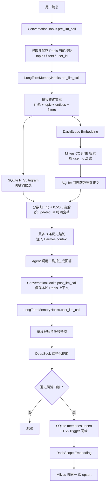

# 长期记忆的结构化沉淀与语义召回

## 1. 文档目的与结论先行

本文面向需要理解、维护或扩展当前长期记忆实现的开发者，说明它如何把一次对话中的业务结论沉淀为结构化记录，并在未来会话中通过关键词与语义双通道召回。

这套实现**不是保存原始聊天记录**。它保存的是带有主题、业务实体、筛选条件、结论和证据的“当前版本业务结论”。例如，值得沉淀的是“华东空调退单中安装问题长期占比最高，并有样本数据支撑”，而不是“昨天查询到 1,283 单”。

实现的核心取舍如下：

- SQLite 是结构化记忆的权威数据源；其 FTS5 索引提供本地关键词召回。
- Milvus 只保存用于语义检索的向量及最小过滤字段，是可降级的派生索引；语义命中后必须回 SQLite 读取正文。
- 回答前同步召回并注入至多 3 条历史结论；回答后通过进程内单线程后台任务沉淀，避免增加用户等待时间。
- 记忆以 `user_id` 隔离，并通过稳定 `memory_key` 把同一业务维度的新结论原位更新、递增版本。
- 记忆是增强能力：模型、向量服务或索引故障都不能阻断正常回答。

本文以当前代码为准。[`docs/05-技术重难点/05e-长期记忆结构化沉淀与召回.md`](./05-技术重难点/05e-长期记忆结构化沉淀与召回.md) 中含有早期设计和伪代码，阅读时不应把其中“Skill 自动执行”“异步接口”等描述当成现行行为。

## 2. 先建立全局认识：短期上下文与长期记忆各做什么

长期记忆依赖已有的短期上下文，但二者的寿命、用途和存储位置不同。

| 层次 | 存储与寿命 | 保存内容 | 在本方案中的职责 |
| --- | --- | --- | --- |
| 短期上下文 | Redis，会话级，默认 TTL 为 1 小时 | 当前 `topic`、筛选条件、最近轮次、摘要 | 补全“继续看上次那个品类”之类的省略表达，并提供可信用户和本轮槽位 |
| 长期结构化记忆 | 独立 SQLite 文件，跨会话保存 | 已筛选的业务结论、实体、条件、证据、版本、时间 | 作为可解释、可更新的业务事实来源 |
| 长期关键词索引 | SQLite FTS5，与主表同库 | `topic`、实体 JSON、`conclusion` | 精确匹配品类、原因、订单等字面词，并在向量服务不可用时降级 |
| 长期语义索引 | Milvus | `id`、`user_id`、`topic`、向量、更新时间 | 召回换说法、同义表达或不共享关键词的历史结论 |

短期上下文不是长期记忆的替代品：Redis 中的槽位会过期，也会随话题变化被更新；长期记忆也不替代实时查询：它只能作为历史参考，实时业务查询结果优先。

## 3. 大局数据链路

插件会先注册短期上下文 Hook，再注册长期记忆 Hook。因此，同一轮请求中，短期槽位先更新，长期召回随后使用该槽位；回答后，短期轮次先落入 Redis，长期沉淀随后提交。整体链路如下。



其中，回答前的 FTS5 与向量召回在概念上是双通道，**但当前代码按顺序执行**：先查询 FTS5，再调用 Embedding 和 Milvus；它们并不是两个并发线程。

### 3.1 两个 Hook 的先后关系

实际注册顺序由 [`.hermes/plugins/suning-rbac-bridge/__init__.py`](../.hermes/plugins/suning-rbac-bridge/__init__.py) 触发，并由 [`context_hooks.py`](../.hermes/plugins/suning-rbac-bridge/context_hooks.py) 和 [`memory_hooks.py`](../.hermes/plugins/suning-rbac-bridge/memory_hooks.py) 完成：

```text
pre_llm_call
  1. ConversationHooks.pre_llm_call       # 更新 Redis 槽位
  2. LongTermMemoryHooks.pre_llm_call     # 用最新槽位做长期召回

post_llm_call
  1. ConversationHooks.post_llm_call      # 保存本轮短期上下文
  2. LongTermMemoryHooks.post_llm_call    # 提交长期沉淀后台任务
```

这项顺序很重要。若长期召回先运行，用户说“继续看华东那类商品”时，查询文本就缺少刚解析出的品类、地域等维度，召回质量会明显下降。

## 4. 数据契约、主题范围与记忆身份

核心模型定义在 [`long_memory_models.py`](../packages/suning-context-runtime/src/suning_context_runtime/long_memory_models.py)。三种模型分别对应“LLM 判断”“持久化当前版本”“召回结果”。所有模型都使用 Pydantic，并设置 `extra="forbid"`，避免未定义字段悄悄进入主链路。

| 模型 | 产生位置 | 关键字段 | 作用 |
| --- | --- | --- | --- |
| `MemoryExtraction` | DeepSeek 结构化输出 | `should_record`、`topic`、`entities`、`filters`、`conclusion`、`evidence`、`confidence` | 表达“这一轮是否值得沉淀，以及提取出的候选事实” |
| `MemoryRecord` | 管道组装并写入 SQLite | `id`、`memory_key`、`user_id`、业务字段、`created_at`、`updated_at`、`version` | 表达一条当前有效的、用户私有的长期记忆 |
| `RetrievalResult` | 双通道融合后 | `record`、`score`、`source` | 记录最终排序分数及命中来源（`fts5`、`vector` 或 `both`） |

### 4.1 主题白名单

当前只允许两类长期记忆：

| 长期主题 | 业务含义 | 会话槽位别名 |
| --- | --- | --- |
| `return_analysis` | 退单、售后原因与趋势分析 | `return_case` 会归一化到此主题 |
| `order_trace` | 订单链路、状态异常与已确认处置结论 | `order_query` 会归一化到此主题 |

主题归一化的目的，是让短期意图标识与长期存储标识稳定对应，避免相同业务事实因命名差异产生多条记录。

### 4.2 稳定键如何实现“结构化归并”

`memory_key` 的生成逻辑可概括为：

```text
memory_key = SHA-256(
  canonical_json({user_id, normalized_topic, entities, filters})
)
```

`canonical_json` 会递归裁剪字符串、排序字典键、稳定排序集合、把时间统一转为 UTC，并拒绝 `NaN`、无穷值和不支持的对象。这样同样的实体和条件即使字典书写顺序不同，也会得到相同的键。

键中**不包含** `conclusion` 和 `evidence`。因此，同一用户在同一主题、实体、筛选条件下获得更好的新结论时，系统更新既有记录而不是制造重复记忆：保留原 `id` 与 `created_at`，覆盖结论、证据、置信度和更新时间，并把 `version` 加一。

这里的“归并”是确定性键上的原位更新，并不是语义相似度去重、冲突自动分析或多版本结论合并；当前也没有历史版本表。

## 5. 回答后：结构化沉淀链路

### 5.1 从 Hook 到后台任务

入口是 [`LongTermMemoryHooks.post_llm_call`](../.hermes/plugins/suning-rbac-bridge/memory_hooks.py)。该 Hook 不直接调用模型和数据库，而是把本轮输入提交给 [`LongTermMemoryPipeline.submit_turn`](../packages/suning-context-runtime/src/suning_context_runtime/long_memory_pipeline.py)。

提交前会做三件事：

1. 优先恢复回答前以 `(session_id, turn_id)` 记录的用户和槽位快照；这一进程内映射最多保留 1024 项，防止共享会话并发时 A 用户的 post Hook 错用 B 用户已经覆盖的 Redis 状态。
2. 用户身份按 `sender_id`、本轮快照用户、Redis 上下文用户的优先级解析，绝不从用户消息正文推断身份。
3. 把 `topic`、`entities`、`filters` 深复制后投递给 `ThreadPoolExecutor(max_workers=1)`；因此 Hook 能快速返回，且本进程内写入按单一顺序执行。

`_slot_context` 会移除 `last_reply_summary`，并将 `brand`、`category`、`order_id`、`reason`、`region`、`return_id`、`sku_code` 单独放入 `entities`，其他条件放入 `filters`。移除摘要尤其关键：它每轮都变化，若进入 `memory_key` 会导致同一业务切片无法合并。

### 5.2 LLM 只负责提取候选，不直接决定落库

后台任务最终调用 [`MemoryExtractor.extract`](../packages/suning-context-runtime/src/suning_context_runtime/long_memory_extractor.py)。它复用 DeepSeek LangChain 模型，通过 `with_structured_output(MemoryExtraction)` 取得受模型约束的输出。

输入由本轮用户问题、最终回答、历史和最新槽位组成。历史会从最近 16 条中筛选出至多 8 条，仅保留原始 `user`/`assistant` 的 `role` 与 `content`，每条最多 2,000 字；工具消息和 `api_content` 不进入提取 Prompt。这样可以避免先前注入的长期记忆再次被写回，形成自我强化的反馈循环，也能控制 Prompt 体积。

模型输出仍需经过四道确定性门禁：

1. `should_record` 必须为 `true`。
2. 主题归一化后必须位于白名单。
3. `confidence` 必须不低于 `LONG_MEMORY_MIN_CONFIDENCE`，默认 `0.7`。
4. `conclusion` 必须是非空文本。

换言之，LLM 解决“是否存在可复用结论、如何抽象”的语义问题；白名单、置信度和非空校验则把最终落库权收回到可审计的程序逻辑。

### 5.3 可信槽位优先于 LLM 维度

管道的 `_memory_dimensions` 有一个容易忽略的规则：只要服务端槽位中的 `entities` 或 `filters` 任一不为空，就**整体采用**服务端槽位；只有二者都为空，才使用 LLM 提取出的实体和条件。

这是为了让已经受短期上下文约束的规范业务维度进入唯一键，避免模型臆造或改写条件导致重复记录。代价是槽位仅部分存在时，LLM 补出的另一部分也不会被采纳；这是当前实现有意选择的确定性优先策略。

### 5.4 SQLite 先提交，FTS5 随事务同步

[`SQLiteMemoryStore.upsert`](../packages/suning-context-runtime/src/suning_context_runtime/long_memory_store.py) 在 `BEGIN IMMEDIATE` 事务中按 `memory_key` 查询和写入：

- 新记录强制从 `version=1` 开始。
- 同键更新保留旧 `id`、旧 `created_at`，并递增版本。
- `memories_ai`、`memories_au`、`memories_ad` 三个 SQLite Trigger 自动维护 FTS5 表。

SQLite 主表为 `memories`，包含 `id`、`memory_key`、`user_id`、主题、实体 JSON、条件 JSON、结论、证据 JSON、置信度、创建/更新时间与版本。初始化还会建立 `(user_id, updated_at DESC)` 索引，补齐可能缺失的 FTS 索引条目。

长期记忆没有单独的 SQL migration：表、FTS5 虚表和 Trigger 都由 `SQLiteMemoryStore.initialize()` 在运行时幂等创建。`backend/infra/mysql/migrations/` 与这部分无关。

### 5.5 向量索引是后续的尽力同步

SQLite 成功后，`build_embedding_text(saved)` 会将下面四项拼成稳定的中文文本：

```text
主题
实体（规范 JSON）
筛选条件（规范 JSON）
结论
```

随后 [`DashScopeEmbeddingClient`](../packages/suning-context-runtime/src/suning_context_runtime/long_memory_store.py) 调用 `text-embedding-v3` 生成向量，校验响应、超时、数值有限性和向量维度稳定性。首次真实向量返回时，客户端会锁定维度。

[`MilvusVectorStore`](../packages/suning-context-runtime/src/suning_context_runtime/long_memory_store.py) 也在首次向量到达时才连接并创建 collection。其 schema 为：

```text
id          VARCHAR(64)，主键，与 SQLite record.id 相同
user_id     VARCHAR(256)
topic       VARCHAR(64)
vector      FLOAT_VECTOR，维度取首次实际 Embedding 维度
updated_at  VARCHAR(64)
```

向量索引采用 `AUTOINDEX + COSINE`。如果 collection 已存在但维度与模型实际输出不一致，代码会报错并保留现有数据，不会为了“修复”而自动删除 collection。

写入顺序是 SQLite/FTS5 成功后再 best-effort 写 Milvus，因此它们不是分布式事务。Embedding 或 Milvus 写入失败时，SQLite 记录仍会保留并可通过 FTS5 召回；但当前没有重试、Outbox、补偿或向量重建任务，旧记录更新失败时 Milvus 可能暂时保留旧向量。

## 6. 回答前：语义召回链路

### 6.1 生成带槽位的查询文本

[`LongMemoryHooks.pre_llm_call`](../.hermes/plugins/suning-rbac-bridge/memory_hooks.py) 读取 Redis 上下文后调用 `pipeline.retrieve`。[`LongMemoryRetriever.build_query_text`](../packages/suning-context-runtime/src/suning_context_runtime/long_memory_retriever.py) 按固定顺序拼出：

```text
用户问题：<本轮消息>
主题：<当前 topic>
实体：<按键排序的 JSON>
筛选条件：<按键排序的 JSON>
```

主题、实体和筛选条件为空时不会输出对应行。FTS5 与 Embedding 使用完全相同的查询文本，使“当前说法”和“会话已确认的业务语义”共同参与检索。实现要求用户原始消息非空；仅有槽位而没有消息时不会发起召回。

### 6.2 关键词通道：SQLite FTS5 trigram

FTS5 虚表使用 `tokenize='trigram'`，索引字段是 `topic`、`entities_text` 和 `conclusion`。它不直接索引 `filters_json` 或 `evidence_json`。

查询前，`_fts_query` 会把连续中文拆成重叠的三字片段，英文、数字、下划线和连字符词至少保留 3 个字符；最多取 64 个词项，并用带引号的 `OR` 组成 `MATCH` 表达式。这样既适配中文没有天然空格分词的特点，也避免用户输入引号、运算符等 FTS 语法改变查询结构。

三元切分无法精确处理“空调”“冰箱”这类两个汉字的实体。因此，若 FTS5 没有命中，`_short_cjk_terms` 会提取最多 32 个二字片段（忽略“用户”“问题”“主题”等固定标签），在同一用户的主表上使用受限 `instr` 子串匹配。这个降级路径会搜索主题、实体、筛选条件和结论，并以匹配词数排序。

无论主路径还是短词降级，SQL 都带有 `user_id` 条件。FTS5 原始使用 BM25，分数越小代表越相关。

### 6.3 语义通道：Embedding 与 Milvus

语义通道先对同一查询文本做 Embedding，再使用 Milvus 的 COSINE 检索。每路候选数为 `top_k * 2`，默认 `LONG_MEMORY_TOP_K=3` 时各取 6 条候选。

Milvus 查询在服务端使用 `user_id == ...` 过滤；解析结果时又会丢弃显式属于其他用户的命中。Milvus 只返回候选 ID 和相似度，召回器随后调用 `SQLiteMemoryStore.get_many(user_id, ids)` 回 SQLite 获取完整、当前版本的记录。这个回表动作同时完成第二次用户过滤，并自动忽略 SQLite 已不存在的陈旧向量 ID。

因此，Milvus 并不拥有结论和证据的最终解释权。即使向量中的元数据过期，最终注入给模型的正文仍来自 SQLite 当前记录。

### 6.4 分数归一化、融合与时效衰减

BM25 与 COSINE 的量纲和方向不同，不能直接相加。实现会在每个通道内部先执行 min-max 归一化到 `0～1`：

- FTS5 使用“分数越小越好”的反向归一化。
- Milvus COSINE 使用“分数越大越好”的正向归一化。
- 某通道所有候选分数相同时，该通道候选都记为 `1.0`。
- 非有限分数不会参与归一化。

同一 `memory_id` 的两路结果会去重，并记录来源。最终分数为：

```text
combined_score = 0.5 × keyword_score + 0.5 × semantic_score
final_score = combined_score × exp(-ln(2) × age_days / half_life_days)
```

`age_days` 基于 `updated_at` 计算，默认 `half_life_days=30`。也就是说，一条刚被相同业务维度的新结论更新过的记忆会重新获得时效权重；30 天后，其他条件相同时分数约为原来的一半。未来时间戳会按 0 天年龄处理。

只在一个通道命中时，另一通道按 `0` 计入，而不是补成满分；双通道共同命中因而是更强的相关信号。结果按 `(final_score, record.id)` 逆序排列后返回 TopK。

当前召回没有按 `topic` 或实体做硬过滤，也没有最低相关度阈值，`confidence` 也不参与召回分数；它只参与沉淀门禁。主题、实体和条件通过查询文本影响关键词和语义匹配。

### 6.5 注入格式与回答优先级

[`format_memory_context`](../.hermes/plugins/suning-rbac-bridge/memory_hooks.py) 会把结果转为 Hermes Hook 的 `context` 字段。它明确提示模型：历史结论只供参考，与本轮实时查询冲突时必须以实时查询结果为准。

每条注入内容包括主题、`entities + filters` 条件、结论、证据和更新时间；不会暴露内部 `score`、命中来源、置信度或版本号。即使 `LONG_MEMORY_TOP_K` 配置大于 3，格式化层仍使用 `results[:3]`，因此最终 Prompt 固定最多注入 3 条，以控制噪声和 token 成本。

## 7. 为什么使用这些技术

| 技术或机制 | 解决的问题 | 当前实现中的理由与效果 |
| --- | --- | --- |
| Hermes pre/post Hooks | 如何稳定地在每轮回答前后执行 | 不修改 Hermes 源码即可接入生命周期；pre 用于召回，post 用于异步沉淀。相比之下 Skill 不能保证每轮回答后自动调用 |
| DeepSeek + LangChain 结构化输出 + Pydantic | 自然语言中什么值得记、该如何抽象 | LLM 负责语义判断，Pydantic 固定输出契约；白名单和置信度门禁防止模型输出直接污染存储 |
| Redis 结构化槽位 | 用户追问经常省略实体与条件 | 用当前 topic、实体和条件增强查询，不要求用户每轮重复完整业务条件 |
| SQLite | 如何以低运维成本保存权威结构化记录 | 独立文件、事务和 JSON 字段足以支持当前用户级写入规模；WAL、独立连接和 busy timeout 支持后台写与前台读并存 |
| SQLite FTS5 trigram | 中文关键词、品类、原因、订单号等精确命中 | 不依赖额外搜索服务；三元分词适合中文子串；Trigger 使更新后的结论与索引同步；向量故障时仍可本地工作 |
| DashScope `text-embedding-v3` | 换一种说法时，关键词可能完全不同 | 将“安装问题是否还是主因”和“空调退单的核心症结”映射到可比较的语义空间；维度由首个真实响应确定，避免硬编码 |
| Milvus + COSINE | 如何高效保存、检索和过滤向量 | 提供 TopK 语义相似度检索与服务端用户过滤；只保存候选字段和向量，避免双存储的正文权威冲突 |
| FTS5 + 向量混合召回 | 单一检索方式各有盲区 | 关键词擅长精确实体，向量擅长同义改写；归一化后等权融合，使排序逻辑简单且可解释 |
| `memory_key` + version | 如何避免同一条件下不断堆积相近结论 | 以用户、主题、实体、条件定义业务切片，新结论覆盖旧结论并递增版本；Milvus 复用同一 ID 同步最新向量 |
| 基于 `updated_at` 的半衰期 | 历史结论可能过时，但不应立即删除 | 软降权保留历史可追溯性，并使最近更新的结论更容易被召回 |
| 单线程后台写入 | 不能因沉淀拖慢用户回答 | post Hook 快速返回，写入顺序稳定；适合第一版低复杂度实现 |
| fail-open 降级 | 记忆系统故障不应影响主营回答 | FTS、Embedding、Milvus、提取器均有异常边界；无法召回时不注入上下文，无法向量化时保留 SQLite/FTS5 |

## 8. 用户隔离、安全与一致性边界

### 8.1 用户隔离不是只靠一个条件

实现对用户隔离采取多层防线：

1. Hook 使用可信 `sender_id`、Redis 已绑定用户和 turn 快照解析身份，不从消息正文取用户。
2. `user_id` 进入 `memory_key`，不同用户的同一业务结论不会归并。
3. FTS5 查询 SQL 带 `m.user_id = ?`。
4. Milvus 搜索表达式带 `user_id == ...`，解析命中时再次检查返回的用户字段。
5. Milvus 命中后 SQLite 回表仍带 `user_id` 条件。
6. 召回器在装载和融合阶段还会检查 `record.user_id`。

这让单层错误更难演变成跨用户的历史结论泄漏。

### 8.2 fail-open 的具体含义

| 失败点 | 当前行为 | 对用户回答的影响 |
| --- | --- | --- |
| 长期 Hook 初始化失败，如缺少关键密钥或 SQLite 不支持 FTS5 | 插件保留 RBAC 工具和短期上下文，但不注册长期 Hook | 正常回答继续，只是没有长期记忆 |
| FTS5 召回失败 | 记录日志，继续尝试向量通道 | 可能仍得到语义结果 |
| Embedding 或 Milvus 召回失败 | 清空语义候选，退化为 FTS5 | 可能仍得到关键词结果 |
| 融合或 pre Hook 整体失败 | 返回 `None`，不注入长期上下文 | 正常回答继续 |
| LLM 提取或 SQLite 写入失败 | 后台任务吞掉异常并记录日志 | 当前回答已经返回，不受影响 |
| Embedding/Milvus 写入失败 | SQLite/FTS5 已保留，不抛回调用方 | 之后可走关键词召回 |

需要注意，FTS5 降级的前提是长期 Hook 已成功初始化。`DASHSCOPE_API_KEY` 是当前 `build_memory_hooks` 的必需配置；缺少它时，整组长期 Hook 不会注册，并非“无需 Embedding 配置也能自动启用 FTS5”。

### 8.3 当前实现的限制

以下边界应作为维护和扩展时的前提，而不是被误认为已实现能力：

- SQLite 与 Milvus 没有分布式事务；SQLite 更新成功、向量同步失败时，Milvus 可能短暂保留旧向量，且当前没有自动补偿。
- 后台队列是进程内 `ThreadPoolExecutor`，进程异常退出时未执行任务可能丢失；没有消息队列、持久队列或重试策略。
- 只存当前版本，`version` 是计数器；没有历史版本表、记忆删除接口、TTL、冲突合并或组织级共享记忆。
- FTS5 主索引不含 `filters_json` 与 `evidence_json`；条件会参与短词降级和 Embedding 文本，但不会进入主 FTS 索引。
- 若 Hermes 未提供 `conversation_history`，长期 Hook 会把 `recent_turns` 作为回退值；但短期上下文记录的条目是 `user_msg`/`assistant_reply` 形状，而提取器只接受 `role`/`content` 形状，因此这部分回退历史当前会被过滤。当前轮的 `user_message` 与 `assistant_response` 仍会正常参与提取。
- 回答前的远端 Embedding 与 Milvus 调用位于同步关键路径。默认 10 秒与 5 秒超时，以及 fail-open 逻辑用于限制影响，但极端故障时仍可能增加回答前等待。

## 9. 代码阅读顺序

推荐按“先看入口和时序，再看编排和数据，再深入适配器，最后看测试”的路径阅读。

| 顺序 | 文件 | 优先关注的符号 | 阅读时回答的问题 |
| --- | --- | --- | --- |
| 1 | [`.hermes/plugins/suning-rbac-bridge/__init__.py`](../.hermes/plugins/suning-rbac-bridge/__init__.py) | `register` | 长期记忆如何被插件装配？失败后哪些能力保留？ |
| 2 | [`memory_hooks.py`](../.hermes/plugins/suning-rbac-bridge/memory_hooks.py) | `LongTermMemoryHooks.pre_llm_call`、`post_llm_call`、`build_memory_hooks` | 何时召回、何时沉淀？用户与槽位从哪里来？上下文如何注入？ |
| 3 | [`context_hooks.py`](../.hermes/plugins/suning-rbac-bridge/context_hooks.py) 与 [`hooks.py`](../packages/suning-context-runtime/src/suning_context_runtime/hooks.py) | `register_context_hooks`、`ConversationHooks` | 为什么长期 Hook 能拿到本轮最新槽位？ |
| 4 | [`long_memory_pipeline.py`](../packages/suning-context-runtime/src/suning_context_runtime/long_memory_pipeline.py) | `submit_turn`、`record_turn`、`retrieve` | 写入和召回如何被统一编排？异步边界在哪里？ |
| 5 | [`long_memory_models.py`](../packages/suning-context-runtime/src/suning_context_runtime/long_memory_models.py) | 三个 Pydantic 模型、`build_memory_key`、`build_embedding_text` | 什么是一条记忆？什么维度决定它的身份？ |
| 6 | [`long_memory_extractor.py`](../packages/suning-context-runtime/src/suning_context_runtime/long_memory_extractor.py) | `extract`、`is_recordable`、`_safe_history` | LLM 如何提取，哪些候选会被拒绝？ |
| 7 | [`long_memory_retriever.py`](../packages/suning-context-runtime/src/suning_context_runtime/long_memory_retriever.py) | `build_query_text`、`retrieve`、`_normalize_scores`、`_decay_score` | 双通道候选如何融合、衰减和排序？ |
| 8 | [`long_memory_store.py`](../packages/suning-context-runtime/src/suning_context_runtime/long_memory_store.py) | `SQLiteMemoryStore`、`DashScopeEmbeddingClient`、`MilvusVectorStore` | SQLite/FTS5、Embedding、Milvus 的真实 schema、超时和隔离如何落地？ |
| 9 | [`backend/tests/test_long_memory.py`](../backend/tests/test_long_memory.py) | FTS 中文、向量维度、用户隔离、融合、衰减测试 | 关键算法和适配器具有什么可执行证据？ |
| 10 | [`backend/tests/test_long_memory_pipeline_hooks.py`](../backend/tests/test_long_memory_pipeline_hooks.py) | 写入顺序、快照、Hook 顺序、fail-open 测试 | 生命周期、并发身份和降级边界是否被锁定？ |
| 11 | [`.hermes/skills/memory-extractor/SKILL.md`](../.hermes/skills/memory-extractor/SKILL.md) | 记录/不记录规则 | 手工检查时模型应遵循什么规则？注意它不是自动写入入口 |
| 12 | [`backend/.env.example`](../backend/.env.example) 与 [`backend/infra/milvus/compose.yaml`](../backend/infra/milvus/compose.yaml) | 环境变量、Milvus 服务 | 运行时需要哪些服务、密钥与超时配置？ |

如果只需快速定位问题，可按症状反查：

- “为什么没有沉淀？”：先看 `memory_hooks.py` 的 post 身份/槽位，再看 `MemoryExtractor.is_recordable` 和 `record_turn`。
- “为什么没有召回？”：先看 `build_query_text`，再看 `search_fts`、Embedding/Milvus 日志和分数融合。
- “为什么召回了错误用户的内容？”：检查 turn 快照、`user_id` 过滤与 SQLite 回表链路。
- “为什么更新后还像旧结论？”：检查 `memory_key` 的实体/条件是否一致，以及 Milvus 是否在 SQLite 提交后同步失败。

## 10. 配置、依赖与验证入口

长期记忆相关配置位于 [`backend/.env.example`](../backend/.env.example)。主要变量如下：

| 配置 | 默认值或作用 |
| --- | --- |
| `DEEPSEEK_API` / `DEEPSEEK_API_KEY` | 结构化提取模型密钥，前者优先 |
| `DEEPSEEK_BASE_URL`、`DEEPSEEK_MODEL` | DeepSeek 服务地址和模型 |
| `LONG_MEMORY_LLM_TIMEOUT_SECONDS` | 提取模型超时，默认 20 秒 |
| `DASHSCOPE_API_KEY` | Embedding 密钥，当前长期 Hook 初始化必需 |
| `MEMORY_EMBEDDING_MODEL` | 默认 `text-embedding-v3` |
| `MEMORY_EMBEDDING_TIMEOUT_SECONDS` | Embedding 超时，默认 10 秒 |
| `MEMORY_DB_PATH` | 默认 `~/.hermes/state/suning_business_memory.db` |
| `MILVUS_URI`、`MILVUS_COLLECTION` | 默认 `http://127.0.0.1:19530`、`memory_vectors` |
| `MILVUS_TIMEOUT_SECONDS` | 默认 5 秒 |
| `LONG_MEMORY_MIN_CONFIDENCE` | 默认 `0.7`，沉淀门禁阈值 |
| `LONG_MEMORY_TOP_K` | 默认 `3`，每路候选数为其两倍；最终注入仍最多 3 条 |
| `LONG_MEMORY_HALF_LIFE_DAYS` | 默认 `30`，时效衰减半衰期 |

Python 依赖在 [`packages/suning-context-runtime/pyproject.toml`](../packages/suning-context-runtime/pyproject.toml) 中声明，包括 `dashscope`、`pymilvus`、LangChain、DeepSeek 集成和 Pydantic。Milvus 开发环境由 [`backend/infra/milvus/compose.yaml`](../backend/infra/milvus/compose.yaml) 提供，包含 Milvus Standalone、etcd 和 MinIO，并暴露 SDK 端口 `19530`。

验证时可先运行长期记忆相关测试：

```bash
cd backend
uv run pytest tests/test_long_memory.py tests/test_long_memory_pipeline_hooks.py
```

提交前再执行项目要求的完整测试：

```bash
cd backend
uv run pytest
```

这些测试重点覆盖稳定键与版本更新、中文 trigram 和二字词降级、向量维度与用户过滤、双通道融合、30 天衰减、向量故障回退、异步快照，以及短期/长期 Hook 的注册顺序。外部 DeepSeek、DashScope、Milvus 在单元测试中主要通过替身验证边界；生产部署仍应单独进行真实服务连通性检查。

## 11. Skill 在体系中的真实角色

`.hermes/skills/memory-extractor/SKILL.md` 保存“哪些结论应记、哪些不应记、主题白名单和输出结构”的可版本管理说明，适合人工检查或调试。

但自动沉淀并不是 Agent 主动调用该 Skill：真实自动路径是：

```text
LongTermMemoryHooks.post_llm_call
  -> LongTermMemoryPipeline.submit_turn
  -> MemoryExtractor.extract
  -> SQLite / FTS5
  -> DashScope / Milvus
```

这样选择的原因是 Hook 能保证生命周期时机，而 Skill 更适合作为显式、可审阅的规则和手工诊断入口。手工调用 Skill 只会帮助检查提取结果是否满足门禁，不会直接写入 SQLite 或 Milvus。

